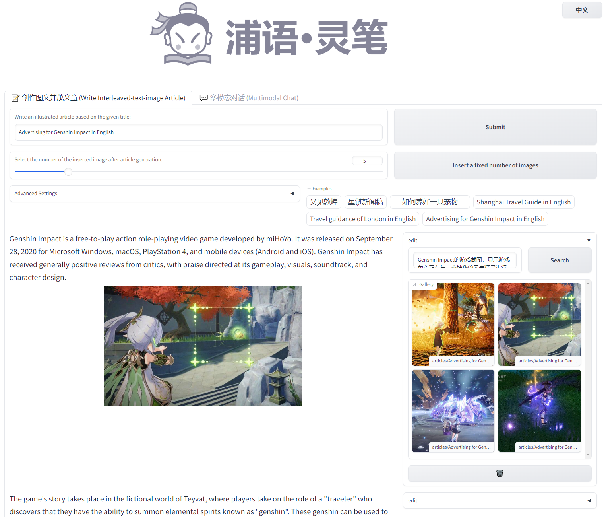
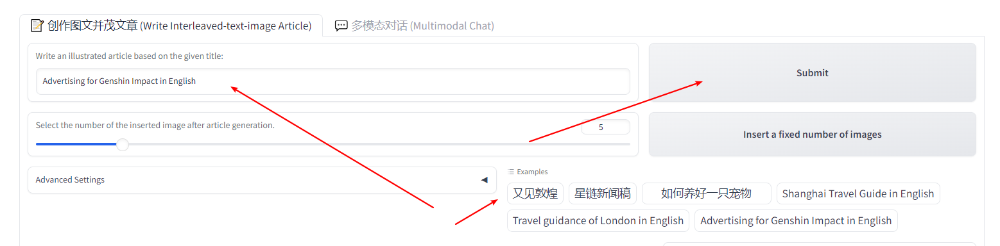
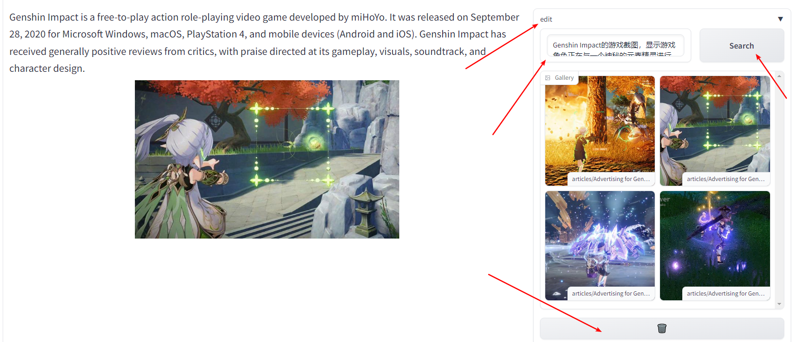

    

## User Guidance for Web Demo

For an academic setting, especially in the context of conferences like CVPR, it's critical to prioritize clarity and precision. Here's a revision:

### Quick Start Guide

1. Input the desired article title into the **textbox** and subsequently press the **submit** button.
2. Alternatively, you may choose from one of the **example** titles available, and then proceed to click the **submit** button.
3. Please allow some time for processing. Upon completion, a comprehensive article, inclusive of visual illustrations and textual content, will be generated automatically.

    

### Interactively improving the article
If you want to edit the images, you can follow the guidance below:

    

To begin editing, click on the **Edit** bar. This will reveal a suite of components designed for image-related edits.

- **Textbox**: This displays the caption generated by XComposer.
- **Search Button**: Use this to find images based on the caption.
- **Image Gallery**: Displays images sourced from your search.

    ### 1. Image Selection
   - Choose an image by clicking on any image within the **gallery**.
   - To display additional images, click the **Search Button**.
   - To explore captions, modify the content in the **Textbox** and then click the **Search Button**.

    ### 2. Image Deletion
   - To remove an image from your selection, simply click the **🗑️ Button**.

    ### 3. Adding Images
   - To add a new image, click the **Add Button** (visible after activating the **Edit** mode). For further instructions, refer to the Image Selection section above.

## Finalizing Your Article

Once you're satisfied with the edits, click the **Save Article** button located at the bottom of the user interface to store the final version of your article.
