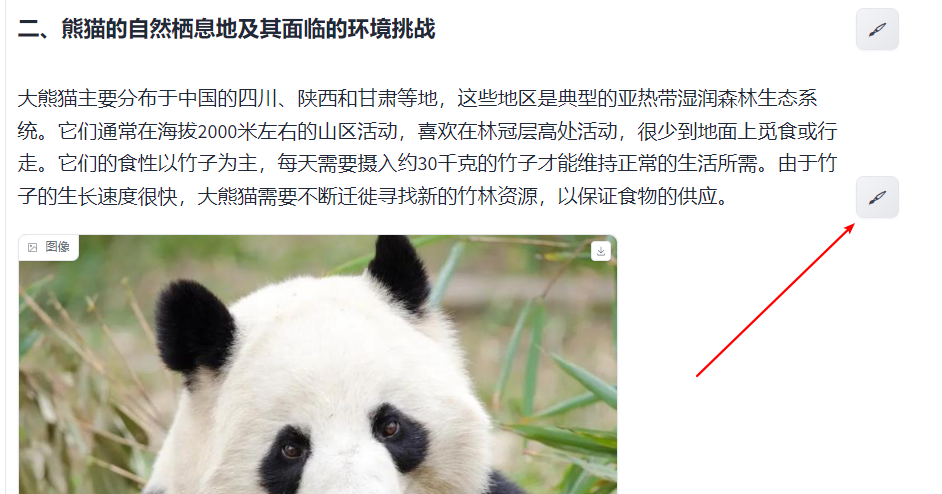

    

## User Guidance for Web Demo

### Quick Start Guide
#### Input

1. You can input instructions or text-type materials in the text box to control the generation of the article.
2. You can also expand and click to upload image-type materials (optional). The model will generate an article based on instructions or text-type materials and image content.
3. You can control the number of images in the generated article by switching the "image number," where the "Automatic" value indicates that the model will automatically determine the number of images.
4. Click submit button and give some time for the generation.

    

### Free-form editing the generated article
#### Paragraph editing

    

1. To modify a paragraph, click the right button, and the editing panel will appear on the right. Currently, InternLM-XComposer2 supports rewriting, expanding, abbreviating, and inserting a new paragraph based on the provided instructions.
2. Choose an editing type, provide an instruction, and then click Run. The edited paragraph will be displayed below.
3. Click Done to replace the original paragraph with the edited results. Additionally, you can click Insert image below to add a new image.

    

#### Image editing

    

To modify an image, click on the image, and the editing panel will appear on the right.

- **Textbox**: This displays the caption generated by XComposer2.
- **Search Button**: Use this to find images based on the caption.
- **Image Gallery**: Displays images sourced from your search.

- Choose an image by clicking on any image within the **gallery**.
- To display additional images, click the **Search Button**.
- To explore captions, modify the content in the **Textbox** and then click the **Search Button**.
- To remove an image from your selection, simply click the **🗑️ Button**.
   

    

## Finalizing Your Article

Once you're satisfied with the edits, click the **Save Article** button located at the bottom of the user interface to store the final version of your article.
