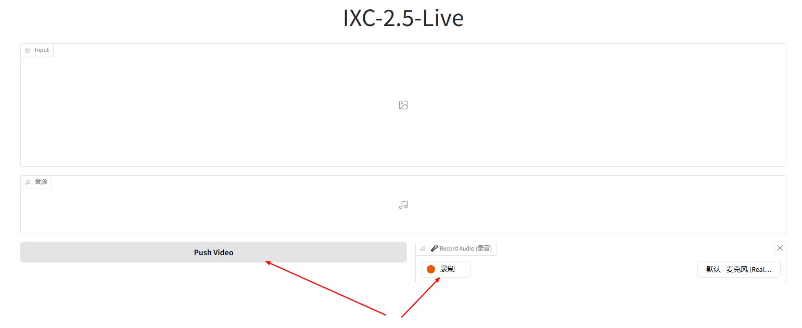

# **InternLM-XComposer-2.5-OmniLive Gradio Demo Setup Guide**

Gradio demo requires:

```bash
gradio==5.8.0
```


## **Deployment Guidelines**

The backend is developed using FastAPI, while the frontend is built with Gradio. There is no requirement for an SRS server.


### **Launch the Backend Server**

Execute the following commands in your terminal to run the server. 

```shell
sh backend.sh
```

The backend program will launch three scripts in sequence: `backend_vs.py`, `backend_llm.py`, and `backend.py`. Specifically, `backend_vs.py` manages video data, constructs memory, and retrieves memory based on queries. `backend_llm.py` acts as the ixc's Multimodal Large Language Model (MLLM). Meanwhile, `backend.py` is tasked with Automatic Speech Recognition (ASR) and Text-to-Speech (TTS) functionalities.


### **Launch the Frontend**

```shell
# replace the backend_ip to your backend ip
python frontend.py --backend_ip 0.0.0.0
```

The frontend program is responsible for streaming video and audio, segmenting the audio using VAD (Voice Activity Detection), and communicating with the backend through requests.

In this setup, the audio source is derived from `gr.Audio()`. To switch to a local microphone, you can set `--audio_source local`, but please note that you will need to implement Echo Cancellation in this case. The video source is obtained from the local camera (only show 1FPS in gradio UI). To switch to a Gradio component, you can set `--video_source gradio`.

Upon starting the frontend, click `Push Video`, wait for the video snapshot to display, then click `Record Audio` to start the chat.

<p align="center">
    
</p>
