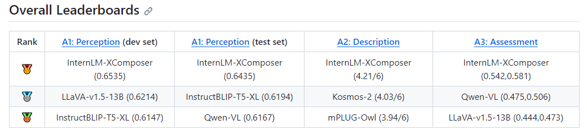
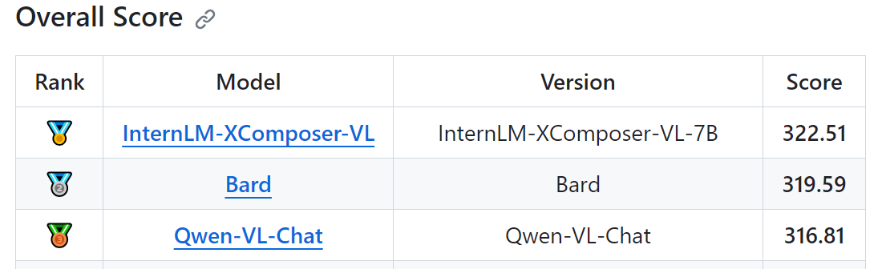
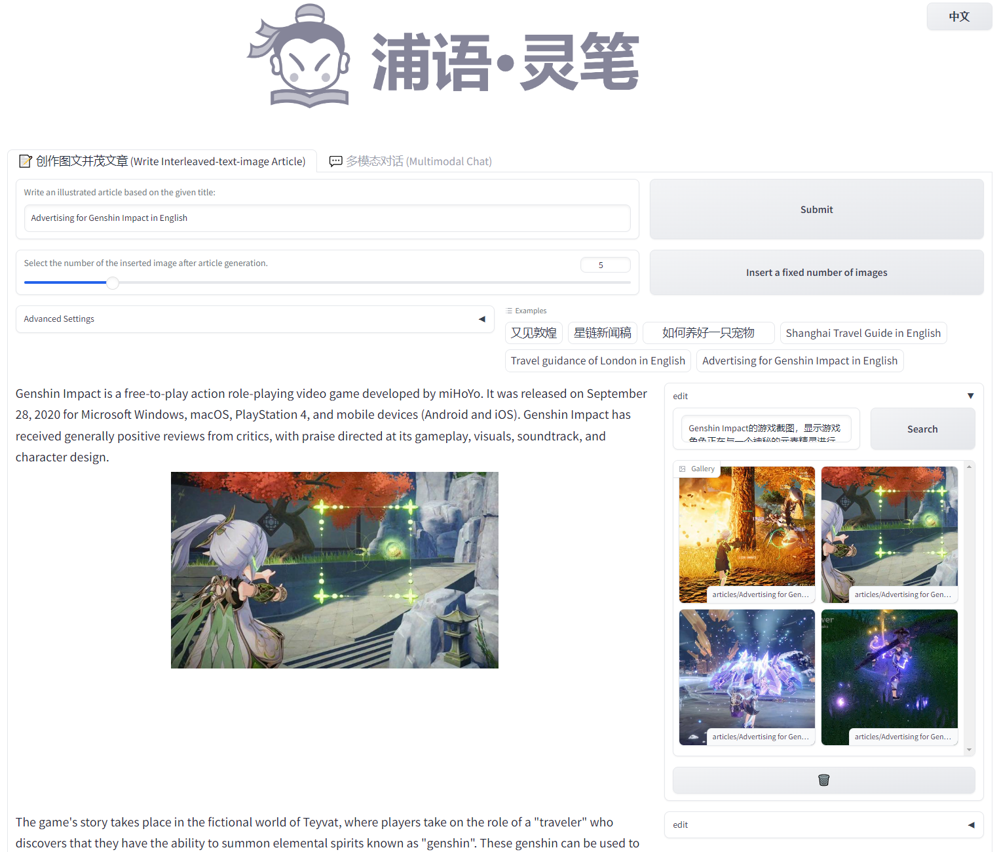

<p align="center">
    
</p>
<p align="center">
    <b><font size="6">InternLM-XComposer</font></b>
</p>


<!-- <div align="center">
        InternLM-XComposer <a href="">🐼 <a> <a href="">🤖 <a> <a href="">🤗</a>&nbsp ｜ InternLM-VL <a href="">🤖 <a> <a href="">🤗</a>&nbsp | Technical Report <a href=""> <a> 📄  -->

<div align="center">
        InternLM-XComposer <a href="https://huggingface.co/internlm/internlm-xcomposer-7b">🤗</a> <a href="https://modelscope.cn/models/Shanghai_AI_Laboratory/internlm-xcomposer-7b">🤖<a href="https://openxlab.org.cn/models/detail/InternLM-xcomposer/internlm-xcomposer-7b">🐼 </a> &nbsp ｜ InternLM-XComposer-VL <a href="https://huggingface.co/internlm/internlm-xcomposer-vl-7b">🤗</a> <a href="https://modelscope.cn/models/Shanghai_AI_Laboratory/internlm-xcomposer-vl-7b">🤖<a href="https://openxlab.org.cn/models/detail/InternLM-xcomposer/internlm-xcomposer-7b">🐼 </a> &nbsp | Technical Report <a href="https://arxiv.org/pdf/2309.15112.pdf">  📄 </a>

[English](./README.md) | [简体中文](./README_CN.md)

</div>

<p align="center">
    Thanks the community for <a href="https://huggingface.co/spaces/Willow123/InternLM-XComposer">HuggingFace Demo </a> and <a href="https://replicate.com/cjwbw/internlm-xcomposer" target="_blank">Replicate Demo</a>
</p>

<p align="center">
    👋 join us on <a href="https://discord.gg/xa29JuW87d" target="_blank">Discord</a> and <a href="https://github.com/InternLM/InternLM/assets/25839884/a6aad896-7232-4220-ac84-9e070c2633ce" target="_blank">WeChat</a>
</p>

<br>

## Multimodal Projects of Our Team

> [**InternLM-XComposer**](https://github.com/InternLM/InternLM-XComposer): **A Vision-Language Large Model for Advanced Text-image Comprehension and Composition**

> [**ShareGPT4V**](https://github.com/InternLM/InternLM-XComposer/tree/main/projects/ShareGPT4V): **Improving Large Multi-modal Models with Better Captions**

</br>

**InternLM-XComposer** is a vision-language large model (VLLM) based on [InternLM](https://github.com/InternLM/InternLM/tree/main) for advanced text-image comprehension and composition. InternLM-XComposer has several appealing properties:

- **Interleaved Text-Image Composition**: InternLM-XComposer can effortlessly generate coherent and contextual articles that seamlessly integrate images, providing a more engaging and immersive reading experience. The interleaved text-image composition is implemented in following steps:

    1. **Text Generation**: It crafts long-form text based on human-provided instructions.
    2. **Image Spoting and Captioning**: It pinpoints optimal locations for image placement and furnishes image descriptions.
    3. **Image Retrieval and Selection**: It select image candidates and identify the image that optimally complements the content.

- **Comprehension with Rich Multilingual Knowledge**: The text-image comprehension is empowered by training on extensive multi-modal multilingual concepts with carefully crafted strategies, resulting in a deep understanding of visual content.
- **Strong performance**: It consistently achieves state-of-the-art results across various benchmarks for vision-language large models, including [MME Benchmark](https://github.com/BradyFU/Awesome-Multimodal-Large-Language-Models/tree/Evaluation) (English), [MMBench](https://opencompass.org.cn/leaderboard-multimodal) (English), [Seed-Bench](https://huggingface.co/spaces/AILab-CVC/SEED-Bench_Leaderboard) (English), [MMBench-CN](https://opencompass.org.cn/leaderboard-multimodal)(Chinese), and [CCBench](https://opencompass.org.cn/leaderboard-multimodal)(Chinese).

We release InternLM-XComposer series in two versions:

- **InternLM-XComposer-VL-7B** <a href="https://huggingface.co/internlm/internlm-xcomposer-7b">🤗</a> <a href="https://modelscope.cn/models/Shanghai_AI_Laboratory/internlm-xcomposer-7b">🤖 </a>: The pretrained and multi-task trained VLLM model with InternLM as the initialization of the LLM, achieving strong performance on various multimodal benchmarks, e.g., MME Benchmark, MMBench Seed-Bench, CCBench, and MMBench-CN.
- **InternLM-XComposer-7B** <a href="https://huggingface.co/internlm/internlm-xcomposer-vl-7b">🤗</a> <a href="https://modelscope.cn/models/Shanghai_AI_Laboratory/internlm-xcomposer-vl-7b">🤖 </a>: The further instruction tuned VLLM for *Interleaved Text-Image Composition* and *LLM-based AI assistant*.

Please refer to [Technical Report](https://arxiv.org/pdf/2309.15112.pdf) for more details.
  <br>

<!-- 
<p align="center">
    <figcaption align = "center"><b> InternLM-XComposer </b></figcaption>
<p> -->


## Demo
[](https://replicate.com/cjwbw/internlm-xcomposer) 


https://github.com/InternLM/InternLM-XComposer/assets/22662425/fdb89a38-c650-45f2-b5b7-51182e89a5cc


Please refer to [Chinese Demo](https://github.com/InternLM/InternLM-XComposer/blob/main/README_CN.md#demo) for the demo of the Chinese version.


## News and Updates
* ```2023.11.22``` 🎉🎉🎉 We release the [ShareGPT4V](https://github.com/InternLM/InternLM-XComposer/tree/main/projects/ShareGPT4V), a large-scale highly descriptive image-text dataset generated by GPT4-Vision and a superior large multimodal model, ShareGPT4V-7B.
* ```2023.10.30``` 🎉🎉🎉 InternLM-XComposer-VL achieved the top 1 ranking in both [Q-Bench](https://github.com/Q-Future/Q-Bench/tree/master/leaderboards#overall-leaderboards) and [Tiny LVLM](https://github.com/OpenGVLab/Multi-Modality-Arena/tree/main/tiny_lvlm_evaluation).
* ```2023.10.19``` 🎉🎉🎉 Support for inference on multiple GPUs. Two 4090 GPUs are sufficient for deploying our demo.
* ```2023.10.12``` 🎉🎉🎉 4-bit demo is supported, model files are available in [Hugging Face](https://huggingface.co/internlm/internlm-xcomposer-7b-4bit) and [ModelScope](https://modelscope.cn/models/Shanghai_AI_Laboratory/internlm-xcomposer-7b-4bit).
* ```2023.10.8``` 🎉🎉🎉 [InternLM-XComposer-7B](https://modelscope.cn/models/Shanghai_AI_Laboratory/internlm-xcomposer-7b) and [InternLM-XComposer-VL-7B](https://modelscope.cn/models/Shanghai_AI_Laboratory/internlm-xcomposer-vl-7b) are publicly available on **ModelScope**. 
* ```2023.9.27``` 🎉🎉🎉 The [evaluation code](./evaluation/) of **InternLM-XComposer-VL-7B** are publicly available.
* ```2023.9.27``` 🎉🎉🎉 [InternLM-XComposer-7B](https://huggingface.co/internlm/internlm-xcomposer-7b) and [InternLM-XComposer-VL-7B](https://huggingface.co/internlm/internlm-xcomposer-vl-7b) are publicly available on **Hugging Face**. 
* ```2023.9.27``` 🎉🎉🎉 We release a [technical report](https://arxiv.org/pdf/2309.15112.pdf) for more details of our model series.
</br>

## Evaluation

We evaluate InternLM-XComposer-VL on seven multimodal benchmarks: [MME Benchmark](https://github.com/BradyFU/Awesome-Multimodal-Large-Language-Models/tree/Evaluation), [MMBench](https://opencompass.org.cn/leaderboard-multimodal), [Seed-Bench](https://huggingface.co/spaces/AILab-CVC/SEED-Bench_Leaderboard), [Q-Bench](https://github.com/Q-Future/Q-Bench/tree/master/leaderboards#overall-leaderboards), [Tiny LVLM](https://github.com/OpenGVLab/Multi-Modality-Arena/tree/main/tiny_lvlm_evaluation) in the English language, [CCBench](https://opencompass.org.cn/leaderboard-multimodal), [MMBench-CN](https://opencompass.org.cn/leaderboard-multimodal) in the simplified chinese language.

   - [MME Benchmark](https://github.com/BradyFU/Awesome-Multimodal-Large-Language-Models/tree/Evaluation): A comprehensive evaluation benchmark for multimodal large language models with 14 subtasks.
   - [MMBench](https://opencompass.org.cn/leaderboard-multimodal): A comprehensive evaluation pipeline comprised of meticulously curated multimodal dataset and a novel circulareval strategy using ChatGPT.
   - [MMBench-CN](https://opencompass.org.cn/leaderboard-multimodal): A simplified chinese language version of [MMBench](https://opencompass.org.cn/leaderboard-multimodal).
   - [Seed-Bench](https://huggingface.co/spaces/AILab-CVC/SEED-Bench_Leaderboard): A multimodal benchmark of 19K multiple-choice questions with accurate human annotations for evaluating Multimodal LLMs.
   - [CCBench](): A multimodal benchmark for chinese cultural comprehension.
   - [Q-Bench](https://github.com/Q-Future/Q-Bench/tree/master/leaderboards#overall-leaderboards): A benchmark for general-purpose foundation models on low-level vision.
   - [Tiny LVLM](https://github.com/OpenGVLab/Multi-Modality-Arena/tree/main/tiny_lvlm_evaluation): An ability-level multimodal dataset split derived from the LVLM-eHub.

InternLM-XComposer-VL outperforms existing vision-language large models on **all the seven benchmarks**, demonstrating stronger multilingual comprehension ability.

<p align="center">
    
</p>

### MME Benchmark

[MME](https://github.com/BradyFU/Awesome-Multimodal-Large-Language-Models/tree/Evaluation) is a comprehensive evaluation benchmark for multimodal large language models. It measures both perception and cognition abilities on a total of 14 subtasks, including existence, count, position, color, poster, celebrity, scene, landmark, artwork, OCR, commonsense reasoning, numerical calculation, text translation, and code reasoning.

  InternLM-XComposer-VL achieves SOTAs on overall performance evaluation. See more details on [HERE](evaluation/mme/MME_Bench.md).


<p align="center">
Overall Performance
</p>


<div align="center">

| Rank |      Model      |          Version         |  Score  |
|:----:|:---------------:|:------------------------:|:-------:|
| ️  1  | [InternLM-XComposer-VL](https://github.com/InternLM/InternLM-XComposer) | [InternLM-7B](https://github.com/InternLM/InternLM-XComposer) | 1919.5 |
|   2  | Qwen-VL-Chat    |        Qwen-7B            | 1848.3 |
|   3  |      MMICL      |         FlanT5xxl        | 1810.7 |
|   4  |    Skywork-MM   |      Skywork-MM-13B      | 1775.5 |
|   5  |       BLIVA     |    FlanT5xxl             | 1669.2 |

</div>


<details>
  <summary>
    <b>leaderboard</b>
  </summary>
<p align="center">
    
</p>
<p align="center">
    
</p>
</details>


### MMBench & MMBench-CN

[MMBench](https://opencompass.org.cn/leaderboard-multimodal) is a comprehensive evaluation pipeline comprised of meticulously curated multimodal dataset and a novel circulareval strategy using ChatGPT. It is comprised of 20 ability dimensions defined by MMBench. [MMBench-CN](https://opencompass.org.cn/leaderboard-multimodal) is the Chinese language version of MMBench.

InternLM-XComposer-VL a
chieves SOTAs on the test split of both MMBench and MMBench-CN. See more details on [HERE](evaluation/mmbench/MMBench.md).


<p align="center">
MMBench Test Split
</p>

<div align='center'>

| Rank |      Model      |          Version         |  Score  |
|:----:|:---------------:|:------------------------:|:-------:|
| ️  1  | InternLM-XComposer-VL | InternLM-7B | 74.4 |
|   2  |    Pink  |        Vicuna-7B            | 74.1 |
|   3  |      JiuTian      |        FLANT5-XXL        | 71.8 |
|   4  |  WeMM   |      InternLM-7B      | 69.0 |
|   5  |     mPLUG-Owl     |    LLaMA2 7B            |  68.5 |

</div>

<details>
  <summary>
    <b>leaderboard</b>
  </summary>
<p align="center">
    
</p>
</details>

<p align="center">
MMBench-CN Test Split
</p>

<div align='center'>

| Rank |         Model         |          Version         |  Score  |
|:----:|:---------------------:|:------------------------:|:-------:|
| ️  1  | InternLM-XComposer-VL | InternLM-7B | 72.4 |
|   2  |     QWen-VL-Chat      | Qwen-7B | 56.3 |
|   3  |         LLaVA         | LLaMA 7B  |36.6 |
|   4  |       VisualGLM       | ChatGLM 6B | 25.6 |
|   5  |       mPLUG-Owl       | LLaMA2 7B  | 24.9 |

</div>

<details>
  <summary>
    <b>leaderboard</b>
  </summary>
<p align="center">
    
</p>
</details>


### SEED-Bench

[SEED-Bench](https://huggingface.co/spaces/AILab-CVC/SEED-Bench_Leaderboard) is a multimodal benchmark of 19K multiple-choice questions with accurate human annotations for evaluating Multimodal LLMs, covering 12 evaluation dimensions including both **image** and **video** understanding. See more details on [HERE](evaluation/seed_bench/SEED.md).

InternLM-XComposer-VL achieves SOTAs on this benchmark for images.


<p align="center">
SeedBench Image Evaluation
</p>

<div align="center">

| Rank |      Model      |          Version         |  Score  |
|:----:|:---------------:|:------------------------:|:-------:|
| ️  1  | InternLM-XComposer-VL | InternLM-7B | 66.9 |
|   2  |    QWen-VL-Chat | Qwen-7B | 65.4 |
|   3  |    QWen-VL | Qwen-7B | 62.3 |
|   4  |    InstructBLIP-Vicuna   |        Vicuna 7B  | 58.8 |
|   5  |    InstructBLIP   |     Flan-T5-XL  | 57.8 |

</div>

<details>
  <summary>
    <b>leaderboard</b>
  </summary>
<p align="center">
    
</p>
</details>


### CCBench

[CCBench](https://opencompass.org.cn/leaderboard-multimodal) is a multimodal benchmark for chinese cultural comprehension. See more details on [HERE](evaluation/mmbench/MMBench.md).

<p align="center">
CCBench Performance
</p>

<div align="center">

| Rank |         Model         |          Version         |  Score  |
|:----:|:---------------------:|:------------------------:|:-------:|
| ️  1 | InternLM-XComposer-VL | InternLM-7B | 47.6 |
|  2   |     QWen-VL-Chat      | Qwen-7B | 39.3 |
|  3   |       mPLUG-Owl       | LLaMA2 7B  | 12.9 |
|  4   |     InstructBLIP      |        Vicuna 7B  | 12.1 |
|  5   |       VisualGLM       | ChatGLM 6B | 9.2  |

</div>

<details>
  <summary>
    <b>leaderboard</b>
  </summary>
<p align="center">
    
</p>
</details>


### Q-Bench

[Q-Bench](https://github.com/Q-Future/Q-Bench/tree/master/leaderboards#overall-leaderboards) is a benchmark for general-purpose foundation models on low-level vision.

<p align="center">
Q-Bench Performance
</p>

<div align="center">

| Rank |       A1：Perception (dev)        |       A1：Perception (test)       |         A2: Description          | A3: Assessment | 
|:----:|:--------------------------------:|:--------------------------------:|:--------------------------------:|:--------------:|
| ️  1 | InternLM-XComposer-VL<br/>0.6535 | InternLM-XComposer-VL<br/>0.6435 | InternLM-XComposer-VL<br/>4.21/6 | InternLM-XComposer-VL<br/>(0.542, 0.581) |
|  2   |    LLaVA-v1.5-13B<br/>0.6214     |   InstrucBLIP-T5-XL<br/>0.6194   |       Kosmos-2<br/>4.03/6        | Qwen-VL<br/>(0.475, 0.506) |
|  3   |   InstrucBLIP-T5-XL<br/>0.6147   |        Qwen-VL<br/>0.6167        |       mPLUG-Owl<br/>3.94/6       | LLaVA-v1.5-13B<br/>(0.444, 0.473) |


</div>

<details>
  <summary>
    <b>leaderboard</b>
  </summary>
<p align="center">
    
</p>
</details>


### Tiny LVLM

[Tiny LVLM](https://github.com/OpenGVLab/Multi-Modality-Arena/tree/main/tiny_lvlm_evaluation) is an ability-level multimodal dataset split derived from the LVLM-eHub.

<p align="center">
Tiny LVLM Performance
</p>

<div align="center">

| Rank |         Model         |   Version    | Score  | 
|:----:|:---------------------:|:------------:|:------:|
| ️  1 | InternLM-XComposer-VL | InternLM-7B  | 322.51 |
|  2   |         Bard          |     Bard     | 319.59 |
|  3   |     Qwen-VL-Chat      | Qwen-VL-Chat | 316.81 |


</div>

<details>
  <summary>
    <b>leaderboard</b>
  </summary>
<p align="center">
    
</p>
</details>


## Requirements

* python 3.8 and above
* pytorch 1.12 and above, 2.0 and above are recommended
* CUDA 11.4 and above are recommended (this is for GPU users)
  <br>

## Installation

Before running the code, make sure you have setup the environment and installed the required packages. Make sure you meet the above requirements, and then install the dependent libraries.
Please refer to the [installation instructions](docs/install.md)

## Quickstart

We provide a simple example to show how to use InternLM-XComposer with 🤗 Transformers.

<details>
  <summary>
    <b>🤗 Transformers</b>
  </summary>

```python
import torch
from transformers import AutoModel, AutoTokenizer

torch.set_grad_enabled(False)

# init model and tokenizer
model = AutoModel.from_pretrained('internlm/internlm-xcomposer-7b', trust_remote_code=True).cuda().eval()
tokenizer = AutoTokenizer.from_pretrained('internlm/internlm-xcomposer-7b', trust_remote_code=True)
model.tokenizer = tokenizer

# example image
image = 'examples/images/aiyinsitan.jpg'

# Single-Turn Pure-Text Dialogue
text = 'Please introduce Einstein.'
response = model.generate(text)
print(response)
# Albert Einstein was a German-born theoretical physicist who developed the general theory of relativity, one of the 
# two pillars of modern physics (alongside quantum mechanics). He is best known for his mass–energy equivalence 
# formula E = mc2 (which has been dubbed "the world's most famous equation"), and his explanation of the photoelectric 
# effect, both of which are examples of his special and general theories of relativity. Einstein is widely regarded as 
# one of the most influential physicists of all time.


# Single-Turn Text-Image Dialogue
text = 'Please introduce the person in this picture in detail.'
image = 'examples/images/aiyinsitan.jpg'
response = model.generate(text, image)
print(response)
# The person in the picture is Albert Einstein, a renowned theoretical physicist and one of the most influential 
# scientists of the 20th century. He is depicted in a black and white portrait, wearing a suit and tie, and has a 
# serious expression on his face.


# Multi-Turn Text-Image Dialogue
# 1st turn
text = 'Who is in the picture?'
response, history = model.chat(text=text, image=image, history=None)
print(response)
# Albert Einstein is in the picture.

# 2nd turn
text = 'What are his achievements?'
response, history = model.chat(text=text, image=None, history=history)
print(response)
# Albert Einstein was a German-born theoretical physicist who developed the general theory of relativity, 
# one of the two pillars of modern physics (alongside quantum mechanics). He is best known for his mass–energy 
# equivalence formula E = mc2 (which has been dubbed "the world's most famous equation"), and his explanation of 
# the photoelectric effect, both of which are examples of his special and general theories of relativity.

# 3rd turn
text = 'Is he the greatest physicist?'
response, history = model.chat(text=text, image=None, history=history)
print(response)
# Yes, Albert Einstein is widely regarded as one of the greatest physicists of all time.
```
</details>


<details>
  <summary>
    <b>🤖 ModelScope</b>
  </summary>

```python
import torch
from modelscope import snapshot_download, AutoModel, AutoTokenizer

torch.set_grad_enabled(False)

# init model and tokenizer
model_dir = snapshot_download('Shanghai_AI_Laboratory/internlm-xcomposer-7b')
model = AutoModel.from_pretrained(model_dir, trust_remote_code=True).cuda().eval()
tokenizer = AutoTokenizer.from_pretrained(model_dir, trust_remote_code=True)
model.tokenizer = tokenizer

# example image
image = 'examples/images/aiyinsitan.jpg'

# Single-Turn Pure-Text Dialogue
text = 'Please introduce Einstein.'
response = model.generate(text)
print(response)
# Albert Einstein was a German-born theoretical physicist who developed the general theory of relativity, one of the 
# two pillars of modern physics (alongside quantum mechanics). He is best known for his mass–energy equivalence 
# formula E = mc2 (which has been dubbed "the world's most famous equation"), and his explanation of the photoelectric 
# effect, both of which are examples of his special and general theories of relativity. Einstein is widely regarded as 
# one of the most influential physicists of all time.
```
</details>

## Finetuning
Now we provide the official training script, finetune/finetune.py, for users to finetune the pretrained model for downstream applications in a simple fashion. Additionally, we provide shell scripts to launch finetuning with no worries. This script supports the training with DeepSpeed and FSDP. The shell scripts that we provide use DeepSpeed, and the fine-tuning requires flash-attention and rotary embedding, thus we advise you to install related packages before you start. Please refer to the [installation instructions](docs/install.md)

### Data preparation
To prepare your training data, you should formulate each sample as a dictionary consisting of an id, an image(for vision-language data), and a list of conversations. 
The vision-language and pure-language data should be formulated as two individual lists and saved as JSON files.

<details>
  <summary>
    <b>vision-language example list with 2 sample</b>
  </summary>

```
  [
    {
      "id": "0",
      "image": 'path/to/image_0.jpg'
      "conversations": [
        {
          "from": "user",
          "value": "图中是什么"
        },
        {
          "from": "assistant",
          "value": "这张图中包含了......"
        }
      ]
    },
    {
      "id": "1",
      "image": 'path/to/image_1.jpg'
      "conversations": [
        {
          "from": "user",
          "value": "what is the color of the dog"
        },
        {
          "from": "assistant",
          "value": "it is ...."
        }
      ]
    }
  ]
```
</details>

<details>
  <summary>
    <b>pure-language example list with 2 sample</b>
  </summary> 

```
  [
    {
      "id": "0",
      "conversations": [
        {
          "from": "user",
          "value": "你好"
        },
        {
          "from": "assistant",
          "value": "你好，我是浦语·灵笔，一个支持图文创作的多模态大模型。"
        }
      ]
    },
    {
      "id": "1",
      "conversations": [
        {
          "from": "user",
          "value": "Tell me something about Albert Einstein."
        },
        {
          "from": "assistant",
          "value": "Albert Einstein was a German-born theoretical physicist who developed .... "
        }
      ]
    }
  ]
```
</details>

After data preparation, you can use the provided shell scripts to run finetuning. Remember to specify the path to the vision-language data file with $VL_DATA, and pure-language with $TXT_DATA.

### Full-parameter finetuning
Full-parameter parameter finetuning requires updating all parameters of LLM in the whole training process. To launch your training, run the following script:
```
sh finetune/finetune.sh
```

### LoRA finetuning
The LoRA allows light-weight model tuning with only a samll subset of parameters updated. We provide the LoRA implementation based on `peft`. To launch your training, run the following script:
```
sh finetune/finetune_lora.sh
```
For the interleaved text-image composition model [InternLM-XComposer-7B](https://huggingface.co/internlm/internlm-xcomposer-7b), its origin LoRA is not merged, so if you want to finetune it with a new LoRA adapter, you should merge it first with the `finetune/merge_lora.py` and finetune the new model.

After training, you could load the model with the path to the adapter. We advise you to use absolute path for your pretrained model. This is because LoRA only saves the adapter and the absolute path in the adapter configuration json file is used for finding out the pretrained model to load. 
```
from peft import AutoPeftModelForCausalLM

model = AutoPeftModelForCausalLM.from_pretrained(
    path_to_adapter, # path to the output directory
    device_map="auto",
    trust_remote_code=True
).eval()
```


## Web UI


Thanks the community for 3rd-party <a href="https://github.com/InternLM/InternLM-XComposer/pull/37">HuggingFace Demo </a> and <a href="https://github.com/InternLM/InternLM-XComposer/pull/9" target="_blank">Replicate Demo</a>


We provide code for users to build a web UI demo.

<p align="center">
    
</p>

Please run the command below (GPU memory >= 32GB, Recommended):

```
python examples/web_demo.py
```
The user guidance of UI demo is given in [HERE](demo_asset/demo.md). If you wish to change the default folder of the model, please use the `--folder=new_folder` option.

## Quantilization
We provide 4-bit quantized models to ease the memory requirement of the models. To run the 4-bit models (GPU memory >= 12GB), you need first install the corresponding [dependency](docs/install.md), then execute the follows scripts for chat and web demo:
```
# 4-bit chat
python examples/example_chat_4bit.py
# 4-bit web demo
python examples/web_demo_4bit.py
```

## Inference on Multiple GPUs
If you have multiple GPUs, but the memory size of each GPU is not enough to accommodate the entire model, you can split the model across multiple GPUs. First, install `accelerate` using the command: `pip install accelerate`. Then, execute the follows scripts for chat and web demo:
```
# chat with 2 GPUs
python examples/example_chat.py --num_gpus 2
# web demo with 2 GPUs
python examples/web_demo.py --num_gpus 2
```

## Calculate TFLOPs and Params
Required package
```pip install calflops```

```
# text = 'Please introduce the person in this picture in detail.'
# image = 'examples/images/aiyinsitan.jpg'
python examples/example_params_and_flops.py
```
The expected output is FLOPs: 17.6 TFLOPS, Params: 8.8 B.
<br>

## Citation

If you find our paper and code useful in your research, please consider giving a star :star: and citation :pencil: :)

```BibTeX
@misc{zhang2023internlmxcomposer,
      title={InternLM-XComposer: A Vision-Language Large Model for Advanced Text-image Comprehension and Composition}, 
      author={Pan Zhang and Xiaoyi Dong and Bin Wang and Yuhang Cao and Chao Xu and Linke Ouyang and Zhiyuan Zhao and Shuangrui Ding and Songyang Zhang and Haodong Duan and Wenwei Zhang and Hang Yan and Xinyue Zhang and Wei Li and Jingwen Li and Kai Chen and Conghui He and Xingcheng Zhang and Yu Qiao and Dahua Lin and Jiaqi Wang},
      year={2023},
      eprint={2309.15112},
      archivePrefix={arXiv},
      primaryClass={cs.CV}
}
```

<br>

## License & Contact Us

The code is licensed under Apache-2.0, while model weights are fully open for academic research and also allow free commercial usage. To apply for a commercial license, please fill in the application form (English)/申请表（中文）. For other questions or collaborations, please contact internlm@pjlab.org.cn.
