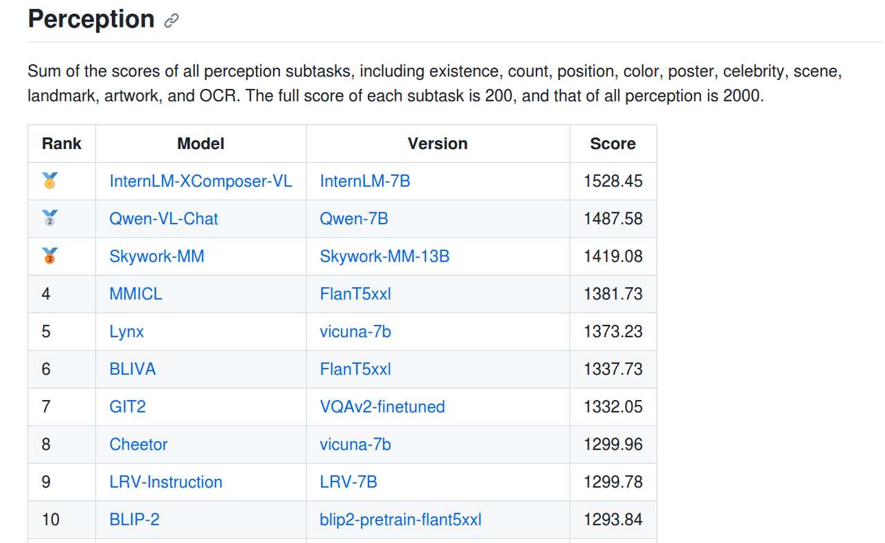
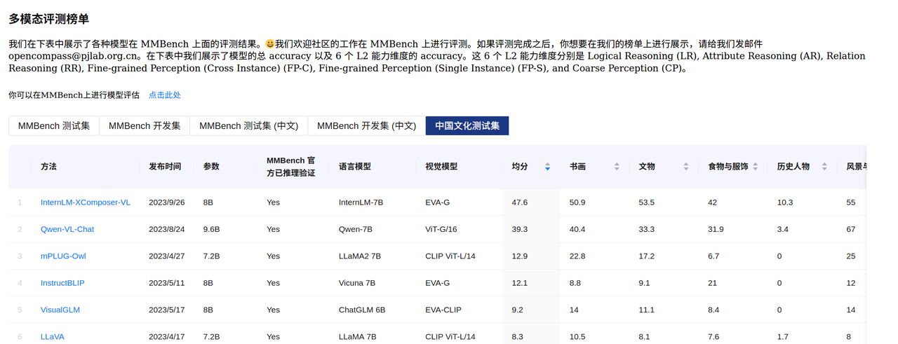

<p align="center">
    
<p>
<p align="center">
    <b><font size="6">InternLM-XComposer</font></b>
<p>

<div align="center">
        InternLM-XComposer <a href="">🤖 <a> <a href="">🤗</a>&nbsp ｜ InternLM-VL <a href="">🤖 <a> <a href="">🤗</a>&nbsp | Technical Report <a href=""> <a> 📄 

[English](./README.md) | [简体中文](./README_zh.md)

</div>

<br><br>


**InternLM-XComposer** is a vision-language large model (VLLM) based on [InternLM](https://github.com/InternLM/InternLM/tree/main) for advanced text-image comprehension and composition. InternLM-XComposer has serveal appealing properties:

- **Interleaved Text-Image Composition**: InternLM-XComposer can effortlessly generate coherent and contextual articles that seamlessly integrate images, providing a more engaging and immersive reading experience. The interleaved text-image composition is implemented in following steps:

    1. **Text Generation**: It crafts long-form text based on human-provided instructions.
    2. **Image Spoting and Captioning**: It pinpoints optimal locations for image placement and furnishes image descriptions.
    3. **Image Retrieval and Selection**: It select image candidates and identify the image that optimally complements the content.

- **Comprehension with Rich Multilingual Knowledge**: The text-image comprehension is empowered by training on extensive multi-modal multilingual concepts with carefully crafted strategies, resulting in a deep understanding of visual content.
- **Strong performance**: It consistently achieves state-of-the-art results across various benchmarks for vision-language large models, including [MME Benchmark](https://github.com/BradyFU/Awesome-Multimodal-Large-Language-Models/tree/Evaluation) (English), [MMBench](https://opencompass.org.cn/leaderboard-multimodal) (English), [Seed-Bench](https://huggingface.co/spaces/AILab-CVC/SEED-Bench_Leaderboard) (English), [ChineseBench]()(Chinese), and [MMBench-CN](https://opencompass.org.cn/leaderboard-multimodal) (Chineese).

We release InternLM-XComposer series in two versions:

- InternLM-XComposer-VL: The pretrained VLLM model with InternLM as the initialization of the LLM, achieving strong performance on various multimodal benchmarks, e.g., MMBench, MME, Seed-Bench, ChineseBench, and MMBench-CN.
- InternLM-XComposer: The finetuned VLLM for *Interleaved Text-Image Composition* and *LLM-based AI assistant*.
  <br>


<p align="center">
    <figcaption align = "center"><b> InternLM-XComposer </b></figcaption>
<p>


## News and Updates
* ```2023.9.27``` 🎉🎉🎉 The evaluation code of **InternLM-XComposer-VL-7B** are publicly available.
* ```2023.9.27``` 🎉🎉🎉 **InternLM-XComposer-7B** and **InternLM-XComposer-VL-7B** are publicly available on ModelScope and Hugging Face. 
* ```2023.9.27``` 🎉🎉🎉 We release a [technical report]() for more details of our model series.
<br>

## Evaluation

We evaluate InternLM-VL on five multimodal benchmarks: [MMBench](https://opencompass.org.cn/leaderboard-multimodal), [MME](https://github.com/BradyFU/Awesome-Multimodal-Large-Language-Models/tree/Evaluation), [Seed-Bench](https://huggingface.co/spaces/AILab-CVC/SEED-Bench_Leaderboard) in the English language, [ChineseBench](), [MMBench-CN](https://opencompass.org.cn/leaderboard-multimodal) in the simplified chinese language.

   - [MME Benchmark](https://github.com/BradyFU/Awesome-Multimodal-Large-Language-Models/tree/Evaluation): A comprehensive evaluation benchmark for multimodal large language models with 14 subtasks.
   - [MMBench](https://opencompass.org.cn/leaderboard-multimodal): A comprehensive evaluation pipeline comprised of meticulously curated multimodal dataset and a novel circulareval strategy using ChatGPT.
   - [MMBench-CN](https://opencompass.org.cn/leaderboard-multimodal): A simplified chinese language version of [MMBench](https://opencompass.org.cn/leaderboard-multimodal).
   - [Seed-Bench](https://huggingface.co/spaces/AILab-CVC/SEED-Bench_Leaderboard): A multimodal benchmark of 19K multiple-choice questions with accurate human annotations for evaluating Multimodal LLMs.
   - [ChineseBench](): A multimodal benchmark for chinese language and knowledge comprehension.

InternLM-VL outperforms existing vision-language large models on **all the five benchmarks**, demonstrating stronger multilingual comprehension ability.


### MME Benchmark

[MME](https://github.com/BradyFU/Awesome-Multimodal-Large-Language-Models/tree/Evaluation) is a comprehensive evaluation benchmark for multimodal large language models. It measures both perception and cognition abilities on a total of 14 subtasks, including existence, count, position, color, poster, celebrity, scene, landmark, artwork, OCR, commonsense reasoning, numerical calculation, text translation, and code reasoning.

InternLM-VL achieves SOTAs on overall performance evaluation. See more details on [HERE](eval_mm/mme/EVAL_MME.md).

<p align="center">
    
<p>
<p align="center">
    
<p>


### MMBench & MMBench-CN

[MMBench](https://opencompass.org.cn/leaderboard-multimodal) is a comprehensive evaluation pipeline comprised of meticulously curated multimodal dataset and a novel circulareval strategy using ChatGPT. It is comprised of 20 ability dimensions defined by MMBench. See more details on [HERE](eval_mm/mmbench/EVAL_MMBench.md).

<p align="center">
    
<p>

<p align="center">
    
<p>

  - InternLM-VL performs **SOTA**.

### SEED-Bench

[SEED-Bench](https://huggingface.co/spaces/AILab-CVC/SEED-Bench_Leaderboard) is a multimodal benchmark of 19K multiple-choice questions with accurate human annotations for evaluating Multimodal LLMs, covering 12 evaluation dimensions including both **image** and **video** understanding. See more details on [HERE](eval_mm/seed_bench/EVAL_SEED.md).

InternLM-VL achieves SOTAs on this benchmark for images.

<p align="center">
    
<p>

### ChineseCultureBench

[ChineseCultureBench]() is a benchmark for chinese language and knowledge comprehension. See more details on [HERE](eval_mm/seed_bench/EVAL_SEED.md).

<p align="center">
    
<p>

- InternLM-VL performs **SOTA** on chinese language and knowledge.

## Requirements

* python 3.8 and above
* pytorch 1.12 and above, 2.0 and above are recommended
* CUDA 11.4 and above are recommended (this is for GPU users)
  <br>

## Installation

Before running the code, make sure you have setup the environment and installed the required packages. Make sure you meet the above requirements, and then install the dependent libraries.
Please refer to the [installation instructions](docs/install.md)

## Quickstart

Below, we provide simple examples to show how to use InternLM-VL and InternLM-XComposer with 🤖 ModelScope and 🤗 Transformers.

Now you can start with ModelScope or Transformers.

#### 🤗 Transformers

To use InternLM-XComposer for the inference, all you need to do is to input a few lines of codes as demonstrated below. However, **please make sure that you are using the latest code.**

```python
import torch
from transformers import AutoModel, AutoTokenizer

torch.set_grad_enabled(False)

# init model and tokenizer
model = AutoModel.from_pretrained('chat', trust_remote_code=True).cuda().eval()
tokenizer = AutoTokenizer.from_pretrained('chat', trust_remote_code=True)
model.tokenizer = tokenizer

# example image
image = 'examples/images/aiyinsitan.jpg'

# Single-Turn Pure-Text Dialogue
text = '请介绍下爱因斯坦的生平'
response = model.generate(text)
# '阿尔伯特·爱因斯坦（Albert Einstein，1879年3月14日－1955年4月18日），德国裔瑞士籍物理学家。他创立了现代物理学的两大支柱理论：
# 相对论和量子力学， 而质能等价公式E=mc2便是他的相对论思想的明证，因而被公认为是继伽利略、牛顿之后最伟大的物理学家。
# 1999年，爱因斯坦被美国《时代周刊》评选为20世纪的“世纪人物”，他在物理学上的贡献，使他在世界各地受到人们的尊敬。'

# Single-Turn Text-Image Dialogue
text = '请问这张图片里面的人是谁？并介绍下他。'
image = 'examples/images/aiyinsitan.jpg'
response = model.generate(text, image)
# 图片中的男子是阿尔伯特·爱因斯坦（Albert Einstein），一位著名的物理学家和理论物理学家。他于1879年3月14日出生于德国巴登-符腾堡州的乌尔姆市，
# 1955 年4月18日逝世于美国新泽西州普林斯顿市。爱因斯坦在20世纪初提出了狭义相对论和广义相对论，对现代物理学的发展产生了深远影响。

# Multi-Turn Text-Image Dialogue
# 1st turn
text = '图片里面的是谁？'
response, history = model.chat(text=text, image=image, history=None)
# 阿尔伯特·爱因斯坦。

# 2nd turn
text = '他有哪些成就?'
response, history = model.chat(text=text, image=None, history=history)
# 阿尔伯特·爱因斯坦是20世纪最伟大的物理学家之一，他提出了狭义相对论和广义相对论，对现代物理学的发展产生了深远影响。
# 此外，他还提出了著名的质能方程E=mc²，为核能的开发提供了理论基础。

# 3rd turn
text = '他是最伟大的物理学家吗?'
response, history = model.chat(text=text, image=None, history=history)
# 是的，阿尔伯特·爱因斯坦是20世纪最伟大的物理学家之一。
```

## Demo

### Web UI

We provide code for users to build a web UI demo.

Run the command below and click on the generated link:

```
python examples/web_demo.py
```

<br>

## Citation

If you find our paper and code useful in your research, please consider giving a star :star: and citation :pencil: :)

```BibTeX
@article{InternLM-XComposer,
  title={InternLM-XComposer: A Vision-Language Large Model for Advanced Text-image Comprehension and Composition},
  author={},
  journal={},
  year={2023}
}
```

<br>

## Contact Us

The code is licensed under Apache-2.0, while model weights are fully open for academic research and also allow free commercial usage. To apply for a commercial license, please fill in the application form (English)/申请表（中文）. For other questions or collaborations, please contact internlm@pjlab.org.cn.
