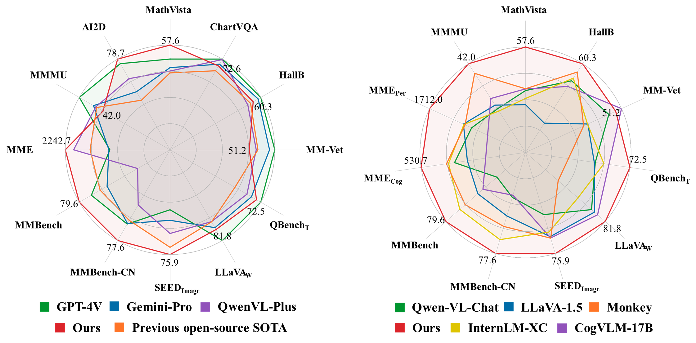

<p align="center">
    
</p>
<p align="center">
    <b><font size="6">InternLM-XComposer2</font></b>
</p>


<!-- <div align="center">
        InternLM-XComposer <a href="">🐼 <a> <a href="">🤖 <a> <a href="">🤗</a>&nbsp ｜ InternLM-VL <a href="">🤖 <a> <a href="">🤗</a>&nbsp | Technical Report <a href=""> <a> 📄  -->

<div align="center">
        InternLM-XComposer2 <a href="https://huggingface.co/internlm/internlm-xcomposer2-7b">🤗</a> <a href="https://modelscope.cn/models/Shanghai_AI_Laboratory/internlm-xcomposer2-7b"></a> &nbsp｜ InternLM-XComposer2-VL <a href="https://huggingface.co/internlm/internlm-xcomposer2-vl-7b">🤗</a> <a href="https://modelscope.cn/models/Shanghai_AI_Laboratory/internlm-xcomposer2-vl-7b"></a> &nbsp | Technical Report <a href="">  📄 </a>

[English](./README.md) | [简体中文](./README_CN.md)

</div>

<p align="center">
    Thanks the community for <a href="https://huggingface.co/spaces/Willow123/InternLM-XComposer">HuggingFace Demo </a>  of InternLM-XComposer2.
</p> 

<p align="center">
    👋 join us on <a href="https://discord.gg/xa29JuW87d" target="_blank">Discord</a> and <a href="https://github.com/InternLM/InternLM/assets/25839884/a6aad896-7232-4220-ac84-9e070c2633ce" target="_blank">WeChat</a>
</p>

<br>

## Multimodal Projects of Our Team

> [**InternLM-XComposer2**](https://github.com/InternLM/InternLM-XComposer): **Mastering Free-form Text-Image Composition and Comprehension in Vision-Language Large Models**

> [**InternLM-XComposer**](https://github.com/InternLM/InternLM-XComposer/tree/main/InternLM-XComposer-1.0): **A Vision-Language Large Model for Advanced Text-image Comprehension and Composition**

> [**ShareGPT4V**](https://github.com/InternLM/InternLM-XComposer/tree/main/projects/ShareGPT4V): **Improving Large Multi-modal Models with Better Captions**

</br>

**InternLM-XComposer2** is a groundbreaking vision-language large model (VLLM) based on [InternLM2-7B](https://github.com/InternLM/InternLM/tree/main) excelling in free-form text-image composition and comprehension. It boasts several amazing capabilities and applications:

- **Free-form Interleaved Text-Image Composition**: InternLM-XComposer2 can effortlessly generate coherent and contextual articles with interleaved images following diverse inputs like outlines, detailed text requirements and reference images, enabling highly customizable content creation.

- **Accurate Vision-language Problem-solving**: InternLM-XComposer2 accurately handles diverse and challenging vision-language Q&A tasks based on free-form instructions, excelling in recognition, perception, detailed captioning, visual reasoning, and more.

- **Awesome performance**: InternLM-XComposer2 based on InternLM2-7B not only significantly outperforms existing open-source multimodal models in 13 benchmarks but also **matches or even surpasses GPT-4V and Gemini Pro in 6 benchmarks**

<p align="center">
    
</p>


We release InternLM-XComposer2 series in two versions:

- **InternLM-XComposer2-VL-7B** <a href="https://huggingface.co/internlm/internlm-xcomposer2-7b">🤗</a> <a href="https://modelscope.cn/models/Shanghai_AI_Laboratory/internlm-xcomposer2-7b"><a href="https://modelscope.cn/models/Shanghai_AI_Laboratory/internlm-xcomposer-vl2-7b"> </a>: The multi-task trained VLLM model with InternLM-7B as the initialization of the LLM for *VL benchmarks* and *AI assistant*. **It ranks as the most powerful vision-language model based on 7B-parameter level LLMs, leading across 13 benchmarks.**

- **InternLM-XComposer2-7B** <a href="https://huggingface.co/internlm/internlm-xcomposer2-vl-7b">🤗</a> <a href="https://modelscope.cn/models/Shanghai_AI_Laboratory/internlm-xcomposer-vl2-7b"><a href="https://modelscope.cn/models/Shanghai_AI_Laboratory/internlm-xcomposer-vl2-7b"> </a>: The further instruction tuned VLLM for *Interleaved Text-Image Composition* with free-form inputs.

Please refer to [Technical Report]() for more details.
  <br>

<!-- 
<p align="center">
    <figcaption align = "center"><b> InternLM-XComposer </b></figcaption>
<p> -->


<!-- https://github.com/InternLM/InternLM-XComposer/assets/22662425/fdb89a38-c650-45f2-b5b7-51182e89a5cc -->

## Demo Video

<video src='https://openxlab.oss-cn-shanghai.aliyuncs.com/xcomposer-writer/InternLM_XComposer_demo_CN.mp4' controls='' height=540 width=960>
</video>


<!-- Please refer to [Chinese Demo](https://github.com/InternLM/InternLM-XComposer/blob/main/README_CN.md#demo) for the demo of the Chinese version. -->


## News and Updates
* ```2023.01.26``` 🎉🎉🎉 The [evaluation code](./evaluation/) of **InternLM-XComposer-VL-7B** are publicly available.
* ```2023.01.26``` 🎉🎉🎉 [InternLM-XComposer2-7B](https://huggingface.co/internlm/internlm-xcomposer2-7b) and [InternLM-XComposer-VL2-7B](https://huggingface.co/internlm/internlm-xcomposer2-vl-7b) are publicly available on **Hugging Face** and **ModelScope**. 
* ```2023.01.26``` 🎉🎉🎉 We release a [technical report]() for more details of InternLM-XComposer2 series.
* ```2023.11.22``` 🎉🎉🎉 We release the [ShareGPT4V](https://github.com/InternLM/InternLM-XComposer/tree/main/projects/ShareGPT4V), a large-scale highly descriptive image-text dataset generated by GPT4-Vision and a superior large multimodal model, ShareGPT4V-7B.
* ```2023.10.30``` 🎉🎉🎉 InternLM-XComposer-VL achieved the top 1 ranking in both [Q-Bench](https://github.com/Q-Future/Q-Bench/tree/master/leaderboards#overall-leaderboards) and [Tiny LVLM](https://github.com/OpenGVLab/Multi-Modality-Arena/tree/main/tiny_lvlm_evaluation).
* ```2023.10.19``` 🎉🎉🎉 Support for inference on multiple GPUs. Two 4090 GPUs are sufficient for deploying our demo.
* ```2023.10.12``` 🎉🎉🎉 4-bit demo is supported, model files are available in [Hugging Face](https://huggingface.co/internlm/internlm-xcomposer-7b-4bit) and [ModelScope](https://modelscope.cn/models/Shanghai_AI_Laboratory/internlm-xcomposer-7b-4bit).
* ```2023.10.8``` 🎉🎉🎉 [InternLM-XComposer-7B](https://modelscope.cn/models/Shanghai_AI_Laboratory/internlm-xcomposer-7b) and [InternLM-XComposer-VL-7B](https://modelscope.cn/models/Shanghai_AI_Laboratory/internlm-xcomposer-vl-7b) are publicly available on **ModelScope**. 
* ```2023.9.27``` 🎉🎉🎉 The [evaluation code](./evaluation/) of **InternLM-XComposer-VL-7B** are publicly available.
* ```2023.9.27``` 🎉🎉🎉 [InternLM-XComposer-7B](https://huggingface.co/internlm/internlm-xcomposer-7b) and [InternLM-XComposer-VL-7B](https://huggingface.co/internlm/internlm-xcomposer-vl-7b) are publicly available on **Hugging Face**. 
* ```2023.9.27``` 🎉🎉🎉 We release a [technical report](https://arxiv.org/pdf/2309.15112.pdf) for more details of our model series.
</br>


## Evaluation

We evaluate InternLM-XComposer2-VL on 12 multimodal benchmarks: [MathVista](https://mathvista.github.io/), [MMMU](https://mmmu-benchmark.github.io/), [AI2D](https://prior.allenai.org/projects/diagram-understanding), [MME](https://github.com/BradyFU/Awesome-Multimodal-Large-Language-Models/tree/Evaluation), [MMBench](https://opencompass.org.cn/leaderboard-multimodal), [MMBench-CN](https://opencompass.org.cn/leaderboard-multimodal), [SEED-Bench](https://huggingface.co/spaces/AILab-CVC/SEED-Bench_Leaderboard), [QBench](https://github.com/Q-Future/Q-Bench/tree/master/leaderboards#overall-leaderboards), [HallusionBench](https://github.com/tianyi-lab/HallusionBench), [ChartQA](https://github.com/vis-nlp/ChartQA), [MM-Vet](https://github.com/yuweihao/MM-Vet), [LLaVA-in-the-wild](https://github.com/haotian-liu/LLaVA), [POPE](https://github.com/AoiDragon/POPE).


See [Evaluation Details](./evaluation/README.md) here.

### Compared with closed-source APIs and previous SOTAs.
|               | MathVista | AI2D   | MMMU  | MME    | MMB    | MMBCN  | SEEDI | LLaVAW | QBenchT | MM-Vet | HallB  | ChartVQA  |
|---------------|-----------|--------|-------|--------|--------|--------|-------|--------|---------|--------|--------|-----------|
|  Open-source Previous  SOTA | SPH-MOE   | Monkey | Yi-VL | WeMM   | L-Int2 | L-Int2 | SPH-2 | CogVLM | Int-XC  | CogVLM | Monkey | CogAgent  |
|    | 8x7B      | 10B    | 34B   | 6B     | 20B    | 20B    | 17B   | 17B    | 8B      | 30B    | 10B    | 18B       |
|  | 42.3      | 72.6   | 45.9  | 2066.6 | 75.1   | 73.7   | 74.8  | 73.9   | 64.4    | 56.8   | 58.4   | 68.4      |
|               |           |        |       |        |        |        |       |        |         |        |        |           |
| GPT-4V        | 49.9      | 78.2   | 56.8  | 1926.5 | 77     | 74.4   | 69.1  | 93.1   | 74.1    | 67.7   | 65.8   | 78.5      |
| Gemini-Pro    | 45.2      | 73.9   | 47.9  | 1933.3 | 73.6   | 74.3   | 70.7  | 79.9   | 70.6    | 64.3   | 63.9   | 74.1      |
| QwenVL-Plus   | 43.3      | 75.9   | 46.5  | 2183.3 | 67     | 70.7   | 72.7  | 73.7   | 68.9    | 55.7   | 56.4   | 78.1      |
| Ours          | 57.6      | 78.7   | 42    | 2242.7 | 79.6   | 77.6   | 75.9  | 81.8   | 72.5    | 51.2   | 60.3   | 72.6      |


### Compared with open-source methods.
| Method       | LLM          | MathVista | MMMU | MMEP     | MMEC  | MMB  | MMBCN | SEEDI | LLaVAW | QBenchT | MM-Vet | HallB  | POPE  |
|--------------|--------------|-----------|------|----------|-------|------|-------|-------|--------|---------|--------|--------|--------|
| BLIP-2       | FLAN-T5      | -         | 35.7 | 1,293.8  | 290.0 | -    | -     | 46.4  | 38.1   | -       | 22.4   | -      | -      |
| InstructBLIP | Vicuna-7B    | 25.3      | 30.6 | -        | -     | 36.0 | 23.7  | 53.4  | 60.9   | 55.9    | 26.2   | 53.6   | 78.9   |
| IDEFICS-80B  | LLaMA-65B    | 26.2      | 24.0 | -        | -     | 54.5 | 38.1  | 52.0  | 56.9   | -       | 39.7   | 46.1   | -      |
| Qwen-VL-Chat | Qwen-7B      | 33.8      | 35.9 | 1,487.5  | 360.7 | 60.6 | 56.7  | 58.2  | 67.7   | 61.7    | 47.3   | 56.4   | -      |
| LLaVA        | Vicuna-7B    | 23.7      | 32.3 | 807.0    | 247.9 | 34.1 | 14.1  | 25.5  | 63.0   | 54.7    | 26.7   | 44.1   | 80.2      |
| LLaVA-1.5    | Vicuna-13B   | 26.1      | 36.4 | 1,531.3  | 295.4 | 67.7 | 63.6  | 68.2  | 70.7   | 61.4    | 35.4   | 46.7   | 85.9      |
| ShareGPT4V   | Vicuna-7B    | 25.8      | 36.6 | 1,567.4  | 376.4 | 68.8 | 62.2  | 69.7  | 72.6   | -       | 37.6   | 49.8   | -      |
| CogVLM-17B   | Vicuna-7B    | 34.7      | 37.3 | -        | -     | 65.8 | 55.9  | 68.8  | 73.9   | -       | 54.5   | 55.1   | -      |
| LLaVA-XTuner | InernLM2-20B | 24.6      | 39.4 | -        | -     | 75.1 | 73.7  | 70.2  | 63.7   | -       | 37.2   | 47.7   | -      |
| Monkey-10B   | Qwen-7B      | 34.8      | 40.7 | 1,522.4 | 401.4 | 72.4 | 67.5  | 68.9  | 33.5   | -       | 33.0     | 58.4   | -      |
| InternLM-XC  | InernLM-7B   | 29.5      | 35.6 | 1,528.4  | 391.1 | 74.4 | 72.4  | 66.1  | 53.8   | 64.4    | 35.2   | 57.0   | -      |
| Ours         | InernLM2-7B  | 57.6      | 43.0 | 1,712.0  | 530.7 | 79.6 | 77.6  | 75.9  | 81.8   | 72.5    | 51.2   | 59.1   | 87.7    |


## Requirements

* python 3.8 and above
* pytorch 1.12 and above, 2.0 and above are recommended
* CUDA 11.4 and above are recommended (this is for GPU users)
  <br>

## Installation

Before running the code, make sure you have setup the environment and installed the required packages. Make sure you meet the above requirements, and then install the dependent libraries.
Please refer to the [installation instructions](docs/install.md)

## Quickstart

We provide a simple example to show how to use InternLM-XComposer with 🤗 Transformers.

<details>
  <summary>
    <b>🤗 Transformers</b>
  </summary>

```python
import torch
from transformers import AutoModel, AutoTokenizer

torch.set_grad_enabled(False)

# init model and tokenizer
model = AutoModel.from_pretrained('internlm/internlm-xcomposer2-vl-7b', trust_remote_code=True).cuda().eval()
tokenizer = AutoTokenizer.from_pretrained('internlm/internlm-xcomposer2-vl-7b', trust_remote_code=True)  
 
text = '<ImageHere>Please describe this image in detail.'
image = 'examples/image1.webp'
with torch.cuda.amp.autocast(): 
  response, _ = model.chat(tokenizer, query=query, image=image, history=[], do_sample=False) 
print(response)
#The image features a quote by Oscar Wilde, "Live life with no excuses, travel with no regret," 
# set against a backdrop of a breathtaking sunset. The sky is painted in hues of pink and orange, 
# creating a serene atmosphere. Two silhouetted figures stand on a cliff, overlooking the horizon. 
# They appear to be hiking or exploring, embodying the essence of the quote. 
# The overall scene conveys a sense of adventure and freedom, encouraging viewers to embrace life without hesitation or regrets.

```
</details>


<details>
  <summary>
    <b>🤖 ModelScope</b>
  </summary>

```python
import torch
from modelscope import snapshot_download, AutoModel, AutoTokenizer

torch.set_grad_enabled(False)

# init model and tokenizer
model_dir = snapshot_download('Shanghai_AI_Laboratory/internlm-xcomposer2-vl-7b')
model = AutoModel.from_pretrained(model_dir, trust_remote_code=True).cuda().eval()
tokenizer = AutoTokenizer.from_pretrained(model_dir, trust_remote_code=True)
model.tokenizer = tokenizer

text = '<ImageHere>Please describe this image in detail.'
image = 'examples/image1.webp'
with torch.cuda.amp.autocast(): 
  response, _ = model.chat(tokenizer, query=query, image=image, history=[], do_sample=False) 
print(response)
#The image features a quote by Oscar Wilde, "Live life with no excuses, travel with no regret," 
# set against a backdrop of a breathtaking sunset. The sky is painted in hues of pink and orange, 
# creating a serene atmosphere. Two silhouetted figures stand on a cliff, overlooking the horizon. 
# They appear to be hiking or exploring, embodying the essence of the quote. 
# The overall scene conveys a sense of adventure and freedom, encouraging viewers to embrace life without hesitation or regrets.
```
</details>
 

## Web UI


Thanks the community for 3rd-party <a href="https://github.com/InternLM/InternLM-XComposer/pull/37">HuggingFace Demo </a>


We provide code for users to build a web UI demo.

Please run the command below for Composition / Chat:

```
# For Free-form Text-Image Composition
python examples/gradio_demo_composition.py

# For Multimodal Chat
python examples/gradio_demo_chat.py
```
The user guidance of UI demo is given in [HERE](demo_asset/demo.md). If you wish to change the default folder of the model, please use the `--folder=new_folder` option.
<br>

## Citation

If you find our paper and code useful in your research, please consider giving a star :star: and citation :pencil: :)

```BibTeX
@misc{zhang2023internlmxcomposer,
      title={InternLM-XComposer: A Vision-Language Large Model for Advanced Text-image Comprehension and Composition}, 
      author={Pan Zhang and Xiaoyi Dong and Bin Wang and Yuhang Cao and Chao Xu and Linke Ouyang and Zhiyuan Zhao and Shuangrui Ding and Songyang Zhang and Haodong Duan and Wenwei Zhang and Hang Yan and Xinyue Zhang and Wei Li and Jingwen Li and Kai Chen and Conghui He and Xingcheng Zhang and Yu Qiao and Dahua Lin and Jiaqi Wang},
      year={2023},
      eprint={2309.15112},
      archivePrefix={arXiv},
      primaryClass={cs.CV}
}
```

<br>

## License & Contact Us

The code is licensed under Apache-2.0, while model weights are fully open for academic research and also allow free commercial usage. To apply for a commercial license, please fill in the application form (English)/申请表（中文）. For other questions or collaborations, please contact internlm@pjlab.org.cn.
