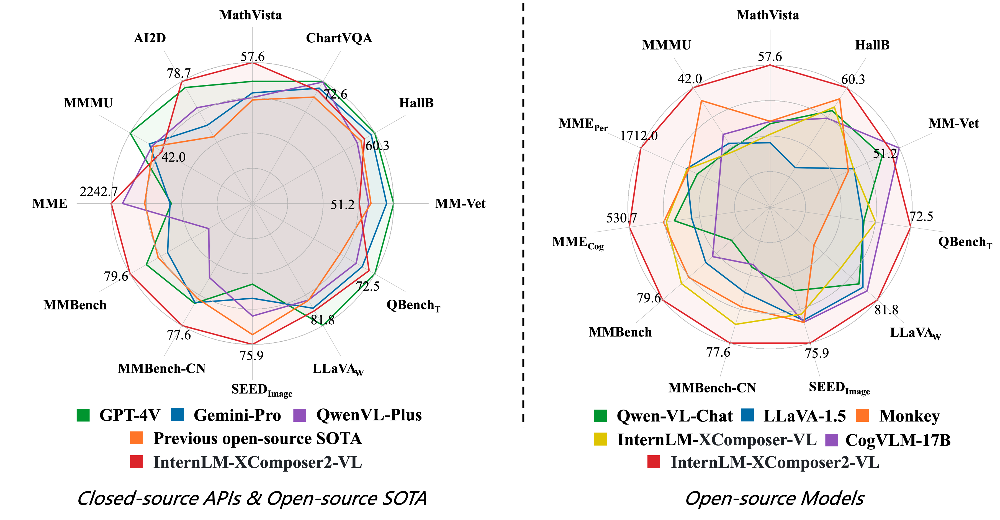

<p align="center">
    
</p>
<p align="center">
    <b><font size="6">InternLM-XComposer-2.5</font></b>
</p>


<div align="center">
        InternLM-XComposer2.5 <a href="https://huggingface.co/internlm/internlm-xcomposer2d5-7b">🤗</a> <a href="https://modelscope.cn/models/Shanghai_AI_Laboratory/internlm-xcomposer2d5-7b"></a> &nbsp｜ XComposer2.5 Technical Report <a href="https://arxiv.org/abs/2407.03320">  📄 </a>  
 

[English](./README.md) | [简体中文](./README_CN.md)

</div>

<p align="center">
    Thanks the community for <a href="https://huggingface.co/spaces/Willow123/InternLM-XComposer">HuggingFace Demo </a>  | <a href="https://openxlab.org.cn/apps/detail/WillowBreeze/InternLM-XComposer">OpenXLab Demo</a> of InternLM-XComposer-2.5.
</p>

<p align="center">
    👋 join us on <a href="https://discord.gg/xa29JuW87d" target="_blank">Discord</a> and <a href="https://r.vansin.top/?r=internwx" target="_blank">WeChat</a>
</p>

<p align="center">
<a href="https://trendshift.io/repositories/5245" target="_blank"></a>
</p>

<br>

## 🔥🔥🔥 **InternLM-XComposer2.5-Reward**

We release **InternLM-XComposer2.5-Reward** <a href="https://huggingface.co/internlm/internlm-xcomposer2d5-7b-reward">🤗</a> (IXC-2.5-Reward, ACL 2025 Findings), a simple yet effective multi-modal reward model, including training code, evaluation scripts, and parts of the traininig data. Please refer to the [project page](InternLM-XComposer-2.5-Reward) for details.

## 🔥🔥🔥 **InternLM-XComposer2.5-OmniLive**

We release **InternLM-XComposer2.5-OmniLive**, a comprehensive multimodal system for long-term streaming video and audio interactions. Please refer to the [project page](InternLM-XComposer-2.5-OmniLive) for details.

<br>

## Multimodal Projects of Our Team
> [**InternLM-XComposer-2.5-Reward**](https://arxiv.org/pdf/2501.xxxxx): **A Simple Yet Effective Multi-Modal Reward Model**

> [**InternLM-XComposer-2.5-OmniLive**](): **A Specialized Generalist Multimodal System for Streaming Video and Audio Interactions**

> [**InternLM-XComposer-2.5**](https://arxiv.org/pdf/2407.03320): **A Versatile Large Vision Language Model Supporting Long-Contextual Input and Output**

> [**InternLM-XComposer2-**](https://github.com/InternLM/InternLM-XComposer): **A Pioneering Large Vision-Language Model Handling Resolutions from 336 Pixels to 4K HD**

> [**InternLM-XComposer2**](https://github.com/InternLM/InternLM-XComposer): **Mastering Free-form Text-Image Composition and Comprehension in Vision-Language Large Models**

> [**InternLM-XComposer**](https://github.com/InternLM/InternLM-XComposer/tree/main/InternLM-XComposer-1.0): **A Vision-Language Large Model for Advanced Text-image Comprehension and Composition**

> [**ShareGPT4Video:**](https://github.com/InternLM/InternLM-XComposer/tree/main/projects/ShareGPT4Video) **Improving Video Understanding and Generation with Better Captions**

> [**ShareGPT4V:**](https://github.com/InternLM/InternLM-XComposer/tree/main/projects/ShareGPT4V) **Improving Large Multi-modal Models with Better Captions**

> [**MMDU:**](https://liuziyu77.github.io/MMDU/) **A Multi-Turn Multi-Image Dialog Understanding Benchmark and Instruction-Tuning Dataset for LVLMs**

> [**DualFocus**](https://github.com/InternLM/InternLM-XComposer/tree/main/projects/DualFocus): **Integrating Macro and Micro Perspectives in Multi-modal Large Language Models**

</br>

**InternLM-XComposer-2.5** excels in various text-image comprehension and composition applications, achieving GPT-4V level capabilities with merely 7B LLM backend. IXC-2.5 is trained with 24K interleaved image-text contexts, it can seamlessly extend to 96K long contexts via RoPE extrapolation. This long-context capability allows IXC-2.5 to perform exceptionally well in tasks requiring extensive input and output contexts. 

- **Ultra-High Resolution Understanding**: IXC-2.5 enhances the dynamic resolution solution proposed in IXC2-4KHD with a native 560 × 560 ViT vision encoder, supporting high-resolution images with any aspect ratio.

- **Fine-Grained Video Understanding**: IXC-2.5 treats videos as a ultra-high-resolution composite picture consisting of tens to hundreds of frames, allowing it to capture fine details through dense sampling and higher resolution for each frame.

- **Multi-Turn Multi-Image Dialogue**: IXC-2.5 supports free-form multi-turn multi-image dialogue, allowing it to naturally interact with humans in multi-round conversations. 

- **Webpage Crafting**: IXC-2.5 can be readily applied to create webpages by composing source code (HTML, CSS, and JavaScript) following text-image instructions.

- **Composing High-Quality Text-Image Articles**: IXC-2.5 leverages specially designed Chain-of-Thought (CoT) and Direct Preference Optimization (DPO) techniques to significantly enhance the quality of its written content. 

- **Awesome performance**: IXC-2.5 has been evaluated on 28 benchmarks, outperforming existing open-source state-of-the-art models on 16 benchmarks. It also surpasses or competes closely with GPT-4V and Gemini Pro on 16 key tasks. 

<p align="center">
    
</p>
  

Please refer to [Technical Report](https://arxiv.org/abs/2407.03320)  for more details.
<br>
 

## Demo Video
🔥 For the best experience, please keep the audio on while enjoying the video.

[https://github.com/InternLM/InternLM-XComposer/assets/147793160/8206f07f-3166-461e-a631-9cbcdec6ae75](https://github.com/InternLM/InternLM-XComposer/assets/147793160/8206f07f-3166-461e-a631-9cbcdec6ae75)

[Youtube Video](https://youtu.be/8tYpiQNOJww)


Please refer to [Chinese Demo](./README_CN.md#demo) for the demo of the Chinese version.

## News and Updates
- `2024.12.12` 🎉🎉🎉 [InternLM-XComposer2.5-7B-Reward](https://huggingface.co/internlm/internlm-xcomposer2d5-7b-reward) is publicly available.
- `2024.12.12` 🎉🎉🎉 [InternLM-XComposer2.5-OmniLive-7B](https://huggingface.co/internlm/internlm-xcomposer2d5-ol-7b) is publicly available.
- `2024.07.15` 🎉🎉🎉 [ModelScope Swift](https://github.com/InternLM/lmdeploy/blob/main/docs/en/multi_modal/xcomposer2d5.md) supports InternLM-XComposer2.5-7B for finetuning and inference.
- `2024.07.15` 🎉🎉🎉 [LMDepoly](https://github.com/InternLM/lmdeploy/blob/main/docs/en/multi_modal/xcomposer2d5.md) supports InternLM-XComposer2.5-7B for 4 bit quantization and inference.
- `2024.07.15` 🎉🎉🎉 [InternLM-XComposer2.5-7B-4bit](https://huggingface.co/internlm/internlm-xcomposer2d5-7b-4bit) is publicly available.
- `2024.07.03` 🎉🎉🎉 [InternLM-XComposer2.5-7B](https://huggingface.co/internlm/internlm-xcomposer2d5-7b) is publicly available.
- `2024.07.02` 🎉🎉🎉 [InternLM-XComposer2-4KHD-7B](https://huggingface.co/internlm/internlm-xcomposer2-4khd-7b) achieves the state-of-the-art results on the [MindBench](https://arxiv.org/abs/2407.02842) dataset, which is a comprehensive benchmark for mind map structure recognition and analysis.
- `2024.07.01` 🎉🎉🎉 [ShareGPT4V](https://github.com/InternLM/InternLM-XComposer/tree/main/projects/ShareGPT4V) is accepted by ECCV2024.
- `2024.04.22` 🎉🎉🎉 The [finetune code](./finetune/) of **InternLM-XComposer2-VL-7B-4KHD-7B** are publicly available.
- `2024.04.09` 🎉🎉🎉 [InternLM-XComposer2-4KHD-7B](https://huggingface.co/internlm/internlm-xcomposer2-4khd-7b) and [evaluation code](./evaluation/README.md) are publicly available.
- `2024.04.09` 🎉🎉🎉 [InternLM-XComposer2-VL-1.8B](https://huggingface.co/internlm/internlm-xcomposer2-vl-1_8b) is publicly available.
- `2024.02.22` 🎉🎉🎉 We release [DualFocus](https://github.com/InternLM/InternLM-XComposer/tree/main/projects/DualFocus), a framework for integrating macro and micro perspectives within MLLMs to enhance vision-language task performance.

* `2024.02.06` 🎉🎉🎉 [InternLM-XComposer2-7B-4bit](https://huggingface.co/internlm/internlm-xcomposer2-7b-4bit) and [InternLM-XComposer-VL2-7B-4bit](https://huggingface.co/internlm/internlm-xcomposer2-vl-7b-4bit) are publicly available on **Hugging Face** and **ModelScope**.

- `2024.02.02` 🎉🎉🎉 The [finetune code](./finetune/) of **InternLM-XComposer2-VL-7B** are publicly available.
- `2024.01.26` 🎉🎉🎉 The [evaluation code](./evaluation/README.md) of **InternLM-XComposer2-VL-7B** are publicly available.
- `2024.01.26` 🎉🎉🎉 [InternLM-XComposer2-7B](https://huggingface.co/internlm/internlm-xcomposer2-7b) and [InternLM-XComposer-VL2-7B](https://huggingface.co/internlm/internlm-xcomposer2-vl-7b) are publicly available on **Hugging Face** and **ModelScope**.
- `2024.01.26` 🎉🎉🎉 We release a [technical report](https://arxiv.org/abs/2401.16420) for more details of InternLM-XComposer2 series.
- `2023.11.22` 🎉🎉🎉 We release the [ShareGPT4V](https://github.com/InternLM/InternLM-XComposer/tree/main/projects/ShareGPT4V), a large-scale highly descriptive image-text dataset generated by GPT4-Vision and a superior large multimodal model, ShareGPT4V-7B.
- `2023.10.30` 🎉🎉🎉 InternLM-XComposer-VL achieved the top 1 ranking in both [Q-Bench](https://github.com/Q-Future/Q-Bench/tree/master/leaderboards#overall-leaderboards) and [Tiny LVLM](https://github.com/OpenGVLab/Multi-Modality-Arena/tree/main/tiny_lvlm_evaluation).
- `2023.10.19` 🎉🎉🎉 Support for inference on multiple GPUs. Two 4090 GPUs are sufficient for deploying our demo.
- `2023.10.12` 🎉🎉🎉 4-bit demo is supported, model files are available in [Hugging Face](https://huggingface.co/internlm/internlm-xcomposer-7b-4bit) and [ModelScope](https://modelscope.cn/models/Shanghai_AI_Laboratory/internlm-xcomposer-7b-4bit).
- `2023.10.8` 🎉🎉🎉 [InternLM-XComposer-7B](https://modelscope.cn/models/Shanghai_AI_Laboratory/internlm-xcomposer-7b) and [InternLM-XComposer-VL-7B](https://modelscope.cn/models/Shanghai_AI_Laboratory/internlm-xcomposer-vl-7b) are publicly available on **ModelScope**.
- `2023.9.27` 🎉🎉🎉 The [evaluation code](./InternLM-XComposer-1.0/evaluation/) of **InternLM-XComposer-VL-7B** are publicly available.
- `2023.9.27` 🎉🎉🎉 [InternLM-XComposer-7B](https://huggingface.co/internlm/internlm-xcomposer-7b) and [InternLM-XComposer-VL-7B](https://huggingface.co/internlm/internlm-xcomposer-vl-7b) are publicly available on **Hugging Face**.
- `2023.9.27` 🎉🎉🎉 We release a [technical report](https://arxiv.org/pdf/2309.15112.pdf) for more details of our model series.
  </br>

## Model Zoo

| Model                           | Usage                                           | Transformers(HF)                                                                                   | ModelScope(HF)                                                                                                                                                                       | Release Date |
| ------------------------------- | ----------------------------------------------- | -------------------------------------------------------------------------------------------------- | ------------------------------------------------------------------------------------------------------------------------------------------------------------------------------------ | ------------ |
| **InternLM-XComposer-2.5**    | Video Understanding, Multi-image Multi-tune Dialog, 4K Resolution Understanding, Web Craft, Article creation,  Benchmark | [🤗internlm-xcomposer2.5](https://huggingface.co/internlm/internlm-xcomposer2d5-7b)       | [ internlm-xcomposer2.5](https://modelscope.cn/models/Shanghai_AI_Laboratory/internlm-xcomposer2d5-7b/summary)       | 2024-07-03   |
| **InternLM-XComposer2-4KHD**    | 4K Resolution Understanding, Benchmark, VL-Chat | [🤗internlm-xcomposer2-4khd-7b](https://huggingface.co/internlm/internlm-xcomposer2-4khd-7b)       | [ internlm-xcomposer2-4khd-7b](https://modelscope.cn/models/Shanghai_AI_Laboratory/internlm-xcomposer2-4khd-7b/summary)       | 2024-04-09   |
| **InternLM-XComposer2-VL-1.8B** | Benchmark, VL-Chat                              | [🤗internlm-xcomposer2-vl-1_8b](https://huggingface.co/internlm/internlm-xcomposer2-vl-1_8b)       | [ internlm-xcomposer2-vl-1_8b](https://modelscope.cn/models/Shanghai_AI_Laboratory/internlm-xcomposer2-vl-1_8b/summary)       | 2024-04-09   |
| **InternLM-XComposer2**         | Text-Image Composition                          | [🤗internlm-xcomposer2-7b](https://huggingface.co/internlm/internlm-xcomposer2-7b)                 | [ internlm-xcomposer2-7b](https://modelscope.cn/models/Shanghai_AI_Laboratory/internlm-xcomposer2-7b/summary)                 | 2024-01-26   |
| **InternLM-XComposer2-VL**      | Benchmark, VL-Chat                              | [🤗internlm-xcomposer2-vl-7b](https://huggingface.co/internlm/internlm-xcomposer2-vl-7b)           | [ internlm-xcomposer2-vl-7b](https://modelscope.cn/models/Shanghai_AI_Laboratory/internlm-xcomposer2-vl-7b/summary)           | 2024-01-26   |
| **InternLM-XComposer2-4bit**    | Text-Image Composition                          | [🤗internlm-xcomposer2-7b-4bit](https://huggingface.co/internlm/internlm-xcomposer2-7b-4bit)       | [ internlm-xcomposer2-7b-4bit](https://modelscope.cn/models/Shanghai_AI_Laboratory/internlm-xcomposer2-7b-4bit/summary)       | 2024-02-06   |
| **InternLM-XComposer2-VL-4bit** | Benchmark, VL-Chat                              | [🤗internlm-xcomposer2-vl-7b-4bit](https://huggingface.co/internlm/internlm-xcomposer2-vl-7b-4bit) | [ internlm-xcomposer2-vl-7b-4bit](https://modelscope.cn/models/Shanghai_AI_Laboratory/internlm-xcomposer2-vl-7b-4bit/summary) | 2024-02-06   |
| **InternLM-XComposer**          | Text-Image Composition, VL-Chat                 | [🤗internlm-xcomposer-7b](https://huggingface.co/internlm/internlm-xcomposer-7b)                   | [ internlm-xcomposer-7b](https://modelscope.cn/models/Shanghai_AI_Laboratory/internlm-xcomposer-7b/summary)                   | 2023-09-26   |
| **InternLM-XComposer-4bit**     | Text-Image Composition, VL-Chat                 | [🤗internlm-xcomposer-7b-4bit](https://huggingface.co/internlm/internlm-xcomposer-7b-4bit)         | [ internlm-xcomposer-7b-4bit](https://modelscope.cn/models/Shanghai_AI_Laboratory/internlm-xcomposer-7b-4bit/summary)         | 2023-09-26   |
| **InternLM-XComposer-VL**       | Benchmark                                       | [🤗internlm-xcomposer-vl-7b](https://huggingface.co/internlm/internlm-xcomposer-vl-7b)             | [ internlm-xcomposer-vl-7b](https://modelscope.cn/models/Shanghai_AI_Laboratory/internlm-xcomposer-vl-7b/summary)             | 2023-09-26   |

## Evaluation

We evaluate InternLM-XComposer-2.5 on 28 multimodal benchmarks, including image benchmarks [MMDU](https://github.com/Liuziyu77/MMDU), [MMStar](https://github.com/MMStar-Benchmark/MMStar), [RealWorldQA](https://x.ai/blog/grok-1.5v),  [Design2Code](https://salt-nlp.github.io/Design2Code/), [DocVQA](https://rrc.cvc.uab.es/?ch=17), [Infographics VQA](https://rrc.cvc.uab.es/?ch=17), [TextVQA](https://textvqa.org/), [ChartQA](https://github.com/vis-nlp/ChartQA), [OCRBench](https://github.com/Yuliang-Liu/MultimodalOCR), [DeepFrom](https://wandb.ai/stacey/deepform_v1/reports/DeepForm-Understand-Structured-Documents-at-Scale--VmlldzoyODQ3Njg), [WTQ](https://arxiv.org/abs/1508.00305), [VisualMRC](https://github.com/nttmdlab-nlp/VisualMRC), [TabFact](https://tabfact.github.io/), [MathVista](https://mathvista.github.io/), [MMMU](https://mmmu-benchmark.github.io/), [AI2D](https://prior.allenai.org/projects/diagram-understanding), [MME](https://github.com/BradyFU/Awesome-Multimodal-Large-Language-Models/tree/Evaluation), [MMBench](https://opencompass.org.cn/leaderboard-multimodal), [MMBench-CN](https://opencompass.org.cn/leaderboard-multimodal), [SEED-Bench](https://huggingface.co/spaces/AILab-CVC/SEED-Bench_Leaderboard), [HallusionBench](https://github.com/tianyi-lab/HallusionBench), [MM-Vet](https://github.com/yuweihao/MM-Vet), and video benchmarks [MVBench](https://github.com/OpenGVLab/Ask-Anything), [MLVU](https://github.com/FlagOpen/FlagEmbedding/tree/master/MLVU/evaluation), [Video-MME](https://github.com/BradyFU/Video-MME), [MMBench-Video](https://github.com/open-compass/VLMEvalKit), [TempCompass](https://github.com/llyx97/TempCompass)

See [Evaluation Details](./evaluation/README.md) here.

### Compared with closed-source APIs and previous SOTAs on Video and Structural High-resolution images.
|            | MVBench    | MLVU        | MME-Video | MMBench-Video | TempCompass | DocVQA      | ChartVQA    | InfoVQA     | TextVQA     | OCRBench | DeepForm   | WTQ        | VisualMRC  | TabFact     |
|------------|------------|-------------|-----------|---------------|-------------|-------------|-------------|-------------|-------------|----------|------------|------------|------------|-------------|
|            | VideoChat2 | InternVL1.5 | LIVA      | InternVL1.5   | Qwen-VL     | InternVL1.5 | InternVL1.5 | InternVL1.5 | InternVL1.5 | GLM-4v   | DocOwl 1.5 | DocOwl 1.5 | DocOwl 1.5 | DocOwl 1.5  |
|            | 7B         | 26B         | 34B       | 26B           | 7B          | 26B         | 26B         | 26B         | 26B         | 9B       | 8B         | 8B         | 8B         | 8B          |
|        | 60.4       | 50.4        | 59.0      | 42.0          | 52.9        | 90.9        | 83.8        | 72.5        | 80.6        | 77.6     | 68.8       | 40.6       | 246.4      | 80.2        |
|            |            |             |           |               |             |             |             |             |             |          |            |            |            |             |
| GPT-4V     | 43.5       | 49.2        | 59.9      | 56.0          | ---         | 88.4        | 78.5        | 75.1        | 78.0        | 51.6     | ---        | ---        | ---        | ---         |
| Gemini-Pro | ---        | ---         | 75.0      | 49.3          | 67.1        | 88.1        | 74.1        | 75.2        | 74.6        | 68.0     | ---        | ---        | ---        | ---         |
| Ours       | 69.1       | 58.8        | 55.8      | 46.9          |             | 90.9        | 82.2        | 69.9        | 78.2        | 69.0     | 71.2       | 53.6       | 307.5      | 85.2        |


### Compared with closed-source APIs and previous SOTAs on Multi-Image dialog and General Visual QA Benchmarks.

|            | MVBench    | MLVU        | MME-Video | MMBench-Video | TempCompass | DocVQA      | ChartVQA    | InfoVQA     | TextVQA     | OCRBench | DeepForm   | WTQ        | VisualMRC  | TabFact     |
|------------|------------|-------------|-----------|---------------|-------------|-------------|-------------|-------------|-------------|----------|------------|------------|------------|-------------|
|            | VideoChat2 | InternVL1.5 | LIVA      | InternVL1.5   | Qwen-VL     | InternVL1.5 | InternVL1.5 | InternVL1.5 | InternVL1.5 | GLM-4v   | DocOwl 1.5 | DocOwl 1.5 | DocOwl 1.5 | DocOwl 1.5  |
|            | 7B         | 26B         | 34B       | 26B           | 7B          | 26B         | 26B         | 26B         | 26B         | 9B       | 8B         | 8B         | 8B         | 8B          |
|            | 60.4       | 50.4        | 59.0      | 42.0          | 58.4        | 90.9        | 83.8        | 72.5        | 80.6        | 77.6     | 68.8       | 40.6       | 246.4      | 80.2        |
|            |            |             |           |               |             |             |             |             |             |          |            |            |            |             |
| GPT-4V     | 43.5       | 49.2        | 59.9      | 56.0          | ---         | 88.4        | 78.5        | 75.1        | 78.0        | 51.6     | ---        | ---        | ---        | ---         |
| Gemini-Pro | ---        | ---         | 75.0      | 49.3          | 70.6        | 88.1        | 74.1        | 75.2        | 74.6        | 68.0     | ---        | ---        | ---        | ---         |
| Ours       | 69.1       | 58.8        | 55.8      | 46.9          | 67.1        | 90.9        | 82.2        | 69.9        | 78.2        | 69.0     | 71.2       | 53.6       | 307.5      | 85.2        |


## Requirements

- python 3.8 and above
- pytorch 1.12 and above, 2.0 and above are recommended
- CUDA 11.4 and above are recommended (this is for GPU users)
- [flash-attention2](https://github.com/Dao-AILab/flash-attention) is required for high-resolution usage of InternLM-XComposer2.5.
  <br>

## Installation

Before running the code, make sure you have setup the environment and installed the required packages. Make sure you meet the above requirements, and then install the dependent libraries.
Please refer to the [installation instructions](docs/install.md)

## Quickstart

We provide a simple example to show how to use InternLM-XComposer-2.5 with 🤗 Transformers.
 

<details>
  <summary>
    <b>Video Understanding</b>
  </summary>

```python
import torch
from transformers import AutoModel, AutoTokenizer

torch.set_grad_enabled(False)

# init model and tokenizer
model = AutoModel.from_pretrained('internlm/internlm-xcomposer2d5-7b', torch_dtype=torch.bfloat16, trust_remote_code=True).cuda().eval().half()
tokenizer = AutoTokenizer.from_pretrained('internlm/internlm-xcomposer2d5-7b', trust_remote_code=True)
model.tokenizer = tokenizer

query = 'Here are some frames of a video. Describe this video in detail'
image = ['./examples/liuxiang.mp4',]
with torch.autocast(device_type='cuda', dtype=torch.float16):
    response, his = model.chat(tokenizer, query, image, do_sample=False, num_beams=3, use_meta=True)
print(response)
#The video opens with a shot of an athlete, dressed in a red and yellow uniform with the word "CHINA" emblazoned across the front, preparing for a race. 
#The athlete, Liu Xiang, is seen in a crouched position, focused and ready, with the Olympic rings visible in the background, indicating the prestigious setting of the Olympic Games. As the race commences, the athletes are seen sprinting towards the hurdles, their determination evident in their powerful strides. 
#The camera captures the intensity of the competition, with the athletes' numbers and times displayed on the screen, providing a real-time update on their performance. The race reaches a climax as Liu Xiang, still in his red and yellow uniform, triumphantly crosses the finish line, his arms raised in victory. 
#The crowd in the stands erupts into cheers, their excitement palpable as they witness the athlete's success. The video concludes with a close-up shot of Liu Xiang, still basking in the glory of his victory, as the Olympic rings continue to symbolize the significance of the event.

query = 'tell me the athlete code of Liu Xiang'
image = ['./examples/liuxiang.mp4',]
with torch.autocast(device_type='cuda', dtype=torch.float16):
    response, _ = model.chat(tokenizer, query, image, history=his, do_sample=False, num_beams=3, use_meta=True)
print(response)
#The athlete code of Liu Xiang, as displayed on his uniform in the video, is "1363".
```

</details>

<details>
  <summary>
    <b>Multi-Image Mutli-Tune Dialog</b>
  </summary>

```python
import torch
from transformers import AutoModel, AutoTokenizer

torch.set_grad_enabled(False)

# init model and tokenizer
model = AutoModel.from_pretrained('internlm/internlm-xcomposer2d5-7b', torch_dtype=torch.bfloat16, trust_remote_code=True).cuda().eval().half()
tokenizer = AutoTokenizer.from_pretrained('internlm/internlm-xcomposer2d5-7b', trust_remote_code=True)
model.tokenizer = tokenizer

query = 'Image1 <ImageHere>; Image2 <ImageHere>; Image3 <ImageHere>; I want to buy a car from the three given cars, analyze their advantages and weaknesses one by one'
image = ['./examples/cars1.jpg',
        './examples/cars2.jpg',
        './examples/cars3.jpg',]
with torch.autocast(device_type='cuda', dtype=torch.float16):
    response, his = model.chat(tokenizer, query, image, do_sample=False, num_beams=3, use_meta=True)
print(response)
#To analyze the advantages and disadvantages of each car, we need to consider factors such as brand reputation, performance, design, cost, and maintenance. 
#1. Mercedes-Benz: - Advantages: Known for its luxury and reliability, the Mercedes-Benz brand offers a high level of comfort, advanced technology, and superior craftsmanship. The vehicle in the image appears to be an SUV, which is versatile for both city driving and off-road conditions. - Disadvantages: Typically, Mercedes-Benz vehicles are more expensive compared to other brands, and they may require more frequent maintenance due to their luxury status. 
#2. Bugatti: - Advantages: Bugatti is renowned for producing some of the fastest and most powerful cars in the world. The vehicle in the image is a sports car, likely offering an exhilarating driving experience with its high-performance engine and advanced aerodynamics. - Disadvantages: Bugatti cars are extremely expensive, making them less accessible to the average consumer. They also require specialized knowledge for maintenance and may not be suitable for everyday driving due to their high-performance nature. 
#3. BMW: - Advantages: BMW is a well-respected manufacturer known for its innovative engineering and design. The car in the image appears to be an electric vehicle (EV), which offers advantages such as lower emissions, reduced noise pollution, and potentially lower operating costs. - Disadvantages: EVs like the one in the image may have a shorter range compared to traditional gasoline-powered vehicles, limiting their suitability for long-distance travel. 
#Additionally, the initial cost of purchasing an EV can be higher than that of a conventional car. In conclusion, each car has its own set of advantages and disadvantages. The Mercedes-Benz offers luxury and versatility, the Bugatti provides high performance and exclusivity, and the BMW represents innovation in electric vehicle technology. The choice ultimately depends on the buyer's priorities, such as comfort, performance, environmental impact, and budget.

query = 'Image4 <ImageHere>; How about the car in Image4'
image.append('./examples/cars4.jpg')        
with torch.autocast(device_type='cuda', dtype=torch.float16):
    response, _ = model.chat(tokenizer, query, image, do_sample=False, num_beams=3, history= his, use_meta=True)
print(response)
#The car in Image4 is a red sports car, which appears to be a Ferrari. Ferrari is a renowned Italian manufacturer known for producing some of the most iconic and high-performance sports cars in the world. - Advantages: Ferrari vehicles are synonymous with speed, luxury, and engineering excellence. 
#The car in the image likely offers an exhilarating driving experience with its powerful engine, advanced aerodynamics, and high-quality craftsmanship. The red color adds to the car's aesthetic appeal, making it stand out on the road. - Disadvantages: Ferrari cars are extremely expensive, making them less accessible to the average consumer. 
#They also require specialized knowledge for maintenance and may not be suitable for everyday driving due to their high-performance nature. In conclusion, the Ferrari in Image4 represents a pinnacle of automotive engineering and design, offering unmatched performance and luxury. 
#However, its high cost and specialized maintenance requirements make it less practical for everyday use compared to the other vehicles in the images.
```


</details>

<details>
  <summary>
    <b>High Resolution Image Understanding</b>
  </summary>

```python
import torch
from transformers import AutoModel, AutoTokenizer

torch.set_grad_enabled(False)

# init model and tokenizer
model = AutoModel.from_pretrained('internlm/internlm-xcomposer2d5-7b', torch_dtype=torch.bfloat16, trust_remote_code=True).cuda().eval().half()
tokenizer = AutoTokenizer.from_pretrained('internlm/internlm-xcomposer2d5-7b', trust_remote_code=True)
model.tokenizer = tokenizer

query = 'Analyze the given image in a detail manner'
image = ['./examples/dubai.png']
with torch.autocast(device_type='cuda', dtype=torch.float16):
    response, _ = model.chat(tokenizer, query, image, do_sample=False, num_beams=3, use_meta=True)
print(response)
#The infographic is a visual representation of various facts about Dubai. It begins with a statement about Palm Jumeirah, highlighting it as the largest artificial island visible from space. It then provides a historical context, noting that in 1968, there were only a few cars in Dubai, contrasting this with the current figure of more than 1.5 million vehicles. 
#The infographic also points out that Dubai has the world's largest Gold Chain, with 7 of the top 10 tallest hotels located there. Additionally, it mentions that the crime rate is near 0%, and the income tax rate is also 0%, with 20% of the world's total cranes operating in Dubai. Furthermore, it states that 17% of the population is Emirati, and 83% are immigrants.
#The Dubai Mall is highlighted as the largest shopping mall in the world, with 1200 stores. The infographic also notes that Dubai has no standard address system, with no zip codes, area codes, or postal services. It mentions that the Burj Khalifa is so tall that its residents on top floors need to wait longer to break fast during Ramadan. 
#The infographic also includes information about Dubai's climate-controlled City, with the Royal Suite at Burj Al Arab costing $24,000 per night. Lastly, it notes that the net worth of the four listed billionaires is roughly equal to the GDP of Honduras.

```

</details>


<details>
  <summary>
    <b>Instruction to Webpage</b>
  </summary>

```python
import torch
from transformers import AutoModel, AutoTokenizer

torch.set_grad_enabled(False)

# init model and tokenizer
model = AutoModel.from_pretrained('internlm/internlm-xcomposer2d5-7b', torch_dtype=torch.bfloat16, trust_remote_code=True).cuda().eval().half()
tokenizer = AutoTokenizer.from_pretrained('internlm/internlm-xcomposer2d5-7b', trust_remote_code=True)
model.tokenizer = tokenizer

query = 'A website for Research institutions. The name is Shanghai AI lab. Top Navigation Bar is blue.Below left, an image shows the logo of the lab. In the right, there is a passage of text below that describes the mission of the laboratory.There are several images to show the research projects of Shanghai AI lab.'
with torch.autocast(device_type='cuda', dtype=torch.float16):
    response = model.write_webpage(query, seed=202, task='Instruction-aware Webpage Generation', repetition_penalty=3.0)
print(response)
# see the Instruction-aware Webpage Generation.html 
```
 
See the [Instruction to Webpage](./examples/Instruction-aware_Webpage_Generation.html) results here.
</details>

<details>
  <summary>
    <b>Resume to Webpage</b>
  </summary>

```python
import torch
from transformers import AutoModel, AutoTokenizer

torch.set_grad_enabled(False)

# init model and tokenizer
model = AutoModel.from_pretrained('internlm/internlm-xcomposer2d5-7b', torch_dtype=torch.bfloat16, trust_remote_code=True).cuda().eval().half()
tokenizer = AutoTokenizer.from_pretrained('internlm/internlm-xcomposer2d5-7b', trust_remote_code=True)
model.tokenizer = tokenizer

## the input should be a resume in markdown format
query = './examples/resume.md'
with torch.autocast(device_type='cuda', dtype=torch.float16):
    response = model.resume_2_webpage(query, seed=202, repetition_penalty=3.0)
print(response)
```
See the [Resume to Webpage](./examples/Resume-to-Personal_Page.html) results here.


</details>


<details>
  <summary>
    <b>Screenshot to Webpage</b>
  </summary>

```python
import torch
from transformers import AutoModel, AutoTokenizer

torch.set_grad_enabled(False)

# init model and tokenizer
model = AutoModel.from_pretrained('internlm/internlm-xcomposer2d5-7b', torch_dtype=torch.bfloat16, trust_remote_code=True).cuda().eval().half()
tokenizer = AutoTokenizer.from_pretrained('internlm/internlm-xcomposer2d5-7b', trust_remote_code=True)
model.tokenizer = tokenizer

query = 'Generate the HTML code of this web image with Tailwind CSS.'
image = ['./examples/screenshot.jpg']
with torch.autocast(device_type='cuda', dtype=torch.float16):
    response = model.screen_2_webpage(query, image, seed=202, repetition_penalty=3.0)
print(response)
```
See the [Screenshot to Webpage](./examples/Screenshot-to-Webpage.html) results here.

</details>


<details>
  <summary>
    <b>Write Article</b>
  </summary>

```python
import torch
from transformers import AutoModel, AutoTokenizer

torch.set_grad_enabled(False)

# init model and tokenizer
model = AutoModel.from_pretrained('internlm/internlm-xcomposer2d5-7b', torch_dtype=torch.bfloat16, trust_remote_code=True).cuda().eval().half()
tokenizer = AutoTokenizer.from_pretrained('internlm/internlm-xcomposer2d5-7b', trust_remote_code=True)
model.tokenizer = tokenizer

query = '阅读下面的材料，根据要求写作。 电影《长安三万里》的出现让人感慨，影片并未将重点全落在大唐风华上，也展现了恢弘气象的阴暗面，即旧门阀的资源垄断、朝政的日益衰败与青年才俊的壮志难酬。高适仕进无门，只能回乡>沉潜修行。李白虽得玉真公主举荐，擢入翰林，但他只是成为唐玄宗的御用文人，不能真正实现有益于朝政的志意。然而，片中高潮部分《将进酒》一节，人至中年、挂着肚腩的李白引众人乘仙鹤上天，一路从水面、瀑布飞升至银河进入仙>宫，李白狂奔着与仙人们碰杯，最后大家纵身飞向漩涡般的九重天。肉身的微贱、世路的“天生我材必有用，坎坷，拘不住精神的高蹈。“天生我材必有用，千金散尽还复来。” 古往今来，身处闲顿、遭受挫折、被病痛折磨，很多人都曾经历>了人生的“失意”，却反而成就了他们“诗意”的人生。对正在追求人生价值的当代青年来说，如何对待人生中的缺憾和困顿?诗意人生中又有怎样的自我坚守和自我认同?请结合“失意”与“诗意”这两个关键词写一篇文章。 要求:选准角度，确定>立意，明确文体，自拟标题;不要套作，不得抄袭;不得泄露个人信息;不少于 800 字。'
with torch.autocast(device_type='cuda', dtype=torch.float16):
    response = model.write_artical(query, seed=8192)
print(response)
#诗意人生，贵在坚守
#《菜根谭》有云:“闲时要有吃紧的心思,忙里要留吃闲工夫。”人生在世,总有失意之时,当面对缺憾和困顿,诗意地生活着才能为人生增添一抹亮色。何谓诗意地生活? 所谓诗意地生活，便是在于坚守本心、直面遗憾、超越自我,在失意中寻找人生价值。
#诗意地生活,需坚守本心,淡然处之。
#陶渊明曾执意辞去彭泽县令,归隐田园,“采菊东篱下,悠然见南山”,在山水间寄情自娱；王维面对仕途失意,终日沉醉于诗酒之中,“兴来每独往,胜事空自知”,在诗酒中闲逸自如;李白仕途不顺,被赐金放还,但他依旧豪气干云,“天生我才必有用,千金散尽还复来”,在失意中坦然豁达。坚守本心，便能在遭遇失意之时守住自己的精神家园,让生活充满诗意。反之,若不能坚守本心,而只是一味迎合世俗以求得升迁,那纵使身居高位,亦会丧失生活的乐趣。
#诗意地生活,需直面遗憾,超越自我。
#“西塞山前白鹭飞,桃花流水鳜鱼肥。青箬笠,绿柳枝,半斤酒,一纶丝。五湖四海皆如此,何妨到此处归。”白居易的《渔歌子》写出了多少人的愿望:没有权势纷扰,没有贫困凄凉,只有青山绿水、白鹭鸥鸟作伴,如此自由自在的生活令人神往。然而,白居易却并没有因此真的归隐山林,而是直面人生,超越自我,写下了一首首诗意而富有现实关怀的作品。如果白居易只顾逃避人生,那又怎会拥有“大弦嘈嘈如急雨,小弦切切如私语”的绝美比喻呢?如果白居易只顾归隐山林,那又怎会写出“此曲只应天上有,人间哪得配白居易”这样的诗句呢?
#诗意地生活,需直面遗憾,坚守本心。
#李文波患有渐冻症,医生说他活不过五年,但他没有因此放弃对音乐的热爱,而是与病魔作斗争,演奏出美妙的乐曲;孙家林自幼患有脑瘫,但他不甘于命运的捉弄,终成全国最美教师;史铁生饱受疾病折磨,但他仍能发出“我常常在我的心头清点,我有什么?”的叩问,并由此走上文学道路,为后世留下丰厚的文化遗产。这些人没有逃避,而是选择直面人生的缺憾,在坚守本心的同时超越自我,最终实现了自己的价值。
#诗意地生活,是于失意中坚守本心,于缺憾中超越自我。当面对人生的缺憾与挫折,坚守本心、超越自我的同时,也必将书写属于自己的辉煌篇章。
#愿你我都能诗意地生活着!

query = 'Please write a blog based on the title: French Pastries: A Sweet Indulgence'
with torch.autocast(device_type='cuda', dtype=torch.float16):
    response = model.write_artical(query, seed=8192)
print(response)
#French Pastries: A Sweet Indulgence
#The French are well known for their love of pastries, and it’s a love that is passed down through generations. When one visits France, they are treated to an assortment of baked goods that can range from the delicate macaron to the rich and decadent chocolate mousse. While there are many delicious types of pastries found in France, five stand out as being the most iconic. Each of these pastries has its own unique qualities that make it special.
#1. Croissant
#One of the most famous pastries from France is the croissant. It is a buttery, flaky pastry that is best enjoyed fresh from the bakery. The dough is laminated with butter, giving it its signature layers. Croissants are typically eaten for breakfast or brunch, often accompanied by coffee or hot chocolate.
#2. Macaron
#The macaron is a small, delicate French confection made from almond flour, powdered sugar, and egg whites. The macaron itself is sandwiched with a ganache or jam filling. They come in a variety of colors and flavors, making them a popular choice for both casual snacking and upscale desserts.
#3. Madeleine
#The madeleine is a small shell-shaped cake that is light and sponge-like. It is often flavored with lemon or orange zest and sometimes dipped in chocolate. Madeleines are perfect for an afternoon snack with tea or coffee.
#4. Éclair
#The éclair is a long, thin pastry filled with cream and topped with chocolate glaze. It is a classic French treat that is both sweet and satisfying. Éclairs can be found in bakeries all over France and are often enjoyed with a cup of hot chocolate.
#5. Tarte Tatin
#The tarte Tatin is an apple tart that is known for its caramelized apples and puff pastry crust. It is named after the Tatin sisters who created the recipe in the late 19th century. Tarte Tatin is best served warm with a scoop of vanilla ice cream.
#These pastries are just a few of the many delicious treats that France has to offer. Whether you are a seasoned traveler or a first-time visitor, indulging in French pastries is a must-do activity. So go ahead, treat yourself—you deserve it!
```

</details>


## Inference on Multiple GPUs

If you have multiple GPUs, but the memory size of each GPU is not enough to accommodate the entire model, you can split the model across multiple GPUs. First, install `accelerate` using the command: `pip install accelerate`. Then, execute the follows scripts for chat:

```
# chat with 2 GPUs
python example_code/example_chat.py --num_gpus 2
```

## Inference Acceleration by LMDeploy

If InternLM-XComposer2d5 model inference optimization is required, we recommend using [LMDeploy](https://github.com/InternLM/lmdeploy/blob/main/docs/en/multi_modal/xcomposer2d5.md).

In the following subsections, we will introduce the usage of LMDeploy with the [internlm-xcomposer2d5-7b](https://huggingface.co/internlm/internlm-xcomposer2d5-7b) model as an example. 

First of all, please install the pypi package with `pip install lmdeploy`. By default, it depends on CUDA 12.x. For a CUDA 11.x environment, please refer to the [installation guide](https://lmdeploy.readthedocs.io/en/latest/get_started.html#installation).

### Offline Inference Pipeline

```python
from lmdeploy import pipeline
from lmdeploy.vl import load_image
pipe = pipeline('internlm/internlm-xcomposer2d5-7b')
image = load_image('examples/dubai.png')
response = pipe(('describe this image', image))
print(response.text)
```

For more on using the VLM pipeline, including multi-image inference or multi-turn chat, please overview [this](https://github.com/InternLM/lmdeploy/blob/main/docs/en/multi_modal/xcomposer2d5.md) guide.

## 4-Bit Model
We offer 4-bit quantized models via LMDeploy to reduce memory requirements. For a memory usage comparison, please refer to [here](example_code/4bit/README.md).

```python
from lmdeploy import TurbomindEngineConfig, pipeline
from lmdeploy.vl import load_image
engine_config = TurbomindEngineConfig(model_format='awq')
pipe = pipeline('internlm/internlm-xcomposer2d5-7b-4bit', backend_config=engine_config)
image = load_image('examples/dubai.png')
response = pipe(('describe this image', image))
print(response.text)
```

## Finetune

1. Please refer to our [finetune scripts](finetune/README.md).
2. Inference and finetune support from [ModelScope Swift](https://github.com/modelscope/swift/blob/main/docs/source_en/Multi-Modal/internlm-xcomposer2-best-practice.md)

## Gradio Deploy

We provide code for users to build a web UI demo. Please use ```gradio==4.13.0```

Please run the command below for Chat / Composition:

```
# For Multimodal Chat
python gradio_demo/gradio_demo_chat.py

# For Free-form Text-Image Composition
python gradio_demo/gradio_demo_composition.py
```

The user guidance of UI demo is given in [HERE](demo_asset/demo.md). If you wish to change the default folder of the model, please use the `--code_path=new_folder` option.
<br>

## Citation

If you find our models / code / papers useful in your research, please consider giving ⭐ and citations 📝, thx :)

```BibTeX
@inproceedings{internlmxcomposer2_5_reward,
      title={InternLM-XComposer2.5-Reward: A Simple Yet Effective Multi-Modal Reward Model}, 
      author={Yuhang Zang and Xiaoyi Dong and Pan Zhang and Yuhang Cao and Ziyu Liu and Shengyuan Ding and Shenxi Wu and Yubo Ma and Haodong Duan and Wenwei Zhang and Kai Chen and Dahua Lin and Jiaqi Wang},
      booktitle={Findings of ACL},
      year={2025}
}
```

```BibTeX
@article{internlmxcomposer2_5_OL,
      title={InternLM-XComposer2.5-OmniLive: A Comprehensive Multimodal System for Long-term Streaming Video and Audio Interactions}, 
      author={Pan Zhang and Xiaoyi Dong and Yuhang Cao and Yuhang Zang and Rui Qian and Xilin Wei and Lin Chen and Yifei Li and Junbo Niu and Shuangrui Ding and Qipeng Guo and Haodong Duan and Xin Chen and Han Lv and Zheng Nie and Min Zhang and Bin Wang and Wenwei Zhang and Xinyue Zhang and Jiaye Ge and Wei Li and Jingwen Li and Zhongying Tu and Conghui He and Xingcheng Zhang and Kai Chen and Yu Qiao and Dahua Lin and Jiaqi Wang},
      journal={arXiv preprint arXiv:2412.09596},
      year={2024}
}
```

```BibTeX
@article{internlmxcomposer2_5,
      title={InternLM-XComposer-2.5: A Versatile Large Vision Language Model Supporting Long-Contextual Input and Output}, 
      author={Pan Zhang and Xiaoyi Dong and Yuhang Zang and Yuhang Cao and Rui Qian and Lin Chen and Qipeng Guo and Haodong Duan and Bin Wang and Linke Ouyang and Songyang Zhang and Wenwei Zhang and Yining Li and Yang Gao and Peng Sun and Xinyue Zhang and Wei Li and Jingwen Li and Wenhai Wang and Hang Yan and Conghui He and Xingcheng Zhang and Kai Chen and Jifeng Dai and Yu Qiao and Dahua Lin and Jiaqi Wang},
      journal={arXiv preprint arXiv:2407.03320},
      year={2024}
}
```

```BibTeX
@article{internlmxcomposer2_4khd,
      title={InternLM-XComposer2-4KHD: A Pioneering Large Vision-Language Model Handling Resolutions from 336 Pixels to 4K HD},
      author={Xiaoyi Dong and Pan Zhang and Yuhang Zang and Yuhang Cao and Bin Wang and Linke Ouyang and Songyang Zhang and Haodong Duan and Wenwei Zhang and Yining Li and Hang Yan and Yang Gao and Zhe Chen and Xinyue Zhang and Wei Li and Jingwen Li and Wenhai Wang and Kai Chen and Conghui He and Xingcheng Zhang and Jifeng Dai and Yu Qiao and Dahua Lin and Jiaqi Wang},
      journal={arXiv preprint arXiv:2404.06512},
      year={2024}
}
```

```BibTeX
@article{internlmxcomposer2,
      title={InternLM-XComposer2: Mastering Free-form Text-Image Composition and Comprehension in Vision-Language Large Model},
      author={Xiaoyi Dong and Pan Zhang and Yuhang Zang and Yuhang Cao and Bin Wang and Linke Ouyang and Xilin Wei and Songyang Zhang and Haodong Duan and Maosong Cao and Wenwei Zhang and Yining Li and Hang Yan and Yang Gao and Xinyue Zhang and Wei Li and Jingwen Li and Kai Chen and Conghui He and Xingcheng Zhang and Yu Qiao and Dahua Lin and Jiaqi Wang},
      journal={arXiv preprint arXiv:2401.16420},
      year={2024}
}
```

```BibTeX
@article{internlmxcomposer,
      title={InternLM-XComposer: A Vision-Language Large Model for Advanced Text-image Comprehension and Composition},
      author={Pan Zhang and Xiaoyi Dong and Bin Wang and Yuhang Cao and Chao Xu and Linke Ouyang and Zhiyuan Zhao and Shuangrui Ding and Songyang Zhang and Haodong Duan and Wenwei Zhang and Hang Yan and Xinyue Zhang and Wei Li and Jingwen Li and Kai Chen and Conghui He and Xingcheng Zhang and Yu Qiao and Dahua Lin and Jiaqi Wang},
      journal={arXiv preprint arXiv:2309.15112},
      year={2023}
}
```

<br>

## License & Contact Us

The code is licensed under Apache-2.0, while model weights are fully open for academic research and also allow **free** commercial usage. To apply for a commercial license, please fill in the [application form (English)](https://wj.qq.com/s2/12727483/5dba/)/[申请表（中文）](https://wj.qq.com/s2/12725412/f7c1/). For other questions or collaborations, please contact <internlm@pjlab.org.cn>.
