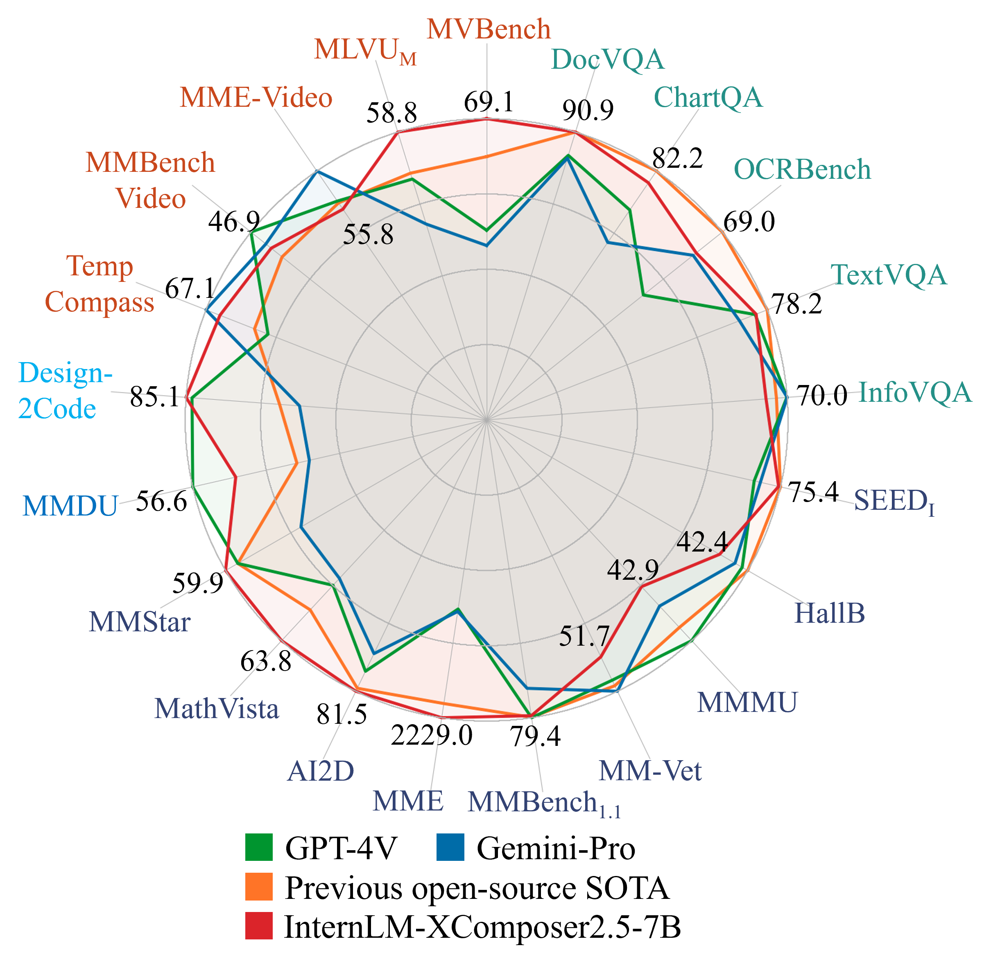

<p align="center">
    
</p>
<p align="center">
    <b><font size="6">InternLM-XComposer2</font></b>
</p>

<!-- <div align="center">
        InternLM-XComposer <a href="">🐼 <a> <a href="">🤖 <a> <a href="">🤗</a>&nbsp ｜ InternLM-VL <a href="">🤖 <a> <a href="">🤗</a>&nbsp | Technical Report <a href=""> <a> 📄  -->

<div align="center">
        InternLM-XComposer2 <a href="https://huggingface.co/internlm/internlm-xcomposer2-7b">🤗</a> <a href="https://modelscope.cn/models/Shanghai_AI_Laboratory/internlm-xcomposer2-7b"></a> &nbsp｜ InternLM-XComposer2-VL <a href="https://huggingface.co/internlm/internlm-xcomposer2-vl-7b">🤗</a> <a href="https://modelscope.cn/models/Shanghai_AI_Laboratory/internlm-xcomposer2-vl-7b"></a> &nbsp | InternLM-XComposer2- <a href="https://huggingface.co/internlm/internlm-xcomposer2-4khd-7b">🤗</a> <a href="https://modelscope.cn/models/Shanghai_AI_Laboratory/internlm-xcomposer2-4khd-7b"></a> &nbsp
</div>
<div align="center">
         XComposer2 Technical Report <a href="https://arxiv.org/abs/2401.16420">  📄 </a> | XComposer2- Technical Report <a href="https://arxiv.org/abs/2404.06512">  📄 </a>

[English](./README.md) | [简体中文](./README_CN.md)

</div>

<p align="center">
    Thanks the community for <a href="https://huggingface.co/spaces/Willow123/InternLM-XComposer">HuggingFace Demo </a>  | <a href="https://openxlab.org.cn/apps/detail/WillowBreeze/InternLM-XComposer">OpenXLab Demo</a> of InternLM-XComposer2.
</p>

<p align="center">
    👋 join us on <a href="https://discord.gg/xa29JuW87d" target="_blank">Discord</a> and <a href="https://r.vansin.top/?r=internwx" target="_blank">WeChat</a>
</p>

<br>

## Multimodal Projects of Our Team

> [**InternLM-XComposer2-**](https://github.com/InternLM/InternLM-XComposer): **A Pioneering Large Vision-Language Model Handling Resolutions from 336 Pixels to 4K HD**

> [**InternLM-XComposer2**](https://github.com/InternLM/InternLM-XComposer): **Mastering Free-form Text-Image Composition and Comprehension in Vision-Language Large Models**

> [**InternLM-XComposer**](https://github.com/InternLM/InternLM-XComposer/tree/main/InternLM-XComposer-1.0): **A Vision-Language Large Model for Advanced Text-image Comprehension and Composition**

> 
[**ShareGPT4Video:**](https://github.com/InternLM/InternLM-XComposer/tree/main/projects/ShareGPT4Video) **Improving Video Understanding and Generation with Better Captions**

> [**ShareGPT4V:**](https://github.com/InternLM/InternLM-XComposer/tree/main/projects/ShareGPT4V) **Improving Large Multi-modal Models with Better Captions**

> [**DualFocus**](https://github.com/InternLM/InternLM-XComposer/tree/main/projects/DualFocus): **Integrating Macro and Micro Perspectives in Multi-modal Large Language Models**

</br>

**InternLM-XComposer2** is a groundbreaking vision-language large model (VLLM) based on [InternLM2-7B](https://github.com/InternLM/InternLM/tree/main) excelling in free-form text-image composition and comprehension. It boasts several amazing capabilities and applications:

- **Free-form Interleaved Text-Image Composition**: InternLM-XComposer2 can effortlessly generate coherent and contextual articles with interleaved images following diverse inputs like outlines, detailed text requirements and reference images, enabling highly customizable content creation.

- **Accurate Vision-language Problem-solving**: InternLM-XComposer2 accurately handles diverse and challenging vision-language Q&A tasks based on free-form instructions, excelling in recognition, perception, detailed captioning, visual reasoning, and more.

- **Awesome performance**: InternLM-XComposer2 based on InternLM2-7B not only significantly outperforms existing open-source multimodal models in 13 benchmarks but also **matches or even surpasses GPT-4V and Gemini Pro in 6 benchmarks**

<p align="center">
    
</p>

**InternLM-XComposer2-4KHD** could further understand 4K Resolution images.

<p align="center">
    
</p>

We release InternLM-XComposer2 series in three versions:

- **InternLM-XComposer2-4KHD-7B** <a href="https://huggingface.co/internlm/internlm-xcomposer2-4khd-7b">🤗</a>: The high-resolution multi-task trained VLLM model with InternLM-7B as the initialization of the LLM for *High-resolution understanding*, *VL benchmarks* and *AI assistant*.

- **InternLM-XComposer2-VL-7B** <a href="https://huggingface.co/internlm/internlm-xcomposer2-vl-7b">🤗</a> : The multi-task trained VLLM model with InternLM-7B as the initialization of the LLM for *VL benchmarks* and *AI assistant*. **It ranks as the most powerful vision-language model based on 7B-parameter level LLMs, leading across 13 benchmarks.**

- **InternLM-XComposer2-VL-1.8B** <a href="https://huggingface.co/internlm/internlm-xcomposer2-vl-1_8b">🤗</a> : A lightweight version of InternLM-XComposer2-VL based on InternLM-1.8B.

- **InternLM-XComposer2-7B** <a href="https://huggingface.co/internlm/internlm-xcomposer2-7b">🤗</a>: The further instruction tuned VLLM for *Interleaved Text-Image Composition* with free-form inputs.

Please refer to [Technical Report](https://arxiv.org/abs/2401.16420) and [4KHD Technical Report](https://arxiv.org/pdf/2404.06512.pdf)for more details.
<br>

<!--
<p align="center">
    <figcaption align = "center"><b> InternLM-XComposer </b></figcaption>
<p> -->

<!-- https://github.com/InternLM/InternLM-XComposer/assets/22662425/fdb89a38-c650-45f2-b5b7-51182e89a5cc -->

## Demo Video

[https://github.com/InternLM/InternLM-XComposer/assets/22662425/fdb89a38-c650-45f2-b5b7-51182e89a5cc](https://github.com/InternLM/InternLM-XComposer/assets/30363822/7c399c65-0cdd-41ae-a903-49b58dca609a)

Please refer to [Chinese Demo](./README_CN.md#demo) for the demo of the Chinese version.

## News and Updates

- `2024.04.22` 🎉🎉🎉 The [finetune code](./finetune/) of **InternLM-XComposer2-VL-7B-4KHD-7B** are publicly available.
- `2024.04.09` 🎉🎉🎉 [InternLM-XComposer2-4KHD-7B](https://huggingface.co/internlm/internlm-xcomposer2-4khd-7b) and [evaluation code](./evaluation/README.md) are publicly available.
- `2024.04.09` 🎉🎉🎉 [InternLM-XComposer2-VL-1.8B](https://huggingface.co/internlm/internlm-xcomposer2-vl-1_8b) is publicly available.
- `2024.02.22` 🎉🎉🎉 We release [DualFocus](https://github.com/InternLM/InternLM-XComposer/tree/main/projects/DualFocus), a framework for integrating macro and micro perspectives within MLLMs to enhance vision-language task performance.

* `2024.02.06` 🎉🎉🎉 [InternLM-XComposer2-7B-4bit](https://huggingface.co/internlm/internlm-xcomposer2-7b-4bit) and [InternLM-XComposer-VL2-7B-4bit](https://huggingface.co/internlm/internlm-xcomposer2-vl-7b-4bit) are publicly available on **Hugging Face** and **ModelScope**.

- `2024.02.02` 🎉🎉🎉 The [finetune code](./finetune/) of **InternLM-XComposer2-VL-7B** are publicly available.
- `2024.01.26` 🎉🎉🎉 The [evaluation code](./evaluation/README.md) of **InternLM-XComposer2-VL-7B** are publicly available.
- `2024.01.26` 🎉🎉🎉 [InternLM-XComposer2-7B](https://huggingface.co/internlm/internlm-xcomposer2-7b) and [InternLM-XComposer-VL2-7B](https://huggingface.co/internlm/internlm-xcomposer2-vl-7b) are publicly available on **Hugging Face** and **ModelScope**.
- `2024.01.26` 🎉🎉🎉 We release a [technical report](https://arxiv.org/abs/2401.16420) for more details of InternLM-XComposer2 series.
- `2023.11.22` 🎉🎉🎉 We release the [ShareGPT4V](https://github.com/InternLM/InternLM-XComposer/tree/main/projects/ShareGPT4V), a large-scale highly descriptive image-text dataset generated by GPT4-Vision and a superior large multimodal model, ShareGPT4V-7B.
- `2023.10.30` 🎉🎉🎉 InternLM-XComposer-VL achieved the top 1 ranking in both [Q-Bench](https://github.com/Q-Future/Q-Bench/tree/master/leaderboards#overall-leaderboards) and [Tiny LVLM](https://github.com/OpenGVLab/Multi-Modality-Arena/tree/main/tiny_lvlm_evaluation).
- `2023.10.19` 🎉🎉🎉 Support for inference on multiple GPUs. Two 4090 GPUs are sufficient for deploying our demo.
- `2023.10.12` 🎉🎉🎉 4-bit demo is supported, model files are available in [Hugging Face](https://huggingface.co/internlm/internlm-xcomposer-7b-4bit) and [ModelScope](https://modelscope.cn/models/Shanghai_AI_Laboratory/internlm-xcomposer-7b-4bit).
- `2023.10.8` 🎉🎉🎉 [InternLM-XComposer-7B](https://modelscope.cn/models/Shanghai_AI_Laboratory/internlm-xcomposer-7b) and [InternLM-XComposer-VL-7B](https://modelscope.cn/models/Shanghai_AI_Laboratory/internlm-xcomposer-vl-7b) are publicly available on **ModelScope**.
- `2023.9.27` 🎉🎉🎉 The [evaluation code](./InternLM-XComposer-1.0/evaluation/) of **InternLM-XComposer-VL-7B** are publicly available.
- `2023.9.27` 🎉🎉🎉 [InternLM-XComposer-7B](https://huggingface.co/internlm/internlm-xcomposer-7b) and [InternLM-XComposer-VL-7B](https://huggingface.co/internlm/internlm-xcomposer-vl-7b) are publicly available on **Hugging Face**.
- `2023.9.27` 🎉🎉🎉 We release a [technical report](https://arxiv.org/pdf/2309.15112.pdf) for more details of our model series.
  </br>

## Model Zoo

| Model                           | Usage                                           | Transformers(HF)                                                                                   | ModelScope(HF)                                                                                                                                                                       | Release Date |
| ------------------------------- | ----------------------------------------------- | -------------------------------------------------------------------------------------------------- | ------------------------------------------------------------------------------------------------------------------------------------------------------------------------------------ | ------------ |
| **InternLM-XComposer2-4KHD**    | 4K Resolution Understanding, Benchmark, VL-Chat | [🤗internlm-xcomposer2-4khd-7b](https://huggingface.co/internlm/internlm-xcomposer2-4khd-7b)       | [ internlm-xcomposer2-4khd-7b](https://modelscope.cn/models/Shanghai_AI_Laboratory/internlm-xcomposer2-4khd-7b/summary)       | 2024-04-09   |
| **InternLM-XComposer2-VL-1.8B** | Benchmark, VL-Chat                              | [🤗internlm-xcomposer2-vl-1_8b](https://huggingface.co/internlm/internlm-xcomposer2-vl-1_8b)       | [ internlm-xcomposer2-vl-1_8b](https://modelscope.cn/models/Shanghai_AI_Laboratory/internlm-xcomposer2-vl-1_8b/summary)       | 2024-04-09   |
| **InternLM-XComposer2**         | Text-Image Composition                          | [🤗internlm-xcomposer2-7b](https://huggingface.co/internlm/internlm-xcomposer2-7b)                 | [ internlm-xcomposer2-7b](https://modelscope.cn/models/Shanghai_AI_Laboratory/internlm-xcomposer2-7b/summary)                 | 2024-01-26   |
| **InternLM-XComposer2-VL**      | Benchmark, VL-Chat                              | [🤗internlm-xcomposer2-vl-7b](https://huggingface.co/internlm/internlm-xcomposer2-vl-7b)           | [ internlm-xcomposer2-vl-7b](https://modelscope.cn/models/Shanghai_AI_Laboratory/internlm-xcomposer2-vl-7b/summary)           | 2024-01-26   |
| **InternLM-XComposer2-4bit**    | Text-Image Composition                          | [🤗internlm-xcomposer2-7b-4bit](https://huggingface.co/internlm/internlm-xcomposer2-7b-4bit)       | [ internlm-xcomposer2-7b-4bit](https://modelscope.cn/models/Shanghai_AI_Laboratory/internlm-xcomposer2-7b-4bit/summary)       | 2024-02-06   |
| **InternLM-XComposer2-VL-4bit** | Benchmark, VL-Chat                              | [🤗internlm-xcomposer2-vl-7b-4bit](https://huggingface.co/internlm/internlm-xcomposer2-vl-7b-4bit) | [ internlm-xcomposer2-vl-7b-4bit](https://modelscope.cn/models/Shanghai_AI_Laboratory/internlm-xcomposer2-vl-7b-4bit/summary) | 2024-02-06   |
| **InternLM-XComposer**          | Text-Image Composition, VL-Chat                 | [🤗internlm-xcomposer-7b](https://huggingface.co/internlm/internlm-xcomposer-7b)                   | [ internlm-xcomposer-7b](https://modelscope.cn/models/Shanghai_AI_Laboratory/internlm-xcomposer-7b/summary)                   | 2023-09-26   |
| **InternLM-XComposer-4bit**     | Text-Image Composition, VL-Chat                 | [🤗internlm-xcomposer-7b-4bit](https://huggingface.co/internlm/internlm-xcomposer-7b-4bit)         | [ internlm-xcomposer-7b-4bit](https://modelscope.cn/models/Shanghai_AI_Laboratory/internlm-xcomposer-7b-4bit/summary)         | 2023-09-26   |
| **InternLM-XComposer-VL**       | Benchmark                                       | [🤗internlm-xcomposer-vl-7b](https://huggingface.co/internlm/internlm-xcomposer-vl-7b)             | [ internlm-xcomposer-vl-7b](https://modelscope.cn/models/Shanghai_AI_Laboratory/internlm-xcomposer-vl-7b/summary)             | 2023-09-26   |

## Evaluation

We evaluate InternLM-XComposer2-VL on 16 multimodal benchmarks: [MMStar](https://github.com/MMStar-Benchmark/MMStar), [DocVQA](https://rrc.cvc.uab.es/?ch=17), [Infographics VQA](https://rrc.cvc.uab.es/?ch=17), [TextVQA](https://textvqa.org/), [ChartQA](https://github.com/vis-nlp/ChartQA), [OCRBench](https://github.com/Yuliang-Liu/MultimodalOCR), [MathVista](https://mathvista.github.io/), [MMMU](https://mmmu-benchmark.github.io/), [AI2D](https://prior.allenai.org/projects/diagram-understanding), [MME](https://github.com/BradyFU/Awesome-Multimodal-Large-Language-Models/tree/Evaluation), [MMBench](https://opencompass.org.cn/leaderboard-multimodal), [MMBench-CN](https://opencompass.org.cn/leaderboard-multimodal), [SEED-Bench](https://huggingface.co/spaces/AILab-CVC/SEED-Bench_Leaderboard), [QBench](https://github.com/Q-Future/Q-Bench/tree/master/leaderboards#overall-leaderboards), [HallusionBench](https://github.com/tianyi-lab/HallusionBench), [MM-Vet](https://github.com/yuweihao/MM-Vet).

See [Evaluation Details](./evaluation/README.md) here.

### Compared with closed-source APIs and previous SOTAs.

|                           | DocVQA     | ChartVQA   | InfoVQA    | TextVQA  | OCRBench | MMStar  | MathVista | AI2D    | MMMU   | MME     | MMB     | MMBCN   | SEEDI   | QBenchT | MM-Vet | HallB  |
| ------------------------- | ---------- | ---------- | ---------- | -------- | -------- | ------- | --------- | ------- | ------ | ------- | ------- | ------- | ------- | ------- | ------ | ------ |
| Open-source Previous SOTA | DocOwl 1.5 | DocOwl 1.5 | DocOwl 1.5 | CogAgent | CogAgent | LLaVA-N | LLaVA-N   | LLaVA-N | Int-VL | WeMM    | LLaVA-N | LLaVA-N | LLaVA-N | Int-XC  | CogVLM | Monkey |
|                           | 8B         | 8B         | 8B         | 18B      | 18B      | 35B     | 35B       | 35B     | 40B    | 6B      | 35B     | 35B     | 35B     | 8B      | 17B    | 10B    |
|                           | 82.2       | 70.2       | 44.5       | 76.1     | 59.0     | 52.1    | 39.0      | 78.9    | 51.6   | 2,050.2 | 81.1    | 79.0    | 75.7    | 64.4    | 54.5   | 39.3   |
|                           |            |            |            |          |          |         |           |         |        |         |         |         |         |         |        |        |
| GPT-4V                    | 88.4       | 78.5       | 75.1       | 78.0     | 51.6     | 57.1    | 47.8      | 75.5    | 56.8   | 1,926.5 | 77.0    | 74.4    | 69.1    | 74.1    | 56.8   | 46.5   |
| Gemini-Pro                | 88.1       | 74.1       | 75.2       | 74.6     | 68.0     | 42.6    | 45.8      | 70.2    | 47.9   | 1,933.3 | 73.6    | 74.3    | 70.7    | 70.6    | 59.2   | 45.2   |
| InternLM-XComposer2-VL    | 57.7       | 72.6       | 34.4       | 70.1     | 53.2     | 55.4    | 57.6      | 81.2    | 41.4   | 2,220.4 | 80.7    | 79.4    | 74.9    | 72.5    | 46.7   | 41.0   |
| InternLM-XComposer2-4KHD  | 90.0       | 81.0       | 68.6       | 77.2     | 67.5     | 54.1    | 57.8      | 80.9    | 39.9   | 2,204.9 | 80.2    | 77.7    | 74.7    | 71.8    | 54.9   | 40.9   |

### Compared with open-source methods.

| Method                   | LLM          | MMStar | MathVista | AI2D | MMEP    | MMEC  | MMB  | MMBCN | SEEDI | QBenchT | MM-Vet |
| ------------------------ | ------------ | ------ | --------- | ---- | ------- | ----- | ---- | ----- | ----- | ------- | ------ |
| InstructBLIP             | Vicuna-7B    | ---    | 25.3      | 40.6 | -       | -     | 36.0 | 23.7  | 53.4  | 55.9    | 26.2   |
| Qwen-VL-Chat             | Qwen-7B      | 37.5   | 33.8      | 63.0 | 1,487.5 | 360.7 | 60.6 | 56.7  | 58.2  | 61.7    | 47.3   |
| LLaVA-1.5                | Vicuna-13B   | 13.9   | 26.1      | 61.1 | 1,531.3 | 295.4 | 67.7 | 63.6  | 68.2  | 61.4    | 35.4   |
| ShareGPT4V               | Vicuna-7B    | 11.9   | 25.8      | 58.0 | 1,567.4 | 376.4 | 68.8 | 62.2  | 69.7  | -       | 37.6   |
| CogVLM-17B               | Vicuna-7B    | 14.9   | 34.7      | 63.3 | -       | -     | 65.8 | 55.9  | 68.8  | -       | 54.5   |
| LLaVA-XTuner             | InernLM2-20B | ---    | 24.6      | 65.4 | -       | -     | 75.1 | 73.7  | 70.2  | -       | 37.2   |
| Monkey                   | Qwen-7B      | 38.3   | 34.8      | 62.5 | 1,522.4 | 401.4 | 72.4 | 67.5  | 68.9  | -       | 33     |
| LLaVA-Next               | Vicuna-13B   | 38.3   | 32.4      | 72.2 | 1,445.0 | 296.0 | 70.0 | 68.5  | 71.4  | -       | 44.9   |
| InternLM-XC              | InernLM-7B   | ---    | 29.5      | 56.9 | 1,528.4 | 391.1 | 74.4 | 72.4  | 66.1  | 64.4    | 35.2   |
| InternLM-XComposer2-VL   | InernLM2-7B  | 55.4   | 57.6      | 81.2 | 1,712.0 | 530.7 | 80.7 | 79.4  | 74.9  | 72.5    | 46.7   |
| InternLM-XComposer2-4KHD | InernLM2-7B  | 54.1   | 57.8      | 80.9 | 1,655.9 | 548.9 | 80.2 | 77.7  | 74.7  | 71.8    | 54.9   |

| Method                 | LLM              | MMStar | MathVista | MMMU | MMEP    | MMEC  | CCBench | MMB  | SEEDI | MM-Vet | HallB | ChartQA | OCRBench | TextVQA | DocVQA | InfoVQA |
| ---------------------- | ---------------- | ------ | --------- | ---- | ------- | ----- | ------- | ---- | ----- | ------ | ----- | ------- | -------- | ------- | ------ | ------- |
| MobileVLM              | MobileLLaMA 2.7B | ---    | ---       | ---  | 1,288.9 | ---   | ---     | 59.6 | ---   | ---    | ---   | ---     | ---      | ---     | ---    | ---     |
| LLaVA-Phi              | Phi2-2.7B        | ---    | ---       | ---  | 1,335.1 | ---   | ---     | 59.8 | ---   | ---    | ---   | ---     | ---      | ---     | ---    | ---     |
| MoE-LLaVA              | 4x Phi-2 2.7B    | ---    | ---       | ---  | 1,431.3 | ---   | ---     | 68.0 | ---   | ---    | ---   | ---     | ---      | ---     | ---    | ---     |
| TinyLLaVA              | Phi2-2.7B        | 36.0   | ---       | ---  | 1,464.9 | ---   | ---     | 66.9 | ---   | 32.0   | ---   | ---     | ---      | ---     | ---    | ---     |
|                        |                  |        |           |      |         |       |         |      |       |        |       |         |          |         |        |         |
| InternLM-XComposer2-VL | InernLM2-1.8B    | 46.3   | 48.2      | 30.1 | 1,465.9 | 420.0 | 41.4    | 72.5 | 70.4  | 30.1   | 34.4  | 57.8    | 46.0     | 65.9    | 48.3   | 24.1    |

## Requirements

- python 3.8 and above
- pytorch 1.12 and above, 2.0 and above are recommended
- CUDA 11.4 and above are recommended (this is for GPU users)
- [flash-attention2](https://github.com/Dao-AILab/flash-attention) is required for the 4KHD model.
  <br>

## Installation

Before running the code, make sure you have setup the environment and installed the required packages. Make sure you meet the above requirements, and then install the dependent libraries.
Please refer to the [installation instructions](docs/install.md)

## Quickstart

We provide a simple example to show how to use InternLM-XComposer with 🤗 Transformers.

### XComposer2-4KHD

<details>
  <summary>
    <b>🤗 Transformers</b>
  </summary>

```python
import torch
from transformers import AutoModel, AutoTokenizer

torch.set_grad_enabled(False)

# init model and tokenizer
model = AutoModel.from_pretrained('internlm/internlm-xcomposer2-4khd-7b', torch_dtype=torch.bfloat16, trust_remote_code=True).cuda().eval()
tokenizer = AutoTokenizer.from_pretrained('internlm/internlm-xcomposer2-4khd-7b', trust_remote_code=True)

###############
# First Round
###############
query = '<ImageHere>Illustrate the fine details present in the image'
image = 'examples/4khd_example.webp'
with torch.cuda.amp.autocast():
  response, his = model.chat(tokenizer, query=query, image=image, hd_num=55, history=[], do_sample=False, num_beams=3)
print(response)
# The image is a vibrant and colorful infographic that showcases 7 graphic design trends that will dominate in 2021. The infographic is divided into 7 sections, each representing a different trend.
# Starting from the top, the first section focuses on "Muted Color Palettes", highlighting the use of muted colors in design.
# The second section delves into "Simple Data Visualizations", emphasizing the importance of easy-to-understand data visualizations.
# The third section introduces "Geometric Shapes Everywhere", showcasing the use of geometric shapes in design.
# The fourth section discusses "Flat Icons and Illustrations", explaining how flat icons and illustrations are being used in design.
# The fifth section is dedicated to "Classic Serif Fonts", illustrating the resurgence of classic serif fonts in design.
# The sixth section explores "Social Media Slide Decks", illustrating how slide decks are being used on social media.
# Finally, the seventh section focuses on "Text Heavy Videos", illustrating the trend of using text-heavy videos in design.
# Each section is filled with relevant images and text, providing a comprehensive overview of the 7 graphic design trends that will dominate in 2021.

###############
# Second Round
###############
query1 = 'what is the detailed explanation of the third part.'
with torch.cuda.amp.autocast():
  response, _ = model.chat(tokenizer, query=query1, image=image, hd_num=55, history=his, do_sample=False, num_beams=3)
print(response)
# The third part of the infographic is about "Geometric Shapes Everywhere". It explains that last year, designers used a lot of
# flowing and abstract shapes in their designs. However, this year, they have been replaced with rigid, hard-edged geometric
# shapes and patterns. The hard edges of a geometric shape create a great contrast against muted colors.


```

</details>

<details>
  <summary>
    <b>🤖 ModelScope</b>
  </summary>

```python
import torch
from modelscope import snapshot_download, AutoModel, AutoTokenizer

torch.set_grad_enabled(False)

# init model and tokenizer
model_dir = snapshot_download('Shanghai_AI_Laboratory/internlm-xcomposer2-4khd-7b')
model = AutoModel.from_pretrained(model_dir, trust_remote_code=True).cuda().eval()
tokenizer = AutoTokenizer.from_pretrained(model_dir, trust_remote_code=True)

###############
# First Round
###############
query = '<ImageHere>Illustrate the fine details present in the image'
image = 'examples/4khd_example.webp'
with torch.cuda.amp.autocast():
  response, his = model.chat(tokenizer, query=query, image=image, hd_num=55, history=[], do_sample=False, num_beams=3)
print(response)
# The image is a vibrant and colorful infographic that showcases 7 graphic design trends that will dominate in 2021. The infographic is divided into 7 sections, each representing a different trend.
# Starting from the top, the first section focuses on "Muted Color Palettes", highlighting the use of muted colors in design.
# The second section delves into "Simple Data Visualizations", emphasizing the importance of easy-to-understand data visualizations.
# The third section introduces "Geometric Shapes Everywhere", showcasing the use of geometric shapes in design.
# The fourth section discusses "Flat Icons and Illustrations", explaining how flat icons and illustrations are being used in design.
# The fifth section is dedicated to "Classic Serif Fonts", illustrating the resurgence of classic serif fonts in design.
# The sixth section explores "Social Media Slide Decks", illustrating how slide decks are being used on social media.
# Finally, the seventh section focuses on "Text Heavy Videos", illustrating the trend of using text-heavy videos in design.
# Each section is filled with relevant images and text, providing a comprehensive overview of the 7 graphic design trends that will dominate in 2021.

###############
# Second Round
###############
query1 = 'what is the detailed explanation of the third part.'
with torch.cuda.amp.autocast():
  response, _ = model.chat(tokenizer, query=query1, image=image, hd_num=55, history=his, do_sample=False, num_beams=3)
print(response)
# The third part of the infographic is about "Geometric Shapes Everywhere". It explains that last year, designers used a lot of
# flowing and abstract shapes in their designs. However, this year, they have been replaced with rigid, hard-edged geometric
# shapes and patterns. The hard edges of a geometric shape create a great contrast against muted colors.


```

</details>

### XComposer2-VL

<details>
  <summary>
    <b>🤗 Transformers</b>
  </summary>

```python
import torch
from transformers import AutoModel, AutoTokenizer

torch.set_grad_enabled(False)

# init model and tokenizer
model = AutoModel.from_pretrained('internlm/internlm-xcomposer2-vl-7b', trust_remote_code=True).cuda().eval()
tokenizer = AutoTokenizer.from_pretrained('internlm/internlm-xcomposer2-vl-7b', trust_remote_code=True)

text = '<ImageHere>Please describe this image in detail.'
image = 'examples/image1.webp'
with torch.cuda.amp.autocast():
  response, _ = model.chat(tokenizer, query=text, image=image, history=[], do_sample=False)
print(response)
#The image features a quote by Oscar Wilde, "Live life with no excuses, travel with no regret,"
# set against a backdrop of a breathtaking sunset. The sky is painted in hues of pink and orange,
# creating a serene atmosphere. Two silhouetted figures stand on a cliff, overlooking the horizon.
# They appear to be hiking or exploring, embodying the essence of the quote.
# The overall scene conveys a sense of adventure and freedom, encouraging viewers to embrace life without hesitation or regrets.

```

</details>

<details>
  <summary>
    <b>🤖 ModelScope</b>
  </summary>

```python
import torch
from modelscope import snapshot_download, AutoModel, AutoTokenizer

torch.set_grad_enabled(False)

# init model and tokenizer
model_dir = snapshot_download('Shanghai_AI_Laboratory/internlm-xcomposer2-vl-7b')
model = AutoModel.from_pretrained(model_dir, trust_remote_code=True).cuda().eval()
tokenizer = AutoTokenizer.from_pretrained(model_dir, trust_remote_code=True)
model.tokenizer = tokenizer

text = '<ImageHere>Please describe this image in detail.'
image = 'examples/image1.webp'
with torch.cuda.amp.autocast():
  response, _ = model.chat(tokenizer, query=text, image=image, history=[], do_sample=False)
print(response)
#The image features a quote by Oscar Wilde, "Live life with no excuses, travel with no regret,"
# set against a backdrop of a breathtaking sunset. The sky is painted in hues of pink and orange,
# creating a serene atmosphere. Two silhouetted figures stand on a cliff, overlooking the horizon.
# They appear to be hiking or exploring, embodying the essence of the quote.
# The overall scene conveys a sense of adventure and freedom, encouraging viewers to embrace life without hesitation or regrets.
```

</details>

## Inference on Multiple GPUs

If you have multiple GPUs, but the memory size of each GPU is not enough to accommodate the entire model, you can split the model across multiple GPUs. First, install `accelerate` using the command: `pip install accelerate`. Then, execute the follows scripts for chat:

```
# chat with 2 GPUs
python examples/example_chat.py --num_gpus 2
```

## Inference Acceleration by LMDeploy

If InternLM-XComposer2 model inference optimization is required, we recommend using [LMDeploy](https://github.com/InternLM/lmdeploy).

In the following subsections, we will introduce the usage of LMDeploy with the [internlm-xcomposer2-4khd-7b](https://huggingface.co/internlm/internlm-xcomposer2-4khd-7b) model as an example. 

First of all, please install the pypi package with `pip install lmdeploy`. By default, it depends on CUDA 12.x. For a CUDA 11.x environment, please refer to the [installation guide](https://lmdeploy.readthedocs.io/en/latest/get_started.html#installation).

### Offline Inference Pipeline

```python
from lmdeploy import pipeline
from lmdeploy.vl import load_image
pipe = pipeline('internlm/internlm-xcomposer2-4khd-7b')
image = load_image('examples/4khd_example.webp')
response = pipe(('describe this image', image))
print(response)
```
For more on using the VLM pipeline, including multi-image inference or multi-turn chat, please overview [this](https://lmdeploy.readthedocs.io/en/latest/inference/vl_pipeline.html) guide.

### Online Inference Service

LMDeploy supports one-click packaging of the InternLM-XComposer2 model into an OpenAI service, providing seamless integration with the OpenAI API.

The service can be launched by one command as below:
```shell
lmdeploy serve api_server internlm/internlm-xcomposer2-4khd-7b
```

The arguments of `api_server` can be viewed through the command `lmdeploy serve api_server -h`, for instance, `--tp` to set tensor parallelism, `--session-len` to specify the max length of the context window, `--cache-max-entry-count` to adjust the GPU mem ratio for k/v cache etc.

For more details, including service startup with docker, RESTful API information, and openai integration methods, please refer to [this](https://lmdeploy.readthedocs.io/en/latest/serving/api_server_vl.html) guide.

## 4-Bit Model

We provide 4-bit quantized models to ease the memory requirement of the models. To run the 4-bit models (GPU memory >= 12GB), you need first install the corresponding [dependency](./docs/install.md), then execute the follows scripts for chat:

<details>
  <summary>
    <b>🤗 Transformers</b>
  </summary>

```python
import torch, auto_gptq
from transformers import AutoModel, AutoTokenizer
from auto_gptq.modeling._base import BaseGPTQForCausalLM

auto_gptq.modeling._base.SUPPORTED_MODELS = ["internlm"]
torch.set_grad_enabled(False)

class InternLMXComposer2QForCausalLM(BaseGPTQForCausalLM):
    layers_block_name = "model.layers"
    outside_layer_modules = [
        'vit', 'vision_proj', 'model.tok_embeddings', 'model.norm', 'output',
    ]
    inside_layer_modules = [
        ["attention.wqkv.linear"],
        ["attention.wo.linear"],
        ["feed_forward.w1.linear", "feed_forward.w3.linear"],
        ["feed_forward.w2.linear"],
    ]


=======
# init model and tokenizer
model = InternLMXComposer2QForCausalLM.from_quantized(
  'internlm/internlm-xcomposer2-vl-7b-4bit', trust_remote_code=True, device="cuda:0").eval()
tokenizer = AutoTokenizer.from_pretrained(
  'internlm/internlm-xcomposer2-vl-7b-4bit', trust_remote_code=True)

text = '<ImageHere>Please describe this image in detail.'
image = 'examples/image1.webp'
with torch.cuda.amp.autocast():
  response, _ = model.chat(tokenizer, query=text, image=image, history=[], do_sample=False)
print(response)
#The image features a quote by Oscar Wilde, "Live life with no excuses, travel with no regrets."
#The quote is displayed in white text against a dark background. In the foreground, there are two silhouettes of people standing on a hill at sunset.
#They appear to be hiking or climbing, as one of them is holding a walking stick.
#The sky behind them is painted with hues of orange and purple, creating a beautiful contrast with the dark figures.
```

</details>

## Finetune

Please refer to our [finetune scripts](finetune/README.md).

## Web UI

Thanks the community for 3rd-party <a href="https://github.com/InternLM/InternLM-XComposer/pull/37">HuggingFace Demo </a>

We provide code for users to build a web UI demo.

Please run the command below for Composition / Chat:

```
# For Free-form Text-Image Composition
python examples/gradio_demo_composition.py

# For Multimodal Chat
python examples/gradio_demo_chat.py
```

The user guidance of UI demo is given in [HERE](demo_asset/demo.md). If you wish to change the default folder of the model, please use the `--folder=new_folder` option.
<br>

## Citation

If you find our models / code / papers useful in your research, please consider giving ⭐ and citations 📝, thx :)

```BibTeX
@article{internlmxcomposer2_4khd,
      title={InternLM-XComposer2-4KHD: A Pioneering Large Vision-Language Model Handling Resolutions from 336 Pixels to 4K HD},
      author={Xiaoyi Dong and Pan Zhang and Yuhang Zang and Yuhang Cao and Bin Wang and Linke Ouyang and Songyang Zhang and Haodong Duan and Wenwei Zhang and Yining Li and Hang Yan and Yang Gao and Zhe Chen and Xinyue Zhang and Wei Li and Jingwen Li and Wenhai Wang and Kai Chen and Conghui He and Xingcheng Zhang and Jifeng Dai and Yu Qiao and Dahua Lin and Jiaqi Wang},
      journal={arXiv preprint arXiv:2404.06512},
      year={2024}
}
```

```BibTeX
@article{internlmxcomposer2,
      title={InternLM-XComposer2: Mastering Free-form Text-Image Composition and Comprehension in Vision-Language Large Model},
      author={Xiaoyi Dong and Pan Zhang and Yuhang Zang and Yuhang Cao and Bin Wang and Linke Ouyang and Xilin Wei and Songyang Zhang and Haodong Duan and Maosong Cao and Wenwei Zhang and Yining Li and Hang Yan and Yang Gao and Xinyue Zhang and Wei Li and Jingwen Li and Kai Chen and Conghui He and Xingcheng Zhang and Yu Qiao and Dahua Lin and Jiaqi Wang},
      journal={arXiv preprint arXiv:2401.16420},
      year={2024}
}
```

```BibTeX
@article{internlmxcomposer,
      title={InternLM-XComposer: A Vision-Language Large Model for Advanced Text-image Comprehension and Composition},
      author={Pan Zhang and Xiaoyi Dong and Bin Wang and Yuhang Cao and Chao Xu and Linke Ouyang and Zhiyuan Zhao and Shuangrui Ding and Songyang Zhang and Haodong Duan and Wenwei Zhang and Hang Yan and Xinyue Zhang and Wei Li and Jingwen Li and Kai Chen and Conghui He and Xingcheng Zhang and Yu Qiao and Dahua Lin and Jiaqi Wang},
      journal={arXiv preprint arXiv:2309.15112},
      year={2023}
}
```

<br>

## License & Contact Us

The code is licensed under Apache-2.0, while model weights are fully open for academic research and also allow **free** commercial usage. To apply for a commercial license, please fill in the [application form (English)](https://wj.qq.com/s2/12727483/5dba/)/[申请表（中文）](https://wj.qq.com/s2/12725412/f7c1/). For other questions or collaborations, please contact <internlm@pjlab.org.cn>.
