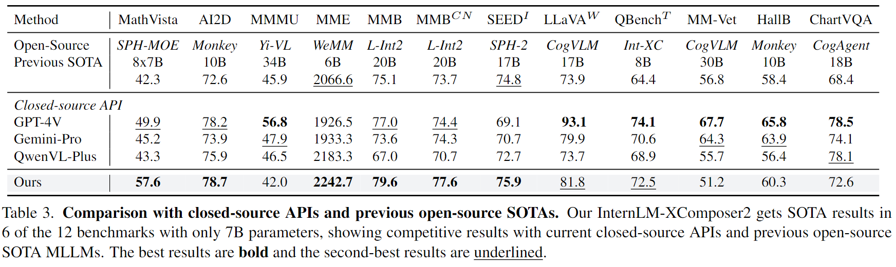
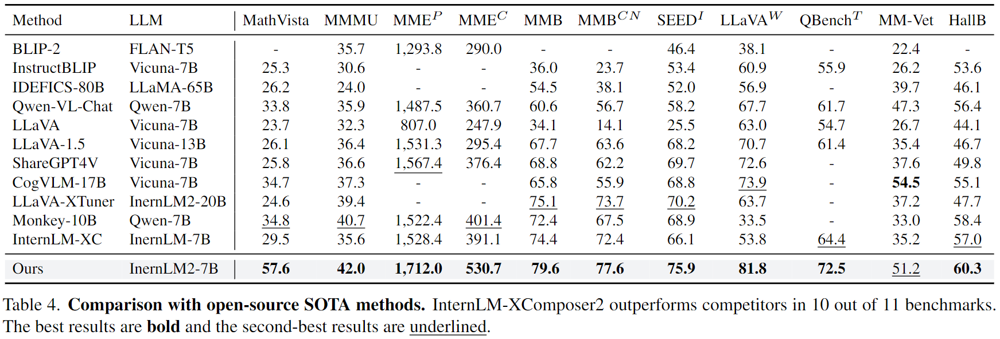

<p align="center">
    
</p>
<p align="center">
    <b><font size="6">浦语·灵笔2</font></b>
</p>

<!-- <div align="center">
        InternLM-XComposer <a href="">🤖 <a> <a href="">🤗</a>&nbsp ｜ InternLM-VL <a href="">🤖 <a> <a href="">🤗</a>&nbsp | Technical Report <a href=""> <a> 📄  -->

<div align="center">
        InternLM-XComposer2 <a href="https://huggingface.co/internlm/internlm-xcomposer2-7b">🤗</a> <a href="https://modelscope.cn/models/Shanghai_AI_Laboratory/internlm-xcomposer2-7b"></a> &nbsp｜ InternLM-XComposer2-VL <a href="https://huggingface.co/internlm/internlm-xcomposer2-vl-7b">🤗</a> <a href="https://modelscope.cn/models/Shanghai_AI_Laboratory/internlm-xcomposer2-vl-7b"></a> &nbsp | 技术报告 <a href="">  📄 </a>

[English](./README.md) | [简体中文](./README_CN.md)


<p align="center">
    感谢社区提供的 InternLM-XComposer2 <a href="https://huggingface.co/spaces/Willow123/InternLM-XComposer">在线试用</a>
</p>

</div>
<p align="center">
    👋 加入我们的 <a href="https://discord.gg/xa29JuW87d" target="_blank">Discord</a> 和 <a href="https://github.com/InternLM/InternLM/assets/25839884/a6aad896-7232-4220-ac84-9e070c2633ce" target="_blank">微信社区</a>
</p>

<br>

## 本仓库包括的多模态项目

> [**InternLM-XComposer2**](https://github.com/InternLM/InternLM-XComposer): **Mastering Free-form Text-Image Composition and Comprehension in Vision-Language Large Models**

> [**InternLM-XComposer**](https://github.com/InternLM/InternLM-XComposer/tree/main/InternLM-XComposer-1.0): **A Vision-Language Large Model for Advanced Text-image Comprehension and Composition**

> [**ShareGPT4V**](https://github.com/InternLM/InternLM-XComposer/tree/main/projects/ShareGPT4V): **Improving Large Multi-modal Models with Better Captions**

</br>


**浦语·灵笔2**是基于[书生·浦语2](https://github.com/InternLM/InternLM/tree/main)大语言模型研发的突破性的图文多模态大模型，具有非凡的图文写作和图像理解能力，在多种应用场景表现出色：

- **自由指令输入的图文写作：** 浦语·灵笔2可以理解**自由形式的图文指令输入，包括大纲、文章细节要求、参考图片等**，为用户打造图文并貌的专属文章。生成的文章文采斐然，图文相得益彰，提供沉浸式的阅读体验。

- **准确的图文问题解答：** 浦语·灵笔2具有海量图文知识，可以准确的回复各种图文问答难题，在识别、感知、细节描述、视觉推理等能力上表现惊人。

- **杰出性能：** 浦语·灵笔2基于书生·浦语2-7B模型，我们在13项多模态评测中大幅领先同量级多模态模型，在其中6项评测中超过 GPT-4V 和 Gemini Pro。

<p align="center">
    
</p>

我们开源的 浦语·灵笔2 包括两个版本:

- **InternLM-XComposer2-VL-7B** <a href="https://huggingface.co/internlm/internlm-xcomposer2-vl-7b">🤗</a> <a href="https://modelscope.cn/models/Shanghai_AI_Laboratory/internlm-xcomposer2-vl-7b"> </a>（浦语·灵笔2-视觉问答-7B）: 基于书生·浦语2-7B大语言模型训练，面向多模态评测和视觉问答。浦语·灵笔2-视觉问答-7B是目前最强的基于7B量级语言模型基座的图文多模态大模型，领跑多达13个多模态大模型榜单。

- **InternLM-XComposer2-7B** <a href="https://huggingface.co/internlm/internlm-xcomposer2-vl-7b">🤗</a> <a href="https://modelscope.cn/models/Shanghai_AI_Laboratory/internlm-xcomposer-vl2-7b"> </a>: 进一步微调，支持自由指令输入图文写作的图文多模态大模型。
 
更多方法细节请参考[技术报告]()．
  <br>

<!-- 
<p align="center">
    <figcaption align = "center"><b> InternLM-XComposer </b></figcaption>
<p> -->


<!-- ## Demo


https://github.com/InternLM/InternLM-XComposer/assets/22662425/0a2b475b-3f74-4f41-a5df-796680fa56cd
 -->


## 更新消息
* ```2023.01.26``` 🎉🎉🎉 **InternLM-XComposer-VL-7B**的[评测代码](./evaluation/)已开源。
* ```2023.01.26``` 🎉🎉🎉 [InternLM-XComposer2-7B](https://modelscope.cn/models/Shanghai_AI_Laboratory/internlm-xcomposer2-7b) and [InternLM-XComposer-VL2-7B](https://modelscope.cn/models/Shanghai_AI_Laboratory/internlm-xcomposer2-vl-7b)已在**ModelScope**开源。
* ```2023.01.26``` 🎉🎉🎉 [InternLM-XComposer2-7B](https://huggingface.co/internlm/internlm-xcomposer2-7b) and [InternLM-XComposer-VL2-7B](https://huggingface.co/internlm/internlm-xcomposer2-vl-7b)已在**Hugging Face**开源。
* ```2023.01.26``` 🎉🎉🎉 我们公开了InternLM-XComposer2更多技术细节，请参考[技术报告]()。
* ```2023.11.22``` 🎉🎉🎉 我们开源了[ShareGPT4V](https://github.com/InternLM/InternLM-XComposer/tree/main/projects/ShareGPT4V), 一个高质量的大规模图文描述数据集，以及性能优秀的多模态大模型ShareGPT4V-7B。
* ```2023.10.30``` 🎉🎉🎉 灵笔在[Q-Bench](https://github.com/Q-Future/Q-Bench/tree/master/leaderboards#overall-leaderboards) 和 [Tiny LVLM](https://github.com/OpenGVLab/Multi-Modality-Arena/tree/main/tiny_lvlm_evaluation) 取得了第一名。
* ```2023.10.19``` 🎉🎉🎉 支持多卡测试，多卡Demo. 两张4090显卡可部署全量Demo。
* ```2023.10.12``` 🎉🎉🎉 支持4比特量化Demo， 模型文件可从[Hugging Face](https://huggingface.co/internlm/internlm-xcomposer-7b-4bit) and [ModelScope](https://modelscope.cn/models/Shanghai_AI_Laboratory/internlm-xcomposer-7b-4bit) 获取。
* ```2023.10.8``` 🎉🎉🎉 [InternLM-XComposer-7B](https://huggingface.co/internlm/internlm-xcomposer-7b) 和 [InternLM-XComposer-VL-7B](https://modelscope.cn/models/Shanghai_AI_Laboratory/internlm-xcomposer-vl-7b) 已在Modelscope开源。
* ```2023.9.27``` 🎉🎉🎉 **InternLM-XComposer-VL-7B**的[评测代码](./evaluation/)已开源。
* ```2023.9.27``` 🎉🎉🎉 [InternLM-XComposer-7B](https://huggingface.co/internlm/internlm-xcomposer-7b) 和 [InternLM-XComposer-VL-7B](https://huggingface.co/internlm/internlm-xcomposer-vl-7b) 已在Hugging Face开源。
* ```2023.9.27``` 🎉🎉🎉 更多技术细节请参考[技术报告](https://arxiv.org/pdf/2309.15112.pdf)。
</br>


## 评测

我们在13个多模态评测对InternLM-XComposer2-VL上进行测试，包括：[MathVista](https://mathvista.github.io/), [MMMU](https://mmmu-benchmark.github.io/), [AI2D](https://prior.allenai.org/projects/diagram-understanding), [MME](https://github.com/BradyFU/Awesome-Multimodal-Large-Language-Models/tree/Evaluation), [MMBench](https://opencompass.org.cn/leaderboard-multimodal), [MMBench-CN](https://opencompass.org.cn/leaderboard-multimodal), [SEED-Bench](https://huggingface.co/spaces/AILab-CVC/SEED-Bench_Leaderboard), [QBench](https://github.com/Q-Future/Q-Bench/tree/master/leaderboards#overall-leaderboards), [HallusionBench](https://github.com/tianyi-lab/HallusionBench), [ChartQA](https://github.com/vis-nlp/ChartQA), [MM-Vet](https://github.com/yuweihao/MM-Vet), [LLaVA-in-the-wild](https://github.com/haotian-liu/LLaVA), [POPE](https://github.com/AoiDragon/POPE).


复现评测结果，请参考[评测细节](./evaluation/README.md)。

对比闭源多模态API以及开源SOTA模型。
<p align="center">
    
</p>

对比开源模型。
<p align="center">
    
</p>


## 环境要求

* python 3.8 and above
* pytorch 1.12 and above, 2.0 and above are recommended
* CUDA 11.4 and above are recommended (this is for GPU users)
  <br>

## 安装教程

在运行代码之前，请先按照要求配置环境。请确认你的设备符合以上环境需求，然后安装环境。
请参考[安装教程](docs/install_CN.md)

## 快速开始

我们提供了一个简单实用的 🤗 Transformers 版本 InternLM-XComposer 的使用案例。

<details>
  <summary>
    <b>🤗 Transformers</b>
  </summary>


```python
import torch
from transformers import AutoModel, AutoTokenizer

torch.set_grad_enabled(False)

# init model and tokenizer
model = AutoModel.from_pretrained('internlm/internlm-xcomposer-7b', trust_remote_code=True).cuda().eval()
tokenizer = AutoTokenizer.from_pretrained('internlm/internlm-xcomposer-7b', trust_remote_code=True)
model.tokenizer = tokenizer

# example image
image = 'examples/images/aiyinsitan.jpg'

# Single-Turn Pure-Text Dialogue
text = '请介绍下爱因斯坦的生平'
response = model.generate(text)
print(response)
# 阿尔伯特·爱因斯坦（Albert Einstein，1879年3月14日-1955年4月18日）是德国出生的理论物理学家。他提出了狭义相对论和广义相对论，
# 这两个理论对现代物理学产生了深远的影响。爱因斯坦还发现了光电效应定律，并因此获得了1921年的诺贝尔物理学奖。
# 爱因斯坦于1879年3月14日出生于德国巴登-符腾堡州乌尔姆市的一个犹太人家庭。他在瑞士苏黎世联邦理工学院学习物理学和数学， # 并于1905年发表了一系列重要论文，其中包括狭义相对论和光电效应定律。
# 1915年，爱因斯坦发表了广义相对论，该理论解释了引力是如何通过时空弯曲来影响物体的运动。这一理论改变了人们对宇宙的认识，并为现代宇宙学奠定了基础。
# 1933年，爱因斯坦因为他的犹太血统而受到纳粹党的迫害，被迫离开德国。他最终定居在美国，并在那里度过了他的余生。1955年4月18日，爱因斯坦在普林斯顿去世，享年76岁。
# 爱因斯坦的贡献对现代物理学产生了深远的影响，他被认为是20世纪最伟大的科学家之一。

# Single-Turn Text-Image Dialogue
text = '请问这张图片里面的人是谁？并介绍下他。'
image = 'examples/images/aiyinsitan.jpg'
response = model.generate(text, image)
print(response)
# 图片里的人是阿尔伯特·爱因斯坦（Albert Einstein），一位著名的物理学家和理论物理学家。他于1879年3月14日出生于德国巴登-符腾堡州的乌尔姆市，
# 并在那里度过了他的 童年和少年时代。爱因斯坦在瑞士苏黎世联邦理工学院学习物理学，并于1905年发表了一系列重要论文，
# 其中包括狭义相对论和质能方程E=mc^2。1921年，爱因斯坦获得了诺贝尔物理学奖，以表彰他对光电效应的发现和对狭义相对论的贡献。

# Multi-Turn Text-Image Dialogue
# 1st turn
text = '图片里面的是谁？'
response, history = model.chat(text=text, image=image, history=None)
print(response)
# 图片里面的人物是阿尔伯特·爱因斯坦（Albert Einstein），一位著名的物理学家和理论物理学家。

# 2nd turn
text = '他有哪些成就?'
response, history = model.chat(text=text, image=None, history=history)
print(response)
# 阿尔伯特·爱因斯坦是20世纪最伟大的物理学家之一，他提出了狭义相对论和广义相对论，为现代物理学的发展做出了巨大的贡献。
# 此外，他还提出了光量子理论、质能关系等重要理论，对现代物理学的发展产生了深远的影响。

# 3rd turn
text = '他是最伟大的物理学家吗?'
response, history = model.chat(text=text, image=None, history=history)
print(response)
# 是的，阿尔伯特·爱因斯坦是20世纪最伟大的物理学家之一。他提出了狭义相对论和广义相对论，为现代物理学的发展做出了巨大的贡献。
```
</details>


<details>
  <summary>
    <b>🤖 ModelScope</b>
  </summary>


```python
import torch
from modelscope import snapshot_download, AutoModel, AutoTokenizer

torch.set_grad_enabled(False)

# init model and tokenizer
model_dir = snapshot_download('Shanghai_AI_Laboratory/internlm-xcomposer-7b')
model = AutoModel.from_pretrained(model_dir, trust_remote_code=True).cuda().eval()
tokenizer = AutoTokenizer.from_pretrained(model_dir, trust_remote_code=True)
model.tokenizer = tokenizer

# example image
image = 'examples/images/aiyinsitan.jpg'

# Single-Turn Pure-Text Dialogue
text = '请介绍下爱因斯坦的生平'
response = model.generate(text)
print(response)
# 阿尔伯特·爱因斯坦（Albert Einstein，1879年3月14日-1955年4月18日）是德国出生的理论物理学家。他提出了狭义相对论和广义相对论，
# 这两个理论对现代物理学产生了深远的影响。爱因斯坦还发现了光电效应定律，并因此获得了1921年的诺贝尔物理学奖。
# 爱因斯坦于1879年3月14日出生于德国巴登-符腾堡州乌尔姆市的一个犹太人家庭。他在瑞士苏黎世联邦理工学院学习物理学和数学， # 并于1905年发表了一系列重要论文，其中包括狭义相对论和光电效应定律。
# 1915年，爱因斯坦发表了广义相对论，该理论解释了引力是如何通过时空弯曲来影响物体的运动。这一理论改变了人们对宇宙的认识，并为现代宇宙学奠定了基础。
# 1933年，爱因斯坦因为他的犹太血统而受到纳粹党的迫害，被迫离开德国。他最终定居在美国，并在那里度过了他的余生。1955年4月18日，爱因斯坦在普林斯顿去世，享年76岁。
# 爱因斯坦的贡献对现代物理学产生了深远的影响，他被认为是20世纪最伟大的科学家之一。
```
</details>


## Web UI

我们提供了一个轻松搭建 Web UI demo 的代码.

<p align="center">
    
</p>


请运行以下代码（需要>=32GB显存的GPU, 推荐）

```
python examples/web_demo.py
```
更多信息请参考 Web UI [用户指南](demo_asset/demo.md)。 如果您想要更改模型存放的文件夹，请使用 --folder=new_folder 选项。

## 量化
我们提供4bit量化模型来缓解模型的内存需求。 要运行4bit模型（GPU内存> = 12GB），您需要首先安装相应的[依赖包](docs/install_CN.md)，然后执行以下脚本进行聊天和网页演示：
```
# 4-bit chat
python examples/example_chat_4bit.py
# 4-bit web demo
python examples/web_demo_4bit.py
```

## 多GPU测试
如果你有多张 GPU，但是每张 GPU 的显存大小都不足以容纳完整的模型，那么可以将模型切分在多张GPU上。首先安装 accelerate: pip install accelerate，然后执行以下脚本进行聊天和网页演示：
```
# chat with 2 GPUs
python examples/example_chat.py --num_gpus 2
# web demo with 2 GPUs
python examples/web_demo.py --num_gpus 2
```
<br>

## 引用

如果你觉得我们的代码和模型对你有帮助，请给我一个 star :star: 和 引用 :pencil: :)

```BibTeX
@misc{zhang2023internlmxcomposer,
      title={InternLM-XComposer: A Vision-Language Large Model for Advanced Text-image Comprehension and Composition}, 
      author={Pan Zhang and Xiaoyi Dong and Bin Wang and Yuhang Cao and Chao Xu and Linke Ouyang and Zhiyuan Zhao and Shuangrui Ding and Songyang Zhang and Haodong Duan and Hang Yan and Xinyue Zhang and Wei Li and Jingwen Li and Kai Chen and Conghui He and Xingcheng Zhang and Yu Qiao and Dahua Lin and Jiaqi Wang},
      year={2023},
      eprint={2309.15112},
      archivePrefix={arXiv},
      primaryClass={cs.CV}
}
```

<br>

## 许可证 & 联系我们

本仓库的代码依照 Apache-2.0 协议开源。模型权重对学术研究完全开放，也可申请免费的商业使用授权（[申请表](https://wj.qq.com/s2/12725412/f7c1/)）。其他问题与合作请联系 <internlm@pjlab.org.cn>。
