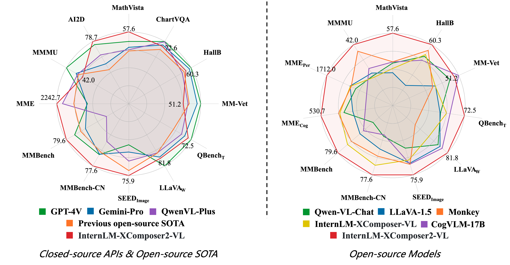

<p align="center">
    
</p>
<p align="center">
    <b><font size="6">浦语·灵笔2.5</font></b>
</p>

<!-- <div align="center">
        InternLM-XComposer <a href="">🤖 <a> <a href="">🤗</a>&nbsp ｜ InternLM-VL <a href="">🤖 <a> <a href="">🤗</a>&nbsp | Technical Report <a href=""> <a> 📄  -->

<div align="center">
        InternLM-XComposer2.5 <a href="https://huggingface.co/internlm/internlm-xcomposer2d5-7b">🤗</a> <a href="https://modelscope.cn/models/Shanghai_AI_Laboratory/internlm-xcomposer2d5-7b"></a> &nbsp｜ 浦语·灵笔2.5技术报告 <a href="https://arxiv.org/abs/">  📄 </a>  

[English](./README.md) | [简体中文](./README_CN.md)

<p align="center">
    感谢社区提供的 InternLM-XComposer2 <a href="https://huggingface.co/spaces/Willow123/InternLM-XComposer">Hugging Face 在线试用</a> | <a href="https://openxlab.org.cn/apps/detail/WillowBreeze/InternLM-XComposer">OpenXLab 在线试用</a>
</p>

</div>
<p align="center">
    👋 加入我们的 <a href="https://discord.gg/xa29JuW87d" target="_blank">Discord</a> 和 <a href="https://r.vansin.top/?r=internwx" target="_blank">微信社区</a>
</p>

<br>

## 本仓库包括的多模态项目
> [**InternLM-XComposer2.5**](https://github.com/InternLM/InternLM-XComposer): **A Versatile Large Vision Language Model Supporting Long-Contextual Input and Output**

> [**InternLM-XComposer2-**](https://github.com/InternLM/InternLM-XComposer): **A Pioneering Large Vision-Language Model Handling Resolutions from 336 Pixels to 4K HD**

> [**InternLM-XComposer2**](https://github.com/InternLM/InternLM-XComposer): **Mastering Free-form Text-Image Composition and Comprehension in Vision-Language Large Models**

> [**InternLM-XComposer**](https://github.com/InternLM/InternLM-XComposer/tree/main/InternLM-XComposer-1.0): **A Vision-Language Large Model for Advanced Text-image Comprehension and Composition**

> [**ShareGPT4V**](https://github.com/InternLM/InternLM-XComposer/tree/main/projects/ShareGPT4V): **Improving Large Multi-modal Models with Better Captions**
 
> [**DualFocus**](https://github.com/InternLM/InternLM-XComposer/tree/main/projects/DualFocus): **Integrating Macro and Micro Perspectives in Multi-modal Large Language Models**


</br>

**浦语·灵笔2.5**是基于[书生·浦语2](https://github.com/InternLM/InternLM/tree/main)大语言模型研发的突破性的图文多模态大模型，仅使用 7B LLM 后端就达到了 GPT-4V 级别的能力。浦语·灵笔2.5使用24K交错的图像-文本上下文进行训练，通过RoPE外推可以无缝扩展到96K长的上下文。这种长上下文能力使浦语·灵笔2.5在需要广泛输入和输出上下文的任务中表现出色。

- **超高分辨率理解**：浦语·灵笔2.5使用560×560分辨率的ViT视觉编码器增强了IXC2-4KHD中提出的动态分辨率解决方案，支持具有任意纵横比的高分辨率图像。
- **细粒度视频理解**：浦语·灵笔2.5将视频视为由数十到数千帧组成的超高分辨率复合图像，从而通过密集采样和每帧更高的分辨率捕捉细节。
- **多轮多图像对话**：浦语·灵笔2.5支持自由形式的多轮多图像对话，使其能够在多轮对话中与人类自然互动。
- **网页制作**：浦语·灵笔2.5可以通过遵循文本-图像指令来创建网页，包括源代码（HTML、CSS和JavaScript）的组合。
- **高质量文本-图像文章创作**：浦语·灵笔2.5利用特别设计的“思维链”（CoT）和“直接偏好优化”（DPO）技术，显著提高了其创作内容的质量。
- **出色的性能**：浦语·灵笔2.5在28个基准测试中进行了评估，在16个基准测试上优于现有的开源先进模型。它还在16个关键任务上超越或与GPT-4V和Gemini Pro表现相近。

<p align="center">
    
</p>
  


更多方法细节请参考[技术报告](https://arxiv.org/abs/2401.16420)．
<br>

<!--
<p align="center">
    <figcaption align = "center"><b> InternLM-XComposer </b></figcaption>
<p> -->

<!-- ## Demo


https://github.com/InternLM/InternLM-XComposer/assets/22662425/0a2b475b-3f74-4f41-a5df-796680fa56cd
 -->

## Demo Video

[](https://youtu.be/8tYpiQNOJww)

## 更新消息
- `2024.07.03` 🎉🎉🎉 我们开源了[InternLM-XComposer2.5-7B](https://huggingface.co/internlm/internlm-xcomposer2d5-7b).
- `2024.04.09` 🎉🎉🎉 我们开源了[InternLM-XComposer2-4KHD-7B](https://huggingface.co/internlm/internlm-xcomposer2-4khd-7b) 和 [评测代码](./evaluation/README.md).
- `2024.04.09` 🎉🎉🎉 我们开源了[InternLM-XComposer2-VL-1.8B](https://huggingface.co/internlm/internlm-xcomposer2-4khd-7b).
- `2024.02.22` 🎉🎉🎉 我们开源了[DualFocus](https://github.com/InternLM/InternLM-XComposer/tree/main/projects/DualFocus), 一个整合宏观和微观视角于多语言大模型中以提升视觉-语言任务性能的框架。
* ```2024.02.06``` 🎉🎉🎉 [InternLM-XComposer2-7B-4bit](https://huggingface.co/internlm/internlm-xcomposer2-7b-4bit) 和 [InternLM-XComposer-VL2-7B-4bit](https://huggingface.co/internlm/internlm-xcomposer2-vl-7b-4bit) 已在**Hugging Face**和**ModelScope**开源。
- `2024.02.02` 🎉🎉🎉 **InternLM-XComposer2-VL-7B**的[微调代码](./finetune/)已开源。
- `2024.01.26` 🎉🎉🎉 **InternLM-XComposer2-VL-7B**的[评测代码](./evaluation/README.md)已开源。
- `2024.01.26` 🎉🎉🎉 [InternLM-XComposer2-7B](https://huggingface.co/internlm/internlm-xcomposer2-7b) 和 [InternLM-XComposer-VL2-7B](https://huggingface.co/internlm/internlm-xcomposer2-vl-7b)已在**Hugging Face**和**ModelScope**开源。
- `2024.01.26` 🎉🎉🎉 我们公开了InternLM-XComposer2更多技术细节，请参考[技术报告](https://arxiv.org/abs/2401.16420)。
- `2023.11.22` 🎉🎉🎉 我们开源了[ShareGPT4V](https://github.com/InternLM/InternLM-XComposer/tree/main/projects/ShareGPT4V), 一个高质量的大规模图文描述数据集，以及性能优秀的多模态大模型ShareGPT4V-7B。
- `2023.10.30` 🎉🎉🎉 灵笔在[Q-Bench](https://github.com/Q-Future/Q-Bench/tree/master/leaderboards#overall-leaderboards) 和 [Tiny LVLM](https://github.com/OpenGVLab/Multi-Modality-Arena/tree/main/tiny_lvlm_evaluation) 取得了第一名。
- `2023.10.19` 🎉🎉🎉 支持多卡测试，多卡Demo. 两张4090显卡可部署全量Demo。
- `2023.10.12` 🎉🎉🎉 支持4比特量化Demo， 模型文件可从[Hugging Face](https://huggingface.co/internlm/internlm-xcomposer-7b-4bit) 和 [ModelScope](https://modelscope.cn/models/Shanghai_AI_Laboratory/internlm-xcomposer-7b-4bit) 获取。
- `2023.10.8` 🎉🎉🎉 [InternLM-XComposer-7B](https://huggingface.co/internlm/internlm-xcomposer-7b) 和 [InternLM-XComposer-VL-7B](https://modelscope.cn/models/Shanghai_AI_Laboratory/internlm-xcomposer-vl-7b) 已在Modelscope开源。
- `2023.9.27` 🎉🎉🎉 **InternLM-XComposer-VL-7B**的[评测代码](./InternLM-XComposer-1.0/evaluation/)已开源。
- `2023.9.27` 🎉🎉🎉 [InternLM-XComposer-7B](https://huggingface.co/internlm/internlm-xcomposer-7b) 和 [InternLM-XComposer-VL-7B](https://huggingface.co/internlm/internlm-xcomposer-vl-7b) 已在Hugging Face开源。
- `2023.9.27` 🎉🎉🎉 更多技术细节请参考[技术报告](https://arxiv.org/pdf/2309.15112.pdf)。
  </br>

## 模型合集

| 模型                        | 用途                | Transformers(HF)                                                                           | ModelScope(HF)                                                                                                                                                               | 开源日期   |
| --------------------------- | ------------------- | ------------------------------------------------------------------------------------------ | ---------------------------------------------------------------------------------------------------------------------------------------------------------------------------- | ---------- |
| **InternLM-XComposer2.5**    | 视频理解，多图多轮对话，超高分辨率图像理解，网页创作，文章创作， Benchmark | [🤗internlm-xcomposer2.5](https://huggingface.co/internlm/internlm-xcomposer2d5-7b)       | [ internlm-xcomposer2.5](https://modelscope.cn/models/Shanghai_AI_Laboratory/internlm-xcomposer2d5-7b/summary)       | 2024-07-03   |
| **InternLM-XComposer2-4KHD**     | 4K分辨率图像理解, Benchmark, 视觉问答          | [🤗internlm-xcomposer2-4khd-7b](https://huggingface.co/internlm/internlm-xcomposer2-4khd-7b)         | [ internlm-xcomposer2-4khd-7b](https://modelscope.cn/models/Shanghai_AI_Laboratory/internlm-xcomposer2-4khd-7b/summary)         | 2024-04-09   |
| **InternLM-XComposer2-VL-1.8B**  | Benchmark, 视觉问答             | [🤗internlm-xcomposer2-vl-1_8b](https://huggingface.co/internlm/internlm-xcomposer2-vl-1_8b)   | [ internlm-xcomposer2-vl-1_8b](https://modelscope.cn/models/Shanghai_AI_Laboratory/internlm-xcomposer2-vl-1_8b/summary)   | 2024-04-09   |
| **InternLM-XComposer2**     | 图文创作            | [🤗internlm-xcomposer2-7b](https://huggingface.co/internlm/internlm-xcomposer2-7b)         | [ internlm-xcomposer2-7b](https://modelscope.cn/models/Shanghai_AI_Laboratory/internlm-xcomposer2-7b/summary)         | 2024-01-26 |
| **InternLM-XComposer2-VL**  | Benchmark, 视觉问答 | [🤗internlm-xcomposer2-vl-7b](https://huggingface.co/internlm/internlm-xcomposer2-vl-7b)   | [ internlm-xcomposer2-vl-7b](https://modelscope.cn/models/Shanghai_AI_Laboratory/internlm-xcomposer2-vl-7b/summary)   | 2024-01-26 |
| **InternLM-XComposer2-4bit**  |  图文创作   | [🤗internlm-xcomposer2-7b-4bit](https://huggingface.co/internlm/internlm-xcomposer2-7b-4bit) | [ internlm-xcomposer2-7b-4bit](https://modelscope.cn/models/Shanghai_AI_Laboratory/internlm-xcomposer2-7b-4bit/summary) |  2024-02-06   |
| **InternLM-XComposer2-VL-4bit**   | Benchmark, 视觉问答   | [🤗internlm-xcomposer2-vl-7b-4bit](https://huggingface.co/internlm/internlm-xcomposer2-vl-7b-4bit) | [ internlm-xcomposer2-vl-7b-4bit](https://modelscope.cn/models/Shanghai_AI_Laboratory/internlm-xcomposer2-vl-7b-4bit/summary) |  2024-02-06   |
| **InternLM-XComposer**      | 图文创作, 视觉问答  | [🤗internlm-xcomposer-7b](https://huggingface.co/internlm/internlm-xcomposer-7b)           | [ internlm-xcomposer-7b](https://modelscope.cn/models/Shanghai_AI_Laboratory/internlm-xcomposer-7b/summary)           | 2023-09-26 |
| **InternLM-XComposer-4bit** | 图文创作, 视觉问答  | [🤗internlm-xcomposer-7b-4bit](https://huggingface.co/internlm/internlm-xcomposer-7b-4bit) | [ internlm-xcomposer-7b-4bit](https://modelscope.cn/models/Shanghai_AI_Laboratory/internlm-xcomposer-7b-4bit/summary) | 2023-09-26 |
| **InternLM-XComposer-VL**   | Benchmark           | [🤗internlm-xcomposer-vl-7b](https://huggingface.co/internlm/internlm-xcomposer-vl-7b)     | [ internlm-xcomposer-vl-7b](https://modelscope.cn/models/Shanghai_AI_Laboratory/internlm-xcomposer-vl-7b/summary)     | 2023-09-26 |

## 评测

我们在28个多模态评测对InternLM-XComposer2-VL上进行测试，包括图像评测 [MMDU](https://github.com/Liuziyu77/MMDU), [MMStar](https://github.com/MMStar-Benchmark/MMStar), [RealWorldQA](https://x.ai/blog/grok-1.5v),  [Design2Code](https://salt-nlp.github.io/Design2Code/), [DocVQA](https://rrc.cvc.uab.es/?ch=17), [Infographics VQA](https://rrc.cvc.uab.es/?ch=17), [TextVQA](https://textvqa.org/), [ChartQA](https://github.com/vis-nlp/ChartQA), [OCRBench](https://github.com/Yuliang-Liu/MultimodalOCR), [DeepFrom](https://wandb.ai/stacey/deepform_v1/reports/DeepForm-Understand-Structured-Documents-at-Scale--VmlldzoyODQ3Njg), [WTQ](https://arxiv.org/abs/1508.00305), [VisualMRC](https://github.com/nttmdlab-nlp/VisualMRC), [TabFact](https://tabfact.github.io/), [MathVista](https://mathvista.github.io/), [MMMU](https://mmmu-benchmark.github.io/), [AI2D](https://prior.allenai.org/projects/diagram-understanding), [MME](https://github.com/BradyFU/Awesome-Multimodal-Large-Language-Models/tree/Evaluation), [MMBench](https://opencompass.org.cn/leaderboard-multimodal), [MMBench-CN](https://opencompass.org.cn/leaderboard-multimodal), [SEED-Bench](https://huggingface.co/spaces/AILab-CVC/SEED-Bench_Leaderboard), [HallusionBench](https://github.com/tianyi-lab/HallusionBench), [MM-Vet](https://github.com/yuweihao/MM-Vet), 和视频评测 [MVBench](https://github.com/OpenGVLab/Ask-Anything), [MLVU](https://github.com/FlagOpen/FlagEmbedding/tree/master/MLVU/evaluation), [Video-MME](https://github.com/BradyFU/Video-MME), [MMBench-Video](https://github.com/open-compass/VLMEvalKit), [TempCompass](https://github.com/llyx97/TempCompass)

复现评测结果，请参考[评测细节](./evaluation/README.md)。

### 在视频和高分辨率任务上与闭源多模态API以及开源SOTA模型对比结果。

|            | MVBench    | MLVU        | MME-Video | MMBench-Video | TempCompass | DocVQA      | ChartVQA    | InfoVQA     | TextVQA     | OCRBench | DeepForm   | WTQ        | VisualMRC  | TabFact     |
|------------|------------|-------------|-----------|---------------|-------------|-------------|-------------|-------------|-------------|----------|------------|------------|------------|-------------|
|            | VideoChat2 | InternVL1.5 | LIVA      | InternVL1.5   | Qwen-VL     | InternVL1.5 | InternVL1.5 | InternVL1.5 | InternVL1.5 | GLM-4v   | DocOwl 1.5 | DocOwl 1.5 | DocOwl 1.5 | DocOwl 1.5  |
|            | 7B         | 26B         | 34B       | 26B           | 7B          | 26B         | 26B         | 26B         | 26B         | 9B       | 8B         | 8B         | 8B         | 8B          |
|            | 60.4       | 50.4        | 59.0      | 42.0          | 58.4        | 90.9        | 83.8        | 72.5        | 80.6        | 77.6     | 68.8       | 40.6       | 246.4      | 80.2        |
|            |            |             |           |               |             |             |             |             |             |          |            |            |            |             |
| GPT-4V     | 43.5       | 49.2        | 59.9      | 56.0          | ---         | 88.4        | 78.5        | 75.1        | 78.0        | 51.6     | ---        | ---        | ---        | ---         |
| Gemini-Pro | ---        | ---         | 75.0      | 49.3          | 70.6        | 88.1        | 74.1        | 75.2        | 74.6        | 68.0     | ---        | ---        | ---        | ---         |
| Ours       | 69.1       | 58.8        | 55.8      | 46.9          | 67.1        | 90.9        | 82.2        | 69.9        | 78.2        | 69.0     | 71.2       | 53.6       | 307.5      | 85.2        |


### 在多图对话和通用VQA任务上与闭源多模态API以及开源SOTA模型对比结果。

|            | MMStar      | MMDU       | Design2Code      | RealWQA | MathVista | AI2D         | MMMU  | MME          | MMB          | MMB-CN       | MMB-1.1      | SEEDI | MM-Vet |
|------------|-------------|------------------|---------|-----------|--------------|-------|--------------|--------------|--------------|--------------|-------|--------|--------|
|            | InternVL1.5 | LLaVa1.6-mistral |Design2Code | WeMM    | WeMM      | InternVL-1.5 | 360VL | InternVL-1.5 | InternVL-1.5 | InternVL-1.5 | InternVL-1.5 | WeMM  | GLM-4v |
|            | 26B         | 8B               |   18B |  8B      | 8B        | 26B          | 70B   | 26B          | 26B          | 26B          | 26B          | 8B    | 14B    |
|        | 57.1        | 42.8      | 80.4       | 68.1    | 54.9      | 80.6         | 53.4  | 2,189.6      | 82.3         | 80.7         | 79.7         | 75.9  | 58.0   |
|            |             |                  |         |           |              |       |              |              |              |              |       |        |
| GPT-4V     | 57.1        | 66.3       |  84.8 | 68.0    | 47.8      | 75.5         | 56.8  | 1,926.5      | 81.3         | 80.2         | 79.8         | 69.1  | 56.8   |
| Gemini-Pro | 42.6        | ---       |  79.4  | 64.1    | 45.8      | 70.2         | 47.9  | 1,933.3      | 73.9         | 74.3         | 73.9         | 70.7  | 59.2   |
| Ours       | 59.9        |   56.6     |  85.1  | 67.8    | 63.8      | 81.5         | 42.9  | 2,229.0      | 82.2         | 80.8         | 79.4         | 75.4  | 51.7   |


## 环境要求

- python 3.8 and above
- pytorch 1.12 and above, 2.0 and above are recommended
- CUDA 11.4 and above are recommended (this is for GPU users)
- [flash-attention2](https://github.com/Dao-AILab/flash-attention) is required for the 4KHD model.
  <br>

## 安装教程

在运行代码之前，请先按照要求配置环境。请确认你的设备符合以上环境需求，然后安装环境。
请参考[安装教程](docs/install_CN.md)

## 快速开始

我们提供了一个简单实用的 🤗 Transformers 版本 InternLM-XComposer系列的使用案例。 


<details>
  <summary>
    <b>视频理解</b>
  </summary>

```python
import torch
from transformers import AutoModel, AutoTokenizer

torch.set_grad_enabled(False)

# init model and tokenizer
model = AutoModel.from_pretrained('internlm/internlm-xcomposer2d5-7b', torch_dtype=torch.bfloat16, trust_remote_code=True).cuda().eval().half()
tokenizer = AutoTokenizer.from_pretrained('internlm/internlm-xcomposer2d5-7b', trust_remote_code=True)

query = 'Here are some frames of a video. Describe this video in detail'
image = ['./examples/liuxiang.mp4',]
with torch.autocast(device_type='cuda', dtype=torch.float16):
    response, his = model.chat(tokenizer, query, image, do_sample=False, num_beams=3, use_meta=True)
print(response)
#The video opens with a shot of an athlete, dressed in a red and yellow uniform with the word "CHINA" emblazoned across the front, preparing for a race. 
#The athlete, Liu Xiang, is seen in a crouched position, focused and ready, with the Olympic rings visible in the background, indicating the prestigious setting of the Olympic Games. As the race commences, the athletes are seen sprinting towards the hurdles, their determination evident in their powerful strides. 
#The camera captures the intensity of the competition, with the athletes' numbers and times displayed on the screen, providing a real-time update on their performance. The race reaches a climax as Liu Xiang, still in his red and yellow uniform, triumphantly crosses the finish line, his arms raised in victory. 
#The crowd in the stands erupts into cheers, their excitement palpable as they witness the athlete's success. The video concludes with a close-up shot of Liu Xiang, still basking in the glory of his victory, as the Olympic rings continue to symbolize the significance of the event.

query = 'tell me the athlete code of Liu Xiang'
image = ['./examples/liuxiang.mp4',]
with torch.autocast(device_type='cuda', dtype=torch.float16):
    response, _ = model.chat(tokenizer, query, image, history=his, do_sample=False, num_beams=3, use_meta=True)
print(response)
#The athlete code of Liu Xiang, as displayed on his uniform in the video, is "1363".
```

</details>

<details>
  <summary>
    <b>多图多轮对话</b>
  </summary>

```python
import torch
from transformers import AutoModel, AutoTokenizer

torch.set_grad_enabled(False)

# init model and tokenizer
model = AutoModel.from_pretrained('internlm/internlm-xcomposer2d5-7b', torch_dtype=torch.bfloat16, trust_remote_code=True).cuda().eval().half()
tokenizer = AutoTokenizer.from_pretrained('internlm/internlm-xcomposer2d5-7b', trust_remote_code=True)

query = 'Image1 <ImageHere>; Image2 <ImageHere>; Image3 <ImageHere>; I want to buy a car from the three given cars, analyze their advantages and weaknesses one by one'
image = ['./examples/cars1.jpg',
        './examples/cars2.jpg',
        './examples/cars3.jpg',]
with torch.autocast(device_type='cuda', dtype=torch.float16):
    response, his = model.chat(tokenizer, query, image, do_sample=False, num_beams=3, use_meta=True)
print(response)
#To analyze the advantages and disadvantages of each car, we need to consider factors such as brand reputation, performance, design, cost, and maintenance. 
#1. Mercedes-Benz: - Advantages: Known for its luxury and reliability, the Mercedes-Benz brand offers a high level of comfort, advanced technology, and superior craftsmanship. The vehicle in the image appears to be an SUV, which is versatile for both city driving and off-road conditions. - Disadvantages: Typically, Mercedes-Benz vehicles are more expensive compared to other brands, and they may require more frequent maintenance due to their luxury status. 
#2. Bugatti: - Advantages: Bugatti is renowned for producing some of the fastest and most powerful cars in the world. The vehicle in the image is a sports car, likely offering an exhilarating driving experience with its high-performance engine and advanced aerodynamics. - Disadvantages: Bugatti cars are extremely expensive, making them less accessible to the average consumer. They also require specialized knowledge for maintenance and may not be suitable for everyday driving due to their high-performance nature. 
#3. BMW: - Advantages: BMW is a well-respected manufacturer known for its innovative engineering and design. The car in the image appears to be an electric vehicle (EV), which offers advantages such as lower emissions, reduced noise pollution, and potentially lower operating costs. - Disadvantages: EVs like the one in the image may have a shorter range compared to traditional gasoline-powered vehicles, limiting their suitability for long-distance travel. 
#Additionally, the initial cost of purchasing an EV can be higher than that of a conventional car. In conclusion, each car has its own set of advantages and disadvantages. The Mercedes-Benz offers luxury and versatility, the Bugatti provides high performance and exclusivity, and the BMW represents innovation in electric vehicle technology. The choice ultimately depends on the buyer's priorities, such as comfort, performance, environmental impact, and budget.

query = 'Image4 <ImageHere>; How about the car in Image4'
image.append('./examples/cars4.jpg')        
with torch.autocast(device_type='cuda', dtype=torch.float16):
    response, _ = model.chat(tokenizer, query, image, do_sample=False, num_beams=3, history= his, use_meta=True)
print(response)
#The car in Image4 is a red sports car, which appears to be a Ferrari. Ferrari is a renowned Italian manufacturer known for producing some of the most iconic and high-performance sports cars in the world. - Advantages: Ferrari vehicles are synonymous with speed, luxury, and engineering excellence. 
#The car in the image likely offers an exhilarating driving experience with its powerful engine, advanced aerodynamics, and high-quality craftsmanship. The red color adds to the car's aesthetic appeal, making it stand out on the road. - Disadvantages: Ferrari cars are extremely expensive, making them less accessible to the average consumer. 
#They also require specialized knowledge for maintenance and may not be suitable for everyday driving due to their high-performance nature. In conclusion, the Ferrari in Image4 represents a pinnacle of automotive engineering and design, offering unmatched performance and luxury. 
#However, its high cost and specialized maintenance requirements make it less practical for everyday use compared to the other vehicles in the images.
```


</details>

<details>
  <summary>
    <b>高分辨率图像理解</b>
  </summary>

```python
import torch
from transformers import AutoModel, AutoTokenizer

torch.set_grad_enabled(False)

# init model and tokenizer
model = AutoModel.from_pretrained('internlm/internlm-xcomposer2d5-7b', torch_dtype=torch.bfloat16, trust_remote_code=True).cuda().eval().half()
tokenizer = AutoTokenizer.from_pretrained('internlm/internlm-xcomposer2d5-7b', trust_remote_code=True)

query = 'Analyze the given image in a detail manner'
image = ['./examples/dubai.png']
with torch.autocast(device_type='cuda', dtype=torch.float16):
    response, _ = model.chat(tokenizer, query, image, do_sample=False, num_beams=3, use_meta=True)
print(response)
#The infographic is a visual representation of various facts about Dubai. It begins with a statement about Palm Jumeirah, highlighting it as the largest artificial island visible from space. It then provides a historical context, noting that in 1968, there were only a few cars in Dubai, contrasting this with the current figure of more than 1.5 million vehicles. 
#The infographic also points out that Dubai has the world's largest Gold Chain, with 7 of the top 10 tallest hotels located there. Additionally, it mentions that the crime rate is near 0%, and the income tax rate is also 0%, with 20% of the world's total cranes operating in Dubai. Furthermore, it states that 17% of the population is Emirati, and 83% are immigrants.
#The Dubai Mall is highlighted as the largest shopping mall in the world, with 1200 stores. The infographic also notes that Dubai has no standard address system, with no zip codes, area codes, or postal services. It mentions that the Burj Khalifa is so tall that its residents on top floors need to wait longer to break fast during Ramadan. 
#The infographic also includes information about Dubai's climate-controlled City, with the Royal Suite at Burj Al Arab costing $24,000 per night. Lastly, it notes that the net worth of the four listed billionaires is roughly equal to the GDP of Honduras.

```

</details>


<details>
  <summary>
    <b>指令生成网页</b>
  </summary>

```python
import torch
from transformers import AutoModel, AutoTokenizer

torch.set_grad_enabled(False)

# init model and tokenizer
model = AutoModel.from_pretrained('internlm/internlm-xcomposer2d5-7b', torch_dtype=torch.bfloat16, trust_remote_code=True).cuda().eval().half()
tokenizer = AutoTokenizer.from_pretrained('internlm/internlm-xcomposer2d5-7b', trust_remote_code=True)

query = 'A website for Research institutions. The name is Shanghai AI lab. Top Navigation Bar is blue.Below left, an image shows the logo of the lab. In the right, there is a passage of text below that describes the mission of the laboratory.There are several images to show the research projects of Shanghai AI lab.'
with torch.autocast(device_type='cuda', dtype=torch.float16):
    response = model.write_webpage(query, seed=202, task='Instruction-aware Webpage Generation', repetition_penalty=3.0)
print(response)
# see the Instruction-aware Webpage Generation.html 
```
 
See the [Instruction to Webpage](./examples/Instruction-aware_Webpage_Generation.html) results here.
</details>

<details>
  <summary>
    <b>个人主页生成</b>
  </summary>

```python
import torch
from transformers import AutoModel, AutoTokenizer

torch.set_grad_enabled(False)

# init model and tokenizer
model = AutoModel.from_pretrained('internlm/internlm-xcomposer2d5-7b', torch_dtype=torch.bfloat16, trust_remote_code=True).cuda().eval().half()
tokenizer = AutoTokenizer.from_pretrained('internlm/internlm-xcomposer2d5-7b', trust_remote_code=True)

## the input should be a resume in markdown format
query = './examples/resume.md'
with torch.autocast(device_type='cuda', dtype=torch.float16):
    response = model.resume_2_webpage(query, seed=202, repetition_penalty=3.0)
print(response)
```
See the [Resume to Webpage](./examples/Resume-to-Personal_Page.html) results here.


</details>


<details>
  <summary>
    <b>截屏生成网页</b>
  </summary>

```python
import torch
from transformers import AutoModel, AutoTokenizer

torch.set_grad_enabled(False)

# init model and tokenizer
model = AutoModel.from_pretrained('internlm/internlm-xcomposer2d5-7b', torch_dtype=torch.bfloat16, trust_remote_code=True).cuda().eval().half()
tokenizer = AutoTokenizer.from_pretrained('internlm/internlm-xcomposer2d5-7b', trust_remote_code=True)

query = 'Generate the HTML code of this web image with Tailwind CSS.'
image = ['./examples/screenshot.jpg']
with torch.autocast(device_type='cuda', dtype=torch.float16):
    response = model.resume_2_webpage(query, image, seed=202, repetition_penalty=3.0)
print(response)
```
See the [Screenshot to Webpage](./examples/Screenshot-to-Webpage.html) results here.

</details>


<details>
  <summary>
    <b>Write Artical</b>
  </summary>

```python
import torch
from transformers import AutoModel, AutoTokenizer

torch.set_grad_enabled(False)

# init model and tokenizer
model = AutoModel.from_pretrained('internlm/internlm-xcomposer2d5-7b', torch_dtype=torch.bfloat16, trust_remote_code=True).cuda().eval().half()
tokenizer = AutoTokenizer.from_pretrained('internlm/internlm-xcomposer2d5-7b', trust_remote_code=True)

query = '阅读下面的材料，根据要求写作。 电影《长安三万里》的出现让人感慨，影片并未将重点全落在大唐风华上，也展现了恢弘气象的阴暗面，即旧门阀的资源垄断、朝政的日益衰败与青年才俊的壮志难酬。高适仕进无门，只能回乡>沉潜修行。李白虽得玉真公主举荐，擢入翰林，但他只是成为唐玄宗的御用文人，不能真正实现有益于朝政的志意。然而，片中高潮部分《将进酒》一节，人至中年、挂着肚腩的李白引众人乘仙鹤上天，一路从水面、瀑布飞升至银河进入仙>宫，李白狂奔着与仙人们碰杯，最后大家纵身飞向漩涡般的九重天。肉身的微贱、世路的“天生我材必有用，坎坷，拘不住精神的高蹈。“天生我材必有用，千金散尽还复来。” 古往今来，身处闲顿、遭受挫折、被病痛折磨，很多人都曾经历>了人生的“失意”，却反而成就了他们“诗意”的人生。对正在追求人生价值的当代青年来说，如何对待人生中的缺憾和困顿?诗意人生中又有怎样的自我坚守和自我认同?请结合“失意”与“诗意”这两个关键词写一篇文章。 要求:选准角度，确定>立意，明确文体，自拟标题;不要套作，不得抄袭;不得泄露个人信息;不少于 800 字。'
with torch.autocast(device_type='cuda', dtype=torch.float16):
    response = model.write_artical(query, seed=8192)
print(response)
#诗意人生，贵在坚守
#《菜根谭》有云:“闲时要有吃紧的心思,忙里要留吃闲工夫。”人生在世,总有失意之时,当面对缺憾和困顿,诗意地生活着才能为人生增添一抹亮色。何谓诗意地生活? 所谓诗意地生活，便是在于坚守本心、直面遗憾、超越自我,在失意中寻找人生价值。
#诗意地生活,需坚守本心,淡然处之。
#陶渊明曾执意辞去彭泽县令,归隐田园,“采菊东篱下,悠然见南山”,在山水间寄情自娱；王维面对仕途失意,终日沉醉于诗酒之中,“兴来每独往,胜事空自知”,在诗酒中闲逸自如;李白仕途不顺,被赐金放还,但他依旧豪气干云,“天生我才必有用,千金散尽还复来”,在失意中坦然豁达。坚守本心，便能在遭遇失意之时守住自己的精神家园,让生活充满诗意。反之,若不能坚守本心,而只是一味迎合世俗以求得升迁,那纵使身居高位,亦会丧失生活的乐趣。
#诗意地生活,需直面遗憾,超越自我。
#“西塞山前白鹭飞,桃花流水鳜鱼肥。青箬笠,绿柳枝,半斤酒,一纶丝。五湖四海皆如此,何妨到此处归。”白居易的《渔歌子》写出了多少人的愿望:没有权势纷扰,没有贫困凄凉,只有青山绿水、白鹭鸥鸟作伴,如此自由自在的生活令人神往。然而,白居易却并没有因此真的归隐山林,而是直面人生,超越自我,写下了一首首诗意而富有现实关怀的作品。如果白居易只顾逃避人生,那又怎会拥有“大弦嘈嘈如急雨,小弦切切如私语”的绝美比喻呢?如果白居易只顾归隐山林,那又怎会写出“此曲只应天上有,人间哪得配白居易”这样的诗句呢?
#诗意地生活,需直面遗憾,坚守本心。
#李文波患有渐冻症,医生说他活不过五年,但他没有因此放弃对音乐的热爱,而是与病魔作斗争,演奏出美妙的乐曲;孙家林自幼患有脑瘫,但他不甘于命运的捉弄,终成全国最美教师;史铁生饱受疾病折磨,但他仍能发出“我常常在我的心头清点,我有什么?”的叩问,并由此走上文学道路,为后世留下丰厚的文化遗产。这些人没有逃避,而是选择直面人生的缺憾,在坚守本心的同时超越自我,最终实现了自己的价值。
#诗意地生活,是于失意中坚守本心,于缺憾中超越自我。当面对人生的缺憾与挫折,坚守本心、超越自我的同时,也必将书写属于自己的辉煌篇章。
#愿你我都能诗意地生活着!

query = 'Please write a blog based on the title: French Pastries: A Sweet Indulgence'
with torch.autocast(device_type='cuda', dtype=torch.float16):
    response = model.write_artical(query, seed=8192)
print(response)
#French Pastries: A Sweet Indulgence
#The French are well known for their love of pastries, and it’s a love that is passed down through generations. When one visits France, they are treated to an assortment of baked goods that can range from the delicate macaron to the rich and decadent chocolate mousse. While there are many delicious types of pastries found in France, five stand out as being the most iconic. Each of these pastries has its own unique qualities that make it special.
#1. Croissant
#One of the most famous pastries from France is the croissant. It is a buttery, flaky pastry that is best enjoyed fresh from the bakery. The dough is laminated with butter, giving it its signature layers. Croissants are typically eaten for breakfast or brunch, often accompanied by coffee or hot chocolate.
#2. Macaron
#The macaron is a small, delicate French confection made from almond flour, powdered sugar, and egg whites. The macaron itself is sandwiched with a ganache or jam filling. They come in a variety of colors and flavors, making them a popular choice for both casual snacking and upscale desserts.
#3. Madeleine
#The madeleine is a small shell-shaped cake that is light and sponge-like. It is often flavored with lemon or orange zest and sometimes dipped in chocolate. Madeleines are perfect for an afternoon snack with tea or coffee.
#4. Éclair
#The éclair is a long, thin pastry filled with cream and topped with chocolate glaze. It is a classic French treat that is both sweet and satisfying. Éclairs can be found in bakeries all over France and are often enjoyed with a cup of hot chocolate.
#5. Tarte Tatin
#The tarte Tatin is an apple tart that is known for its caramelized apples and puff pastry crust. It is named after the Tatin sisters who created the recipe in the late 19th century. Tarte Tatin is best served warm with a scoop of vanilla ice cream.
#These pastries are just a few of the many delicious treats that France has to offer. Whether you are a seasoned traveler or a first-time visitor, indulging in French pastries is a must-do activity. So go ahead, treat yourself—you deserve it!
```

</details>


## 多GPU测试
如果你有多张 GPU，但是每张 GPU 的显存大小都不足以容纳完整的模型，那么可以将模型切分在多张GPU上。首先安装 accelerate: pip install accelerate，然后执行以下脚本进行聊天：
```
# chat with 2 GPUs
python examples/example_chat.py --num_gpus 2
```

## 使用 LMDeploy 加速推理

准备中

## 4-Bit 量化模型

准备中

## 微调代码

请参考 [微调指南](finetune/README_zh-CN.md)

## Web UI
准备中

<br>

## 引用

如果你觉得我们模型/代码/技术报告对你有帮助，请给我 ⭐ 和 引用 📝，谢谢 :)
```BibTeX
@article{internlmxcomposer2_4khd,
      title={InternLM-XComposer2-4KHD: A Pioneering Large Vision-Language Model Handling Resolutions from 336 Pixels to 4K HD},
      author={Xiaoyi Dong and Pan Zhang and Yuhang Zang and Yuhang Cao and Bin Wang and Linke Ouyang and Songyang Zhang and Haodong Duan and Wenwei Zhang and Yining Li and Hang Yan and Yang Gao and Zhe Chen and Xinyue Zhang and Wei Li and Jingwen Li and Wenhai Wang and Kai Chen and Conghui He and Xingcheng Zhang and Jifeng Dai and Yu Qiao and Dahua Lin and Jiaqi Wang},
      journal={arXiv preprint arXiv:2404.06512},
      year={2024}
}
```

```BibTeX
@article{internlmxcomposer2,
      title={InternLM-XComposer2: Mastering Free-form Text-Image Composition and Comprehension in Vision-Language Large Model},
      author={Xiaoyi Dong and Pan Zhang and Yuhang Zang and Yuhang Cao and Bin Wang and Linke Ouyang and Xilin Wei and Songyang Zhang and Haodong Duan and Maosong Cao and Wenwei Zhang and Yining Li and Hang Yan and Yang Gao and Xinyue Zhang and Wei Li and Jingwen Li and Kai Chen and Conghui He and Xingcheng Zhang and Yu Qiao and Dahua Lin and Jiaqi Wang},
      journal={arXiv preprint arXiv:2401.16420},
      year={2024}
}
```

```BibTeX
@article{internlmxcomposer,
      title={InternLM-XComposer: A Vision-Language Large Model for Advanced Text-image Comprehension and Composition},
      author={Pan Zhang and Xiaoyi Dong and Bin Wang and Yuhang Cao and Chao Xu and Linke Ouyang and Zhiyuan Zhao and Shuangrui Ding and Songyang Zhang and Haodong Duan and Wenwei Zhang and Hang Yan and Xinyue Zhang and Wei Li and Jingwen Li and Kai Chen and Conghui He and Xingcheng Zhang and Yu Qiao and Dahua Lin and Jiaqi Wang},
      journal={arXiv preprint arXiv:2309.15112},
      year={2023}
}
```

<br>

## 许可证 & 联系我们

本仓库的代码依照 Apache-2.0 协议开源。模型权重对学术研究完全开放，也可申请免费的商业使用授权（[申请表](https://wj.qq.com/s2/12725412/f7c1/)）。其他问题与合作请联系 <internlm@pjlab.org.cn>。
