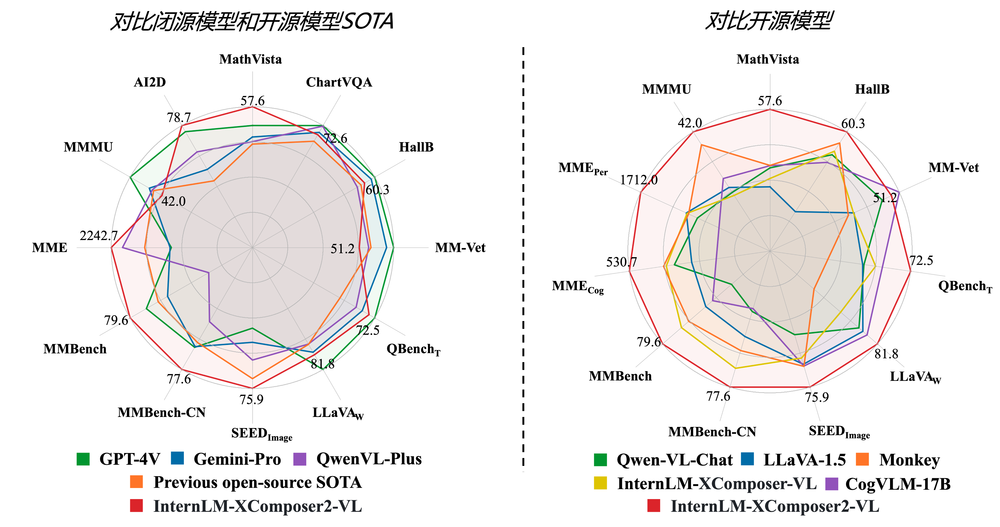

<p align="center">
    
</p>
<p align="center">
    <b><font size="6">浦语·灵笔2</font></b>
</p>

<!-- <div align="center">
        InternLM-XComposer <a href="">🤖 <a> <a href="">🤗</a>&nbsp ｜ InternLM-VL <a href="">🤖 <a> <a href="">🤗</a>&nbsp | Technical Report <a href=""> <a> 📄  -->

<div align="center">
        InternLM-XComposer2 <a href="https://huggingface.co/internlm/internlm-xcomposer2-7b">🤗</a> <a href="https://modelscope.cn/models/Shanghai_AI_Laboratory/internlm-xcomposer2-7b"></a> &nbsp｜ InternLM-XComposer2-VL <a href="https://huggingface.co/internlm/internlm-xcomposer2-vl-7b">🤗</a> <a href="https://modelscope.cn/models/Shanghai_AI_Laboratory/internlm-xcomposer2-vl-7b"></a> &nbsp | InternLM-XComposer2- <a href="https://huggingface.co/internlm/internlm-xcomposer2-4khd-7b">🤗</a> <a href="https://modelscope.cn/models/Shanghai_AI_Laboratory/internlm-xcomposer2-4khd-7b"></a> &nbsp
</div>
<div align="center">
         灵笔2技术报告 <a href="https://arxiv.org/abs/2401.16420">  📄 </a> | 灵笔2- 技术报告 <a href="https://arxiv.org/abs/2404.06512">  📄 </a>

[English](./README.md) | [简体中文](./README_CN.md)

<p align="center">
    感谢社区提供的 InternLM-XComposer2 <a href="https://huggingface.co/spaces/Willow123/InternLM-XComposer">Hugging Face 在线试用</a> | <a href="https://openxlab.org.cn/apps/detail/WillowBreeze/InternLM-XComposer">OpenXLab 在线试用</a>
</p>

</div>
<p align="center">
    👋 加入我们的 <a href="https://discord.gg/xa29JuW87d" target="_blank">Discord</a> 和 <a href="https://r.vansin.top/?r=internwx" target="_blank">微信社区</a>
</p>

<br>

## 本仓库包括的多模态项目

> [**InternLM-XComposer2-**](https://github.com/InternLM/InternLM-XComposer): **A Pioneering Large Vision-Language Model Handling Resolutions from 336 Pixels to 4K HD**

> [**InternLM-XComposer2**](https://github.com/InternLM/InternLM-XComposer): **Mastering Free-form Text-Image Composition and Comprehension in Vision-Language Large Models**

> [**InternLM-XComposer**](https://github.com/InternLM/InternLM-XComposer/tree/main/InternLM-XComposer-1.0): **A Vision-Language Large Model for Advanced Text-image Comprehension and Composition**

> [**ShareGPT4V**](https://github.com/InternLM/InternLM-XComposer/tree/main/projects/ShareGPT4V): **Improving Large Multi-modal Models with Better Captions**
 
> [**DualFocus**](https://github.com/InternLM/InternLM-XComposer/tree/main/projects/DualFocus): **Integrating Macro and Micro Perspectives in Multi-modal Large Language Models**


</br>

**浦语·灵笔2**是基于[书生·浦语2](https://github.com/InternLM/InternLM/tree/main)大语言模型研发的突破性的图文多模态大模型，具有非凡的图文写作和图像理解能力，在多种应用场景表现出色：

- **自由指令输入的图文写作：** 浦语·灵笔2可以理解**自由形式的图文指令输入，包括大纲、文章细节要求、参考图片等**，为用户打造图文并貌的专属文章。生成的文章文采斐然，图文相得益彰，提供沉浸式的阅读体验。

- **准确的图文问题解答：** 浦语·灵笔2具有海量图文知识，可以准确的回复各种图文问答难题，在识别、感知、细节描述、视觉推理等能力上表现惊人。

- **杰出性能：** 浦语·灵笔2基于书生·浦语2-7B模型，我们在13项多模态评测中大幅领先同量级多模态模型，在其中6项评测中超过 GPT-4V 和 Gemini Pro。

<p align="center">
    
</p>


**InternLM-XComposer2-4KHD** 进一步支持4K分辨率输入和文档理解。
<p align="center">
    
</p>


我们开源的 浦语·灵笔2 包括两个版本:

- **InternLM-XComposer2-4KHD-7B** <a href="https://huggingface.co/internlm/internlm-xcomposer2-4khd-7b">🤗</a>: 基于浦语·灵笔2-7B多模态大模型，支持4K分辨率输入，面向多模态评测和视觉问答

- **InternLM-XComposer2-VL-7B** <a href="https://huggingface.co/internlm/internlm-xcomposer2-vl-7b">🤗</a> <a href="https://modelscope.cn/models/Shanghai_AI_Laboratory/internlm-xcomposer2-vl-7b"> </a>（浦语·灵笔2-视觉问答-7B）: 基于书生·浦语2-7B大语言模型训练，面向多模态评测和视觉问答。浦语·灵笔2-视觉问答-7B是目前最强的基于7B量级语言模型基座的图文多模态大模型，领跑多达13个多模态大模型榜单。

- **InternLM-XComposer2-VL-1.8B** <a href="https://huggingface.co/internlm/internlm-xcomposer2-vl-1_8b">🤗</a> : 基于InternLM-1.8B的轻量化多模态大模型，兼顾了性能和效率.

- **InternLM-XComposer2-7B** <a href="https://huggingface.co/internlm/internlm-xcomposer2-7b">🤗</a> <a href="https://modelscope.cn/models/Shanghai_AI_Laboratory/internlm-xcomposer2-7b/"> </a>: 进一步微调，支持自由指令输入图文写作的图文多模态大模型。

更多方法细节请参考[技术报告](https://arxiv.org/abs/2401.16420) 和[4KHD技术报告](https://arxiv.org/pdf/2404.06512.pdf)．
<br>

<!--
<p align="center">
    <figcaption align = "center"><b> InternLM-XComposer </b></figcaption>
<p> -->

<!-- ## Demo


https://github.com/InternLM/InternLM-XComposer/assets/22662425/0a2b475b-3f74-4f41-a5df-796680fa56cd
 -->

## Demo Video

[https://github.com/InternLM/InternLM-XComposer/assets/22662425/0a2b475b-3f74-4f41-a5df-796680fa56cd](https://github.com/InternLM/InternLM-XComposer/assets/30363822/63756590-7366-4c5d-807f-66c4e69ea827)

## 更新消息
- `2024.04.09` 🎉🎉🎉 我们开源了[InternLM-XComposer2-4KHD-7B](https://huggingface.co/internlm/internlm-xcomposer2-4khd-7b) 和 [评测代码](./evaluation/README.md).
- `2024.04.09` 🎉🎉🎉 我们开源了[InternLM-XComposer2-VL-1.8B](https://huggingface.co/internlm/internlm-xcomposer2-4khd-7b).
- `2024.02.22` 🎉🎉🎉 我们开源了[DualFocus](https://github.com/InternLM/InternLM-XComposer/tree/main/projects/DualFocus), 一个整合宏观和微观视角于多语言大模型中以提升视觉-语言任务性能的框架。
* ```2024.02.06``` 🎉🎉🎉 [InternLM-XComposer2-7B-4bit](https://huggingface.co/internlm/internlm-xcomposer2-7b-4bit) 和 [InternLM-XComposer-VL2-7B-4bit](https://huggingface.co/internlm/internlm-xcomposer2-vl-7b-4bit) 已在**Hugging Face**和**ModelScope**开源。
- `2024.02.02` 🎉🎉🎉 **InternLM-XComposer2-VL-7B**的[微调代码](./finetune/)已开源。
- `2024.01.26` 🎉🎉🎉 **InternLM-XComposer2-VL-7B**的[评测代码](./evaluation/README.md)已开源。
- `2024.01.26` 🎉🎉🎉 [InternLM-XComposer2-7B](https://huggingface.co/internlm/internlm-xcomposer2-7b) 和 [InternLM-XComposer-VL2-7B](https://huggingface.co/internlm/internlm-xcomposer2-vl-7b)已在**Hugging Face**和**ModelScope**开源。
- `2024.01.26` 🎉🎉🎉 我们公开了InternLM-XComposer2更多技术细节，请参考[技术报告](https://arxiv.org/abs/2401.16420)。
- `2023.11.22` 🎉🎉🎉 我们开源了[ShareGPT4V](https://github.com/InternLM/InternLM-XComposer/tree/main/projects/ShareGPT4V), 一个高质量的大规模图文描述数据集，以及性能优秀的多模态大模型ShareGPT4V-7B。
- `2023.10.30` 🎉🎉🎉 灵笔在[Q-Bench](https://github.com/Q-Future/Q-Bench/tree/master/leaderboards#overall-leaderboards) 和 [Tiny LVLM](https://github.com/OpenGVLab/Multi-Modality-Arena/tree/main/tiny_lvlm_evaluation) 取得了第一名。
- `2023.10.19` 🎉🎉🎉 支持多卡测试，多卡Demo. 两张4090显卡可部署全量Demo。
- `2023.10.12` 🎉🎉🎉 支持4比特量化Demo， 模型文件可从[Hugging Face](https://huggingface.co/internlm/internlm-xcomposer-7b-4bit) 和 [ModelScope](https://modelscope.cn/models/Shanghai_AI_Laboratory/internlm-xcomposer-7b-4bit) 获取。
- `2023.10.8` 🎉🎉🎉 [InternLM-XComposer-7B](https://huggingface.co/internlm/internlm-xcomposer-7b) 和 [InternLM-XComposer-VL-7B](https://modelscope.cn/models/Shanghai_AI_Laboratory/internlm-xcomposer-vl-7b) 已在Modelscope开源。
- `2023.9.27` 🎉🎉🎉 **InternLM-XComposer-VL-7B**的[评测代码](./InternLM-XComposer-1.0/evaluation/)已开源。
- `2023.9.27` 🎉🎉🎉 [InternLM-XComposer-7B](https://huggingface.co/internlm/internlm-xcomposer-7b) 和 [InternLM-XComposer-VL-7B](https://huggingface.co/internlm/internlm-xcomposer-vl-7b) 已在Hugging Face开源。
- `2023.9.27` 🎉🎉🎉 更多技术细节请参考[技术报告](https://arxiv.org/pdf/2309.15112.pdf)。
  </br>

## 模型合集

| 模型                        | 用途                | Transformers(HF)                                                                           | ModelScope(HF)                                                                                                                                                               | 开源日期   |
| --------------------------- | ------------------- | ------------------------------------------------------------------------------------------ | ---------------------------------------------------------------------------------------------------------------------------------------------------------------------------- | ---------- |
| **InternLM-XComposer2-4KHD**     | 4K分辨率图像理解, Benchmark, 视觉问答          | [🤗internlm-xcomposer2-4khd-7b](https://huggingface.co/internlm/internlm-xcomposer2-4khd-7b)         | [ internlm-xcomposer2-4khd-7b](https://modelscope.cn/models/Shanghai_AI_Laboratory/internlm-xcomposer2-4khd-7b/summary)         | 2024-04-09   |
| **InternLM-XComposer2-VL-1.8B**  | Benchmark, 视觉问答             | [🤗internlm-xcomposer2-vl-1_8b](https://huggingface.co/internlm/internlm-xcomposer2-vl-1_8b)   | [ internlm-xcomposer2-vl-1_8b](https://modelscope.cn/models/Shanghai_AI_Laboratory/internlm-xcomposer2-vl-1_8b/summary)   | 2024-04-09   |
| **InternLM-XComposer2**     | 图文创作            | [🤗internlm-xcomposer2-7b](https://huggingface.co/internlm/internlm-xcomposer2-7b)         | [ internlm-xcomposer2-7b](https://modelscope.cn/models/Shanghai_AI_Laboratory/internlm-xcomposer2-7b/summary)         | 2024-01-26 |
| **InternLM-XComposer2-VL**  | Benchmark, 视觉问答 | [🤗internlm-xcomposer2-vl-7b](https://huggingface.co/internlm/internlm-xcomposer2-vl-7b)   | [ internlm-xcomposer2-vl-7b](https://modelscope.cn/models/Shanghai_AI_Laboratory/internlm-xcomposer2-vl-7b/summary)   | 2024-01-26 |
| **InternLM-XComposer2-4bit**  |  图文创作   | [🤗internlm-xcomposer2-7b-4bit](https://huggingface.co/internlm/internlm-xcomposer2-7b-4bit) | [ internlm-xcomposer2-7b-4bit](https://modelscope.cn/models/Shanghai_AI_Laboratory/internlm-xcomposer2-7b-4bit/summary) |  2024-02-06   |
| **InternLM-XComposer2-VL-4bit**   | Benchmark, 视觉问答   | [🤗internlm-xcomposer2-vl-7b-4bit](https://huggingface.co/internlm/internlm-xcomposer2-vl-7b-4bit) | [ internlm-xcomposer2-vl-7b-4bit](https://modelscope.cn/models/Shanghai_AI_Laboratory/internlm-xcomposer2-vl-7b-4bit/summary) |  2024-02-06   |
| **InternLM-XComposer**      | 图文创作, 视觉问答  | [🤗internlm-xcomposer-7b](https://huggingface.co/internlm/internlm-xcomposer-7b)           | [ internlm-xcomposer-7b](https://modelscope.cn/models/Shanghai_AI_Laboratory/internlm-xcomposer-7b/summary)           | 2023-09-26 |
| **InternLM-XComposer-4bit** | 图文创作, 视觉问答  | [🤗internlm-xcomposer-7b-4bit](https://huggingface.co/internlm/internlm-xcomposer-7b-4bit) | [ internlm-xcomposer-7b-4bit](https://modelscope.cn/models/Shanghai_AI_Laboratory/internlm-xcomposer-7b-4bit/summary) | 2023-09-26 |
| **InternLM-XComposer-VL**   | Benchmark           | [🤗internlm-xcomposer-vl-7b](https://huggingface.co/internlm/internlm-xcomposer-vl-7b)     | [ internlm-xcomposer-vl-7b](https://modelscope.cn/models/Shanghai_AI_Laboratory/internlm-xcomposer-vl-7b/summary)     | 2023-09-26 |

## 评测

我们在16个多模态评测对InternLM-XComposer2-VL上进行测试，包括：[MMStar](https://github.com/MMStar-Benchmark/MMStar), [DocVQA](https://rrc.cvc.uab.es/?ch=17), [Infographics VQA](https://rrc.cvc.uab.es/?ch=17), [TextVQA](https://textvqa.org/), [ChartQA](https://github.com/vis-nlp/ChartQA), [OCRBench](https://github.com/Yuliang-Liu/MultimodalOCR), [MathVista](https://mathvista.github.io/), [MMMU](https://mmmu-benchmark.github.io/), [AI2D](https://prior.allenai.org/projects/diagram-understanding), [MME](https://github.com/BradyFU/Awesome-Multimodal-Large-Language-Models/tree/Evaluation), [MMBench](https://opencompass.org.cn/leaderboard-multimodal), [MMBench-CN](https://opencompass.org.cn/leaderboard-multimodal), [SEED-Bench](https://huggingface.co/spaces/AILab-CVC/SEED-Bench_Leaderboard), [QBench](https://github.com/Q-Future/Q-Bench/tree/master/leaderboards#overall-leaderboards), [HallusionBench](https://github.com/tianyi-lab/HallusionBench), [MM-Vet](https://github.com/yuweihao/MM-Vet).

复现评测结果，请参考[评测细节](./evaluation/README.md)。

### 对比闭源多模态API以及开源SOTA模型。

|                          | DocVQA     | ChartVQA   | InfoVQA    | TextVQA  | OCRBench | MMStar  | MathVista | AI2D    | MMMU   | MME     | MMB     | MMBCN   | SEEDI   | QBenchT | MM-Vet | HallB   |
|--------------------------|------------|------------|------------|----------|----------|---------|-----------|---------|--------|---------|---------|---------|---------|---------|--------|---------|
|  Open-source Previous SOTA   | DocOwl 1.5 | DocOwl 1.5 | DocOwl 1.5 | CogAgent | CogAgent | LLaVA-N | LLaVA-N   | LLaVA-N | Int-VL | WeMM    | LLaVA-N | LLaVA-N | LLaVA-N | Int-XC  | CogVLM | Monkey  |
|                          | 8B         | 8B         | 8B         | 18B      | 18B      | 35B     | 35B       | 35B     | 40B    | 6B      | 35B     | 35B     | 35B     | 8B      | 17B    | 10B     |
|                          | 82.2       | 70.2       | 44.5       | 76.1     | 59.0     | 52.1    | 39.0      | 78.9    | 51.6   | 2,050.2 | 81.1    | 79.0    | 75.7    | 64.4    | 54.5   | 39.3    |
|                          |            |            |            |          |          |         |           |         |        |         |         |         |         |         |        |         |
| GPT-4V                   | 88.4       | 78.5       | 75.1       | 78.0     | 51.6     | 57.1    | 47.8      | 75.5    | 56.8   | 1,926.5 | 77.0    | 74.4    | 69.1    | 74.1    | 56.8   | 46.5    |
| Gemini-Pro               | 88.1       | 74.1       | 75.2       | 74.6     | 68.0     | 42.6    | 45.8      | 70.2    | 47.9   | 1,933.3 | 73.6    | 74.3    | 70.7    | 70.6    | 59.2   | 45.2    |
| InternLM-XComposer2-VL   | 57.7       | 72.6       | 34.4       | 70.1     | 53.2     | 55.4    | 57.6      | 81.2    | 41.4   | 2,220.4 | 80.7    | 79.4    | 74.9    | 72.5    | 46.7   | 41.0    |
| InternLM-XComposer2-4KHD | 90.0       | 81.0       | 68.6       | 77.2     | 67.5     | 54.1    | 57.8      | 80.9    | 39.9   | 2,204.9 | 80.2    | 77.7    | 74.7    | 71.8    | 54.9   | 40.9    |

### 对比开源模型。

| Method       | LLM          | MMStar | MathVista | AI2D | MMEP    | MMEC  | MMB  | MMBCN | SEEDI | QBenchT | MM-Vet  |
|--------------|--------------|--------|-----------|------|---------|-------|------|-------|-------|---------|---------|
| InstructBLIP | Vicuna-7B    | ---    | 25.3      | 40.6 | -       | -     | 36.0 | 23.7  | 53.4  | 55.9    | 26.2    |
| Qwen-VL-Chat | Qwen-7B      | 37.5   | 33.8      | 63.0 | 1,487.5 | 360.7 | 60.6 | 56.7  | 58.2  | 61.7    | 47.3    |
| LLaVA-1.5    | Vicuna-13B   | 13.9   | 26.1      | 61.1 | 1,531.3 | 295.4 | 67.7 | 63.6  | 68.2  | 61.4    | 35.4    |
| ShareGPT4V   | Vicuna-7B    | 11.9   | 25.8      | 58.0 | 1,567.4 | 376.4 | 68.8 | 62.2  | 69.7  | -       | 37.6    |
| CogVLM-17B   | Vicuna-7B    | 14.9   | 34.7      | 63.3 | -       | -     | 65.8 | 55.9  | 68.8  | -       | 54.5    |
| LLaVA-XTuner | InernLM2-20B | ---    | 24.6      | 65.4 | -       | -     | 75.1 | 73.7  | 70.2  | -       | 37.2    |
| Monkey       | Qwen-7B      | 38.3   | 34.8      | 62.5 | 1,522.4 | 401.4 | 72.4 | 67.5  | 68.9  | -       | 33      |
| LLaVA-Next   | Vicuna-13B   | 38.3   | 32.4      | 72.2 | 1,445.0 | 296.0 | 70.0 | 68.5  | 71.4  | -       | 44.9    |
| InternLM-XC  | InernLM-7B   | ---    | 29.5      | 56.9 | 1,528.4 | 391.1 | 74.4 | 72.4  | 66.1  | 64.4    | 35.2    |
| InternLM-XComposer2-VL      | InernLM2-7B  | 55.4   | 57.6      | 81.2 | 1,712.0 | 530.7 | 80.7 | 79.4  | 74.9  | 72.5    | 46.7    |
| InternLM-XComposer2-4KHD    | InernLM2-7B  | 54.1   | 57.8      | 80.9 | 1,655.9 | 548.9 | 80.2 | 77.7  | 74.7  | 71.8    | 54.9    |


| Method     | LLM               | MMStar | MathVista | MMMU | MMEP    | MMEC  | CCBench | MMB  | SEEDI | MM-Vet | HallB | ChartQA | OCRBench | TextVQA | DocVQA | InfoVQA  |
|------------|-------------------|--------|-----------|------|---------|-------|---------|------|-------|--------|-------|---------|----------|---------|--------|----------|
| MobileVLM  |  MobileLLaMA 2.7B  |---  | ---       | ---  | 1,288.9 | ---   | ---     | 59.6 | ---   | ---    | ---   | ---     | ---      | ---     | ---    | ---      |
| LLaVA-Phi  |  Phi2-2.7B  |---  | ---       | ---  | 1,335.1 | ---   | ---     | 59.8 | ---   | ---    | ---   | ---     | ---      | ---     | ---    | ---      |
| MoE-LLaVA  | 4x Phi-2 2.7B |---  | ---       | ---  | 1,431.3 | ---   | ---     | 68.0 | ---   | ---    | ---   | ---     | ---      | ---     | ---    | ---      |
| TinyLLaVA  | Phi2-2.7B         | 36.0   | ---       | ---  | 1,464.9 | ---   | ---     | 66.9 | ---   | 32.0   | ---   | ---     | ---      | ---     | ---    | ---      |
|            |                   |        |           |      |         |       |         |      |       |        |       |         |          |         |        |          |
| InternLM-XComposer2-VL       | InernLM2-1.8B     | 46.3   | 48.2      | 30.1 | 1,465.9 | 420.0 | 41.4    | 72.5 | 70.4  | 30.1   | 34.4  | 57.8    | 46.0     | 65.9    | 48.3   | 24.1     |


## 环境要求

- python 3.8 and above
- pytorch 1.12 and above, 2.0 and above are recommended
- CUDA 11.4 and above are recommended (this is for GPU users)
- [flash-attention2](https://github.com/Dao-AILab/flash-attention) is required for the 4KHD model.
  <br>

## 安装教程

在运行代码之前，请先按照要求配置环境。请确认你的设备符合以上环境需求，然后安装环境。
请参考[安装教程](docs/install_CN.md)

## 快速开始

我们提供了一个简单实用的 🤗 Transformers 版本 InternLM-XComposer系列的使用案例。 

### XComposer2-4KHD
<details>
  <summary>
    <b>🤗 Transformers</b>
  </summary>

```python
import torch
from transformers import AutoModel, AutoTokenizer

torch.set_grad_enabled(False)

# init model and tokenizer
model = AutoModel.from_pretrained('internlm/internlm-xcomposer2-4khd-7b', torch_dtype=torch.bfloat16, trust_remote_code=True).cuda().eval()
tokenizer = AutoTokenizer.from_pretrained('internlm/internlm-xcomposer2-4khd-7b', trust_remote_code=True)

###############
# First Round
###############
query = '<ImageHere>Illustrate the fine details present in the image'
image = 'examples/4khd_example.webp'
with torch.cuda.amp.autocast():
  response, his = model.chat(tokenizer, query=query, image=image, hd_num=55, history=[], do_sample=False, num_beams=3)
print(response)
# The image is a vibrant and colorful infographic that showcases 7 graphic design trends that will dominate in 2021. The infographic is divided into 7 sections, each representing a different trend. 
# Starting from the top, the first section focuses on "Muted Color Palettes", highlighting the use of muted colors in design.
# The second section delves into "Simple Data Visualizations", emphasizing the importance of easy-to-understand data visualizations. 
# The third section introduces "Geometric Shapes Everywhere", showcasing the use of geometric shapes in design. 
# The fourth section discusses "Flat Icons and Illustrations", explaining how flat icons and illustrations are being used in design. 
# The fifth section is dedicated to "Classic Serif Fonts", illustrating the resurgence of classic serif fonts in design.
# The sixth section explores "Social Media Slide Decks", illustrating how slide decks are being used on social media. 
# Finally, the seventh section focuses on "Text Heavy Videos", illustrating the trend of using text-heavy videos in design. 
# Each section is filled with relevant images and text, providing a comprehensive overview of the 7 graphic design trends that will dominate in 2021.

###############
# Second Round
###############
query1 = 'what is the detailed explanation of the third part.'
with torch.cuda.amp.autocast():
  response, _ = model.chat(tokenizer, query=query1, image=image, hd_num=55, history=his, do_sample=False, num_beams=3)
print(response)
# The third part of the infographic is about "Geometric Shapes Everywhere". It explains that last year, designers used a lot of
# flowing and abstract shapes in their designs. However, this year, they have been replaced with rigid, hard-edged geometric
# shapes and patterns. The hard edges of a geometric shape create a great contrast against muted colors.


```

</details>

<details>
  <summary>
    <b>🤖 ModelScope</b>
  </summary>

```python
import torch
from modelscope import snapshot_download, AutoModel, AutoTokenizer

torch.set_grad_enabled(False)

# init model and tokenizer
model_dir = snapshot_download('Shanghai_AI_Laboratory/internlm-xcomposer2-4khd-7b')
model = AutoModel.from_pretrained(model_dir, trust_remote_code=True).cuda().eval()
tokenizer = AutoTokenizer.from_pretrained(model_dir, trust_remote_code=True)

###############
# First Round
###############
query = '<ImageHere>Illustrate the fine details present in the image'
image = 'examples/4khd_example.webp'
with torch.cuda.amp.autocast():
  response, his = model.chat(tokenizer, query=query, image=image, hd_num=55, history=[], do_sample=False, num_beams=3)
print(response)
# The image is a vibrant and colorful infographic that showcases 7 graphic design trends that will dominate in 2021. The infographic is divided into 7 sections, each representing a different trend. 
# Starting from the top, the first section focuses on "Muted Color Palettes", highlighting the use of muted colors in design.
# The second section delves into "Simple Data Visualizations", emphasizing the importance of easy-to-understand data visualizations. 
# The third section introduces "Geometric Shapes Everywhere", showcasing the use of geometric shapes in design. 
# The fourth section discusses "Flat Icons and Illustrations", explaining how flat icons and illustrations are being used in design. 
# The fifth section is dedicated to "Classic Serif Fonts", illustrating the resurgence of classic serif fonts in design.
# The sixth section explores "Social Media Slide Decks", illustrating how slide decks are being used on social media. 
# Finally, the seventh section focuses on "Text Heavy Videos", illustrating the trend of using text-heavy videos in design. 
# Each section is filled with relevant images and text, providing a comprehensive overview of the 7 graphic design trends that will dominate in 2021.

###############
# Second Round
###############
query1 = 'what is the detailed explanation of the third part.'
with torch.cuda.amp.autocast():
  response, _ = model.chat(tokenizer, query=query1, image=image, hd_num=55, history=his, do_sample=False, num_beams=3)
print(response)
# The third part of the infographic is about "Geometric Shapes Everywhere". It explains that last year, designers used a lot of
# flowing and abstract shapes in their designs. However, this year, they have been replaced with rigid, hard-edged geometric
# shapes and patterns. The hard edges of a geometric shape create a great contrast against muted colors.


```

</details>

### XComposer2-VL


<details>
  <summary>
    <b>🤗 Transformers</b>
  </summary>

```python
import torch
from transformers import AutoModel, AutoTokenizer

torch.set_grad_enabled(False)

# init model and tokenizer
model = AutoModel.from_pretrained('internlm/internlm-xcomposer2-vl-7b', trust_remote_code=True).cuda().eval()
tokenizer = AutoTokenizer.from_pretrained('internlm/internlm-xcomposer2-vl-7b', trust_remote_code=True)

text = '<ImageHere>仔细描述这张图'
image = 'examples/image1.webp'
with torch.cuda.amp.autocast():
  response, _ = model.chat(tokenizer, query=text, image=image, history=[], do_sample=False)
print(response)
#这张图片是一个引用的奥斯卡·王尔德的名言，它被放在一个美丽的日落背景上。
#引用的内容是“Live life with no excuses, travel with no regrets”，意思是“生活不要找借口，旅行不要后悔”。
# 在日落时分，两个身影站在山丘上，他们似乎正在享受这个美景。整个场景传达出一种积极向上、勇敢追求梦想的情感。
```

</details>

<details>
  <summary>
    <b>🤖 ModelScope</b>
  </summary>

```python
import torch
from modelscope import snapshot_download, AutoModel, AutoTokenizer

torch.set_grad_enabled(False)

# init model and tokenizer
model_dir = snapshot_download('Shanghai_AI_Laboratory/internlm-xcomposer2-vl-7b')
model = AutoModel.from_pretrained(model_dir, trust_remote_code=True).cuda().eval()
tokenizer = AutoTokenizer.from_pretrained(model_dir, trust_remote_code=True)
model.tokenizer = tokenizer

text = '<ImageHere>仔细描述这张图'
image = 'examples/image1.webp'
with torch.cuda.amp.autocast():
  response, _ = model.chat(tokenizer, query=text, image=image, history=[], do_sample=False)
print(response)
#这张图片是一个引用的奥斯卡·王尔德的名言，它被放在一个美丽的日落背景上。
#引用的内容是“Live life with no excuses, travel with no regrets”，意思是“生活不要找借口，旅行不要后悔”。
# 在日落时分，两个身影站在山丘上，他们似乎正在享受这个美景。整个场景传达出一种积极向上、勇敢追求梦想的情感。
```

</details>

## 多GPU测试
如果你有多张 GPU，但是每张 GPU 的显存大小都不足以容纳完整的模型，那么可以将模型切分在多张GPU上。首先安装 accelerate: pip install accelerate，然后执行以下脚本进行聊天：
```
# chat with 2 GPUs
python examples/example_chat.py --num_gpus 2
```


## 4-Bit 量化模型

我们提供4bit量化模型来缓解模型的内存需求。 要运行4bit模型（GPU内存> = 12GB），您需要首先安装相应的[依赖包](https://github.com/InternLM/InternLM-XComposer/docs/install.md), 然后执行以下脚本:


<details>
  <summary>
    <b>🤗 Transformers</b>
  </summary>

```python
import torch, auto_gptq
from transformers import AutoModel, AutoTokenizer 
from auto_gptq.modeling import BaseGPTQForCausalLM

auto_gptq.modeling._base.SUPPORTED_MODELS = ["internlm"]
torch.set_grad_enabled(False)

class InternLMXComposer2QForCausalLM(BaseGPTQForCausalLM):
    layers_block_name = "model.layers"
    outside_layer_modules = [
        'vit', 'vision_proj', 'model.tok_embeddings', 'model.norm', 'output', 
    ]
    inside_layer_modules = [
        ["attention.wqkv.linear"],
        ["attention.wo.linear"],
        ["feed_forward.w1.linear", "feed_forward.w3.linear"],
        ["feed_forward.w2.linear"],
    ]
 
# init model and tokenizer
model = InternLMXComposer2QForCausalLM.from_quantized(
  'internlm/internlm-xcomposer2-vl-7b-4bit', trust_remote_code=True, device="cuda:0").eval()
tokenizer = AutoTokenizer.from_pretrained(
  'internlm/internlm-xcomposer2-vl-7b-4bit', trust_remote_code=True)

text = '<ImageHere>Please describe this image in detail.'
image = 'examples/image1.webp'
with torch.cuda.amp.autocast(): 
  response, _ = model.chat(tokenizer, query=query, image=image, history=[], do_sample=False) 
print(response)
#The image features a quote by Oscar Wilde, "Live life with no excuses, travel with no regrets." 
#The quote is displayed in white text against a dark background. In the foreground, there are two silhouettes of people standing on a hill at sunset. 
#They appear to be hiking or climbing, as one of them is holding a walking stick. 
#The sky behind them is painted with hues of orange and purple, creating a beautiful contrast with the dark figures.
```
</details>

## 微调代码

请参考 [微调指南](finetune/README_zh-CN.md)

## Web UI

我们提供了一个轻松搭建 Web UI demo 的代码.

```
# 自由形式的图文创作demo
python examples/gradio_demo_composition.py

# 多模态对话demo
python examples/gradio_demo_chat.py
```

更多信息请参考 Web UI [用户指南](demo_asset/demo.md)。 如果您想要更改模型存放的文件夹，请使用 --folder=new_folder 选项。

<br>

## 引用

如果你觉得我们模型/代码/技术报告对你有帮助，请给我 ⭐ 和 引用 📝，谢谢 :)
```BibTeX
@article{internlmxcomposer2_4khd,
      title={InternLM-XComposer2-4KHD: A Pioneering Large Vision-Language Model Handling Resolutions from 336 Pixels to 4K HD},
      author={Xiaoyi Dong and Pan Zhang and Yuhang Zang and Yuhang Cao and Bin Wang and Linke Ouyang and Songyang Zhang and Haodong Duan and Wenwei Zhang and Yining Li and Hang Yan and Yang Gao and Zhe Chen and Xinyue Zhang and Wei Li and Jingwen Li and Wenhai Wang and Kai Chen and Conghui He and Xingcheng Zhang and Jifeng Dai and Yu Qiao and Dahua Lin and Jiaqi Wang},
      journal={arXiv preprint arXiv:2404.06512},
      year={2024}
}
```

```BibTeX
@article{internlmxcomposer2,
      title={InternLM-XComposer2: Mastering Free-form Text-Image Composition and Comprehension in Vision-Language Large Model},
      author={Xiaoyi Dong and Pan Zhang and Yuhang Zang and Yuhang Cao and Bin Wang and Linke Ouyang and Xilin Wei and Songyang Zhang and Haodong Duan and Maosong Cao and Wenwei Zhang and Yining Li and Hang Yan and Yang Gao and Xinyue Zhang and Wei Li and Jingwen Li and Kai Chen and Conghui He and Xingcheng Zhang and Yu Qiao and Dahua Lin and Jiaqi Wang},
      journal={arXiv preprint arXiv:2401.16420},
      year={2024}
}
```

```BibTeX
@article{internlmxcomposer,
      title={InternLM-XComposer: A Vision-Language Large Model for Advanced Text-image Comprehension and Composition},
      author={Pan Zhang and Xiaoyi Dong and Bin Wang and Yuhang Cao and Chao Xu and Linke Ouyang and Zhiyuan Zhao and Shuangrui Ding and Songyang Zhang and Haodong Duan and Wenwei Zhang and Hang Yan and Xinyue Zhang and Wei Li and Jingwen Li and Kai Chen and Conghui He and Xingcheng Zhang and Yu Qiao and Dahua Lin and Jiaqi Wang},
      journal={arXiv preprint arXiv:2309.15112},
      year={2023}
}
```

<br>

## 许可证 & 联系我们

本仓库的代码依照 Apache-2.0 协议开源。模型权重对学术研究完全开放，也可申请免费的商业使用授权（[申请表](https://wj.qq.com/s2/12725412/f7c1/)）。其他问题与合作请联系 <internlm@pjlab.org.cn>。
