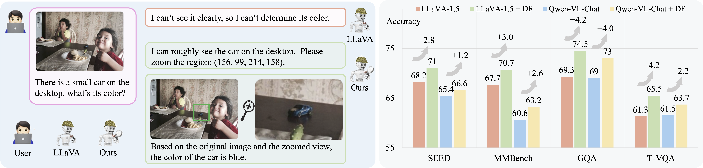

#  DualFocus: Integrating Macro and Micro Perspectives in Multi-modal Large Language Models

⭐️ [**Star to follow our team's projects !**](https://github.com/InternLM/InternLM-XComposer)

---

🚀🚀🚀 Official implementation of **DualFocus: Integrating Macro and Micro Perspectives in Multi-modal Large Language Models**.
<p align="center">
  
</p>

- **Authors**: [Yuhang Cao](https://scholar.google.com/citations?user=sJkqsqkAAAAJ&hl=zh-CN), [Pan Zhang](https://panzhang0212.github.io/), [Xiaoyi Dong](https://scholar.google.com/citations?user=FscToE0AAAAJ&hl=en), [Dahua Lin📧](http://dahua.site/), [Jiaqi Wang](https://myownskyw7.github.io/)

- **Institutes**: The Chinese University of Hong Kong; Shanghai AI Laboratory
- **Resources**: [[Paper](https://www.example.com/)] 
- **Models**: [[DualFocus-LLaVA-1.5-7B](https://huggingface.co/yhcao/DualFocus-LLaVA-1.5-7B)]; [[DualFocus-LLaVA-1.5-13B](https://huggingface.co/yhcao/DualFocus-LLaVA-1.5-13B)]; [[DualFocus-ShareGPT4V-13B](https://huggingface.co/yhcao/DualFocus-ShareGPT4V-13B)] 

## 📜 News
[2024/02/22] The paper, evaluation code and checkpoints are released!

## 👨‍💻 Todo
- [x] Release evaluation code and checkpoints
- [ ] Release paper
- [ ] Release training code
- [ ] Speed up inference

## 🤖 Model Zoo

|Name                                                                             | LLM        | SEED<sup>*IMG*</sup> | MMBench     | GQA<sup>*</sup> | TextVQA     |
|---------------------------------------------------------------------------------|------------|----------------------|-------------|-----------------|-------------|
|[LLaVA-1.5-7B](https://huggingface.co/liuhaotian/llava-v1.5-7b)                  | Vicuna-7B  | 66.2                 | 64.3        | 67.2            | 58.2        |
|[DualFocus-LLaVA-1.5-7B](https://huggingface.co/yhcao/DualFocus-LLaVA-1.5-7B)    | Vicuna-7B  | 68.9 (+2.7)          | 66.8 (+2.5) | 69.4 (+2.2)     | 62.3 (+3.9) |
|[LLaVA-1.5-13B](https://huggingface.co/liuhaotian/llava-v1.5-13b)                | Vicuna-13B | 68.2                 | 67.7        | 69.3            | 61.3        |
|[DualFocus-LLaVA-1.5-13B](https://huggingface.co/yhcao/DualFocus-LLaVA-1.5-13B)  | Vicuna-13B | 71.0 (+2.8)          | 71.4 (+3.7) | 74.5 (+5.2)     | 65.7(+4.4)  |
|[ShareGPT4V-13B](https://huggingface.co/Lin-Chen/ShareGPT4V-13B)                 | Vicuna-13B | 70.8                 | 68.5        | 71.1            | 62.2        |
|[DualFocus-ShareGPT4V-13B](https://huggingface.co/yhcao/DualFocus-ShareGPT4V-13B)| Vicuna-13B | 72.9 (+2.1)          | 71.0 (+3.5) | 75.7 (+4.6)     | 66.7 (+4.5) |

GQA<sup>*</sup>: we convert the GQA dataset into multi-choice-question format via GPT-3.5. Please refer to [here](https://huggingface.co/datasets/yhcao/GQA-MCQ/viewer) for details.


## Install

```bash
git clone https://github.com/InternLM/InternLM-XComposer --depth=1
cd projects/DualFocus
conda create -n DualFocus python=3.9 -y
conda activate DualFocus

pip install --upgrade pip
pip install -e .
pip install -e ".[train]"
pip install flash-attn --no-build-isolation
```

## Data Preparation

You should follow this instruction [Data.md](https://github.com/haotian-liu/LLaVA/blob/main/docs/Evaluation.md) to manage the datasets. 

## Evaluation

We provide [scripts](scripts/eval) for evaluation on 4 benchmarks. Here we take DualFocus-LLaVA-1.5-7B as an example.
For slurm users, please config the parameters, PARTITION, QUOTA_TYPE and GPUS yourself.

### MMBench-EN

1. Download [`mmbench_dev_20230712.tsv`](https://download.openmmlab.com/mmclassification/datasets/mmbench/mmbench_dev_20230712.tsv) and put under `./playground/data/eval/mmbench`.
2. Multi-GPU inference.
```Shell
# for single node inference
bash scripts/eval/eval_mmbench.sh yhcao/DualFocus-LLaVA-1.5-7B
```
```Shell
# for slurm inference
bash scripts/eval/slurm_eval_mmbench.sh yhcao/DualFocus-LLaVA-1.5-7B
```
3. Submit the results to the [evaluation server](https://mmbench.opencompass.org.cn/mmbench-submission): `./playground/data/eval/mmbench/answers_upload/{res}.xlsx`.


### SEED-Bench-Image

1. Following the official [instructions](https://github.com/AILab-CVC/SEED-Bench/blob/main/DATASET.md) to download the images. Put images under `./playground/data/eval/seed_bench/SEED-Bench-image`.
2. Multiple-GPU inference and evaluate.
```Shell
# for single node inference
bash scripts/eval/eval_seed.sh yhcao/DualFocus-LLaVA-1.5-7B
```
```Shell
# for slurm inference
base scripts/eval/slurm_eval_seed.sh yhcao/DualFocus-LLaVA-1.5-7B
```


### TextVQA

1. Download [`TextVQA_0.5.1_val.json`](https://dl.fbaipublicfiles.com/textvqa/data/TextVQA_0.5.1_val.json) and [images](https://dl.fbaipublicfiles.com/textvqa/images/train_val_images.zip) and extract to `./playground/data/eval/textvqa`.
2. Multi-GPU inference and evaluate.
```Shell
# for single node inference
bash scripts/eval/eval_textvqa.sh yhcao/DualFocus-LLaVA-1.5-7B
```
```Shell
# for slurm inference
bash scripts/eval/slurm_eval_textvqa.sh yhcao/DualFocus-LLaVA-1.5-7B
```


### GQA

1. Download the [data](https://cs.stanford.edu/people/dorarad/gqa/download.html) and [evaluation scripts](https://cs.stanford.edu/people/dorarad/gqa/evaluate.html) following the official instructions and put under `./playground/data/eval/gqa/data`. Download the [json](https://huggingface.co/datasets/yhcao/GQA-MCQ/blob/main/llava_gqa_testdev_balanced_mcq.jsonl) and put under `./playground/data/eval/gqa`. You may need to modify `eval.py` as [this](https://gist.github.com/haotian-liu/db6eddc2a984b4cbcc8a7f26fd523187) due to the missing assets in the GQA v1.2 release.
2. Multi-GPU inference and evaluate.
```Shell
# for single node inference
bash scripts/eval/eval_gqa.sh yhcao/DualFocus-LLaVA-1.5-7B
```
```Shell
# for slurm inference
bash scripts/eval/slurm_eval_gqa.sh yhcao/DualFocus-LLaVA-1.5-7B
```


## ❤️ Acknowledgments
- [LLaVA](https://github.com/haotian-liu/LLaVA): the codebase we built upon. Thanks for their wonderful work.
- [Vicuna](https://github.com/lm-sys/FastChat): the amazing open-sourced large language model!

## ✒️ Citation
If you find our work helpful for your research, please consider giving a star ⭐ and citation 📝
```bibtex
placeholder
```

## License
  **Usage and License Notices**: The data and checkpoint is intended and licensed for research use only. They are also restricted to uses that follow the license agreement of LLaMA, Vicuna and GPT-4. The dataset is CC BY NC 4.0 (allowing only non-commercial use) and models trained using the dataset should not be used outside of research purposes.
